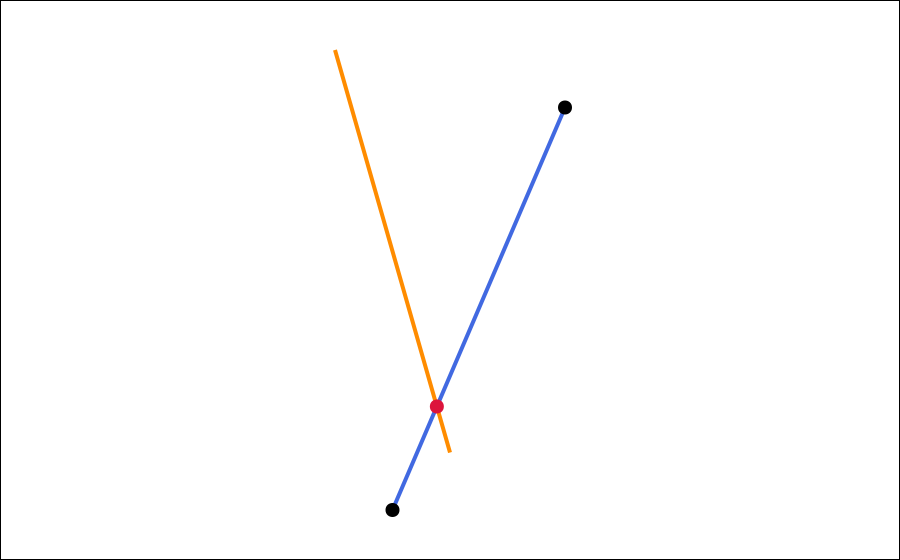

<!-- AUTO-GENERATED from doc/raw/canvas.md by doc/raw/doxylink.py — do not edit; edit the raw version and regenerate. -->


<picture>
  <source media="(prefers-color-scheme: dark)" srcset="figures/logotextdark.svg"/>
  
</picture>

[](https://github.com/gfonsecabr/pgl/actions/workflows/tests.yml)
[.svg)](https://en.wikipedia.org/wiki/C%2B%2B#Standardization)
[.svg)](https://opensource.org/licenses/MIT)
[.svg)](https://gfonsecabr.github.io/pgl/benchmarks/index.html)

<br/>

> ⚠️ **Work in Progress**: This library is still under construction and contains **bugs and missing features**. Use in production environments is not recommended.

## Canvas

[`Canvas`](https://gfonsecabr.github.io/pgl/classpgl_1_1Canvas.html) is a lightweight SVG renderer for Pangolin shapes. It is designed for
inspection, debugging, examples, and test output: you push shapes into a
canvas, optionally change the drawing style in between, and then export the
result as an SVG file or string.

The canvas automatically fits the inserted geometry into the output image,
preserves aspect ratio, clips infinite primitives to the visible viewport, and
stores an SVG `<title>` for each inserted element so that exported images keep a
human-readable tooltip.

<table>
  <tr>
    <td valign="top" width="58%">

```c++
#include "pgl.hpp"

int main() {
    // Let's set up two segments that cross in a nice visible spot.
    pgl::Point p = {1, 0}, q = {4, 7};
    pgl::Segment s = {p, q}, t = {0, 8, 2, 1};

    // Create your canvas
    pgl::Canvas canvas;
    canvas.size(900.0, 560.0)
          .margin(30.0) // you can define the margin you want
          .pointRadius(5.0)
          .strokeWidth(4.0)
          .borders(true); // if you want borders

    // Draw the two segments with distinct colors.
    canvas << pgl::stroke("royalblue") << pgl::fill("none") << s;
    canvas << pgl::stroke("darkorange") << t;
    // Then you can draw the endpoints on top so they stay easy to spot.
    canvas << pgl::stroke("black") << pgl::fill("black") << p << q;

    if (s.intersects(t)) {
        // when they cross, we can highlight the exact intersection too!
        pgl::Shape crossing(s.intersection<pgl::Rational<int>>(t));
        canvas << pgl::stroke("crimson")
               << pgl::fill("crimson")
               << crossing;
    }

    // One call writes the finished SVG.
    canvas.writeSVG("example1.svg");
}
```

  </td>
    <td valign="top" width="42%">
      
    </td>
  </tr>
</table>

### Style

The canvas maintains a current style. When you insert a shape, that shape
captures the style that is active at that exact moment. Changing the style
afterwards affects only shapes inserted later.

This is why the order of streamed commands matters:

```c++
pgl::Canvas canvas;
pgl::Segment firstSegment = {0, 0, 4, 3}, secondSegment = {0, 3, 4, 0};
// Each shape remembers the style that was active when it was inserted.
canvas << pgl::stroke("royalblue") << firstSegment;
// So changing the stroke now only affects what comes next.
canvas << pgl::stroke("crimson") << secondSegment;
```

Here `firstSegment` stays blue even though the current canvas stroke later
becomes crimson.

| Command | Effect |
| --- | --- |
| [`pgl::stroke("value")`](https://gfonsecabr.github.io/pgl/namespacepgl.html#a2e234c901f9abf59d6a354cdc9a9168f) | Sets the stroke color or stroke paint used for subsequent shapes. Typical values are color names such as `"red"`, hex codes such as `"#3366cc"`, or any SVG paint value. |
| [`pgl::fill("value")`](https://gfonsecabr.github.io/pgl/namespacepgl.html#ac8cbf973d67ef1569c611788f93f6761) | Sets the interior fill used for subsequent filled shapes and points. Use `"none"` to disable filling. |
| [`pgl::fillOpacity("value")`](https://gfonsecabr.github.io/pgl/namespacepgl.html#a8cf94a6c54fd68e2972ff7440eca978b) | Sets the fill opacity for subsequent shapes. Values are forwarded as SVG strings, so `"0.2"` makes the fill translucent. |
| [`pgl::strokeOpacity("value")`](https://gfonsecabr.github.io/pgl/namespacepgl.html#a7c60899586c30e2ea3c3aacfc192228e) | Sets the stroke opacity for subsequent shapes. |
| [`pgl::strokeWidth("value")`](https://gfonsecabr.github.io/pgl/namespacepgl.html#a49586374ddc1970a6253da193b279526) | Sets the stroke width for subsequent shapes using a raw SVG length string. This is useful when you want direct SVG-style control. |

Example:

```c++
pgl::Canvas canvas;
pgl::Halfplane halfplane = {0, 0, 4, 2};
pgl::Rectangle rectangle = {{1, 1}, {3, 3}};
// Soft fill for the half-plane so the rest of the drawing still shows through.
canvas << pgl::stroke("teal")
       << pgl::fill("teal")
       << pgl::fillOpacity("0.18")
       << halfplane
       // Then switch gears and draw the rectangle
       << pgl::stroke("sienna")
       << pgl::fill("gold")
       << pgl::fillOpacity("0.22")
       << rectangle;
```

### Configuration

These methods configure the exported image or update the current drawing
defaults:

| Method | What it changes |
| --- | --- |
| [`scale(double factor)`](https://gfonsecabr.github.io/pgl/classpgl_1_1Canvas.html#a40b9eaa91fa720483a2999d09e89e47b) | Multiplies the automatically fitted scale by `factor`. Values greater than `1` zoom in; values between `0` and `1` zoom out. The value must be strictly positive. |
| [`width(double widthPixels)`](https://gfonsecabr.github.io/pgl/classpgl_1_1Canvas.html#ae77d195e33e5becef12de273bd327f51) | Sets the SVG width in pixels. The value must be strictly positive. |
| [`height(double heightPixels)`](https://gfonsecabr.github.io/pgl/classpgl_1_1Canvas.html#a8256fca52537707a7288cd82a42f016c) | Sets the SVG height in pixels. The value must be strictly positive. |
| [`size(double widthPixels, double heightPixels)`](https://gfonsecabr.github.io/pgl/classpgl_1_1Canvas.html#ab56282ffe4990051d30b69a0468e2394) | Convenience wrapper for setting width and height together. |
| [`margin(double marginPixels)`](https://gfonsecabr.github.io/pgl/classpgl_1_1Canvas.html#ac5d887cdc706ea1473bebdda02c2390d) | Reserves blank space around the fitted drawing. Increasing the margin gives the geometry more breathing room inside the image. The value must be non-negative. |
| [`pointRadius(double radiusPixels)`](https://gfonsecabr.github.io/pgl/classpgl_1_1Canvas.html#ac8db0a0bacf5718320d2c97d2d01cf1c) | Sets the rendered radius of point primitives in pixels. This affects how large [`Point`](https://gfonsecabr.github.io/pgl/structpgl_1_1Point.html) objects appear in the exported SVG. |
| [`strokeWidth(double widthPixels)`](https://gfonsecabr.github.io/pgl/classpgl_1_1Canvas.html#ace003bc5e4a86d18d961d7d909733007) | Sets the current stroke width using a numeric pixel value. This updates the current style for subsequently inserted shapes. |
| [`borders(bool enabled = true)`](https://gfonsecabr.github.io/pgl/classpgl_1_1Canvas.html#a6621826426cfa82bd0b5fd8221b7376b) | Enables or disables a thin rectangular frame around the whole SVG. This is especially helpful when debugging clipping and margins. |
| [`writeSVG(const std::string& path)`](https://gfonsecabr.github.io/pgl/classpgl_1_1Canvas.html#ade8bd4b3d2c895f3659aa101552e3031) | Writes the full SVG document to disk. Throws if the output file cannot be opened. |
| [`toSVG()`](https://gfonsecabr.github.io/pgl/classpgl_1_1Canvas.html#a9d02568a8bf29a1d7c7638a1186a9f14) | Returns the complete SVG document as a string, which is useful for tests, web responses, or custom output pipelines. |

Two related width setters exist on purpose:

- [`canvas.strokeWidth(4.0)`](https://gfonsecabr.github.io/pgl/classpgl_1_1Canvas.html#ace003bc5e4a86d18d961d7d909733007) is a canvas method taking a numeric width in pixels.
- `canvas << pgl::strokeWidth("4")` is a streamed style command taking a raw SVG string.

Both affect the style captured by later shapes; the method form is simply more
convenient when you want a numeric pixel width.

### How fitting works

Canvas fitting is automatic:

- the bounds of all inserted elements are collected;
- the drawing is uniformly scaled to fit inside the chosen width and height;
- the aspect ratio is preserved;
- the configured margin and optional border are respected;
- the y-axis is flipped during export so that mathematical coordinates still
  feel natural in C++ code while SVG receives screen-space coordinates.

Infinite primitives are clipped to the visible viewport:

- [`Line`](https://gfonsecabr.github.io/pgl/structpgl_1_1Line.html) becomes the visible chord of the line inside the SVG box;
- [`OrientedLine`](https://gfonsecabr.github.io/pgl/structpgl_1_1OrientedLine.html) behaves the same but keeps its orientation arrow;
- [`Ray`](https://gfonsecabr.github.io/pgl/structpgl_1_1Ray.html) starts at its source and stops at the first viewport boundary it meets;
- [`Halfplane`](https://gfonsecabr.github.io/pgl/structpgl_1_1Halfplane.html) is clipped to the viewport as a polygonal region.

The generated SVG uses `vector-effect="non-scaling-stroke"`, so stroke widths
stay visually constant even when the geometry is scaled to fit the output box.

### Notes

- [`Canvas`](https://gfonsecabr.github.io/pgl/classpgl_1_1Canvas.html) is intentionally lightweight. It is a geometry inspection tool, not a
  general plotting framework.
- Shapes are stored in insertion order, and SVG output preserves that order, so
  later shapes are drawn on top of earlier ones.
- Because style is captured on insertion, it is easy to layer highlights on top
  of a base drawing by switching style right before inserting the highlighted
  object.
- [`Halfplane`](https://gfonsecabr.github.io/pgl/structpgl_1_1Halfplane.html) fill and [`Rectangle`](https://gfonsecabr.github.io/pgl/structpgl_1_1Rectangle.html) fill are often easier to read when combined
  with translucent [`fillOpacity(...)`](https://gfonsecabr.github.io/pgl/namespacepgl.html#a8cf94a6c54fd68e2972ff7440eca978b).
- [`Triangle`](https://gfonsecabr.github.io/pgl/structpgl_1_1Triangle.html) supports both stroke and fill just like [`Rectangle`](https://gfonsecabr.github.io/pgl/structpgl_1_1Rectangle.html).

If you do not want to write a file immediately, you can generate an SVG string
and hand it to your own output layer:

```c++
pgl::Canvas canvas;
canvas << pgl::stroke("black") << pgl::Segment({0, 0}, {4, 3});
std::string svg = canvas.toSVG();
```
