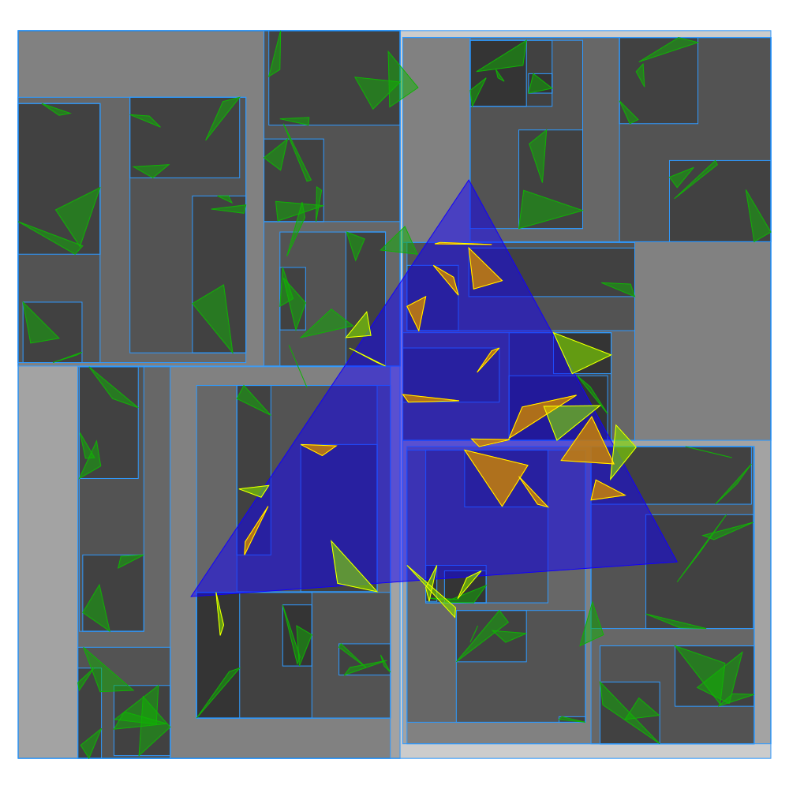

<!-- AUTO-GENERATED from doc/raw/data_structures.md by doc/raw/doxylink.py — do not edit; edit the raw version and regenerate. -->

<picture>
  <source media="(prefers-color-scheme: dark)" srcset="figures/logotextdark.svg"/>
  
</picture>

[.svg)](https://en.wikipedia.org/wiki/C%2B%2B#Standardization)
[.svg)](https://opensource.org/licenses/MIT)
[.svg)](https://gfonsecabr.github.io/pgl/benchmarks/index.html)

 

> ⚠️ **Work in Progress**: This library is still under construction and contains **bugs and missing features**. Use in production environments is not recommended.

## Data Structures

### Shape Tree

`ShapeTree<Shape>` is a container for bounded shapes. The tree is built once and answers range queries against an arbitrary query shape `q`. If the tree stores $n$ points, then it is a kd-tree, with $O(\sqrt{n})$ query time for orthogonal range counting and $O(\log n)$ height. For large intersecting shapes, the tree will be similar to storing the shapes in a vector and examining all of them, but with a much larger construction time.

- `ShapeTree<Shape>(V)` builds the tree over the shapes in container `V`. An optional second argument sets the leaf size (default 8): the maximum number of shapes kept at a leaf.

The query methods come in two families. The *intersecting* family matches stored shapes `s` with `s.intersects(q)`; the *contained* family matches stored shapes `s` with `q.contains(s)`. Each family offers the same five operations:

- [`countIntersecting(q)`](https://gfonsecabr.github.io/pgl/classpgl_1_1ShapeTree.html#ab9a97f8962f28bea8a93e59c7e959014 "Counts the stored shapes intersecting a query shape.") / [`countContainedIn(q)`](https://gfonsecabr.github.io/pgl/classpgl_1_1ShapeTree.html#aae23593e5f3cee436125f3287da6b4d5 "Counts the stored shapes contained in a query shape.") return the number of matching stored shapes.

- [`reportIntersecting(q)`](https://gfonsecabr.github.io/pgl/classpgl_1_1ShapeTree.html#acfd0b343eb6267a71f22ef7f5adf6ac7 "Returns copies of the stored shapes intersecting a query shape.") / [`reportContainedIn(q)`](https://gfonsecabr.github.io/pgl/classpgl_1_1ShapeTree.html#a74aaaaabb391d4828371fdd2a74b9215 "Returns copies of the stored shapes contained in a query shape.") return a vector with a copy of each matching stored shape.

- [`visitIntersecting(q, f)`](https://gfonsecabr.github.io/pgl/classpgl_1_1ShapeTree.html#a63c5008738d8300bd823a4288c421e50 "Calls fn on each stored shape intersecting a query shape.") / [`visitContainedIn(q, f)`](https://gfonsecabr.github.io/pgl/classpgl_1_1ShapeTree.html#a8c0868aea15e190a8e54895f7c0753fe "Calls fn on each stored shape contained in a query shape.") call `f(s)` on each matching stored shape `s` as it is found. If `f` returns `true` the visit stops.

- [`emptyIntersecting(q)`](https://gfonsecabr.github.io/pgl/classpgl_1_1ShapeTree.html#a8dce1815d2e4ac57b72dcc11ba22a898 "Returns whether no stored shape intersects a query shape.") / [`emptyContainedIn(q)`](https://gfonsecabr.github.io/pgl/classpgl_1_1ShapeTree.html#aa6e8876bbef51debe667a37b5086009a "Returns whether no stored shape is contained in a query shape.") return true if no stored shape matches.

- [`sumIntersecting(q)`](https://gfonsecabr.github.io/pgl/classpgl_1_1ShapeTree.html#ae05cf1c45fe7e9c0db0979e9c0fef5d6 "Sums the weights of the stored shapes intersecting a query shape.") / [`sumContainedIn(q)`](https://gfonsecabr.github.io/pgl/classpgl_1_1ShapeTree.html#a8809bb7ad02988ac7dcae36e71fb4d50 "Sums the weights of the stored shapes contained in a query shape.") return the sum of a weight over the matching stored shapes. The weight is given by an optional `WeightFn` template parameter mapping a shape to any type with `operator+` (`ShapeTree<Shape, WeightFn>`); the weight function is passed to the constructor and ignored by default.

- Other methods: [`begin`](https://gfonsecabr.github.io/pgl/classpgl_1_1ShapeTree.html#ac2840a2aea67a3f0ac06434f05059cfc "Returns an iterator to the first stored shape."), [`boundingBoxes`](https://gfonsecabr.github.io/pgl/classpgl_1_1ShapeTree.html#a44bafd1d3814f712f04f175897781cd2 "Returns every node's subtree bounding box in pre-order."), [`cbegin`](https://gfonsecabr.github.io/pgl/classpgl_1_1ShapeTree.html#a0e6c64798a6b433b5c5667cbfcd42828 "Returns an iterator to the first stored shape."), [`cend`](https://gfonsecabr.github.io/pgl/classpgl_1_1ShapeTree.html#a22cdcf6dd36d07181d92c5c88d49036a "Returns an iterator past the last stored shape."), [`empty`](https://gfonsecabr.github.io/pgl/classpgl_1_1ShapeTree.html#a08029ef8e2844225621d5d6c7444532c "Returns whether the tree is empty."), [`end`](https://gfonsecabr.github.io/pgl/classpgl_1_1ShapeTree.html#a2aefa6c4aec74adc3e8088671fb0c709 "Returns an iterator past the last stored shape."), [`erase`](https://gfonsecabr.github.io/pgl/classpgl_1_1ShapeTree.html#a448a617ddcb55d32e55a9aaec1324b90 "Removes one stored shape equal to shape."), [`has`](https://gfonsecabr.github.io/pgl/classpgl_1_1ShapeTree.html#a79f8e616b064b9319688f995c247d99d "Returns whether a shape equal to shape is stored in the tree."), [`nearestNeighbor`](https://gfonsecabr.github.io/pgl/classpgl_1_1ShapeTree.html#ac0dbce70b240573605347874012eeb0f "Returns the stored shape nearest to a query shape."), [`nearestNeighborL1`](https://gfonsecabr.github.io/pgl/classpgl_1_1ShapeTree.html#a9d5155581e52b9105ab63f4dfc0bbe56 "Returns the stored shape nearest to a query shape under the L1 (Manhattan) metric."), [`nearestNeighborLInf`](https://gfonsecabr.github.io/pgl/classpgl_1_1ShapeTree.html#a7958dfa8f53009473ddf61423bbec433 "Returns the stored shape nearest to a query shape under the LInf (Chebyshev) metric."), [`rebuild`](https://gfonsecabr.github.io/pgl/classpgl_1_1ShapeTree.html#acd07b5b5fc1b7ae74565dd8a252706cd "Rebuilds the tree from the stored shapes, restoring its quality."), [`shapes`](https://gfonsecabr.github.io/pgl/classpgl_1_1ShapeTree.html#ac99194f3238dc21544ae1e76d69295dc "Returns the stored shapes in their internal order."), [`size`](https://gfonsecabr.github.io/pgl/classpgl_1_1ShapeTree.html#a3b69d00d3decdb9016cd6c78b9d8fb43 "Returns the number of stored shapes.").

Sending a tree to a [Canvas](canvas.md) with `canvas << tree` draws all node bounding boxes. Is is possible to insert a new element with [`insert`](https://gfonsecabr.github.io/pgl/classpgl_1_1ShapeTree.html#a0ccc82dec95517590154bd038214445d "Inserts a shape without rebalancing the existing tree."), but no rebalancing is performed.

  
   
  <em>A shape tree over 100 random triangles: the query triangle with the triangles it contains and intersects, plus the node bounding boxes.</em>

### Triangulation

[`Triangulation`](https://gfonsecabr.github.io/pgl/structpgl_1_1Triangulation.html "Triangulation whose connectivity may change and whose vertex set may grow.") stores a mutable triangulation of either a polygon or a point set: vertex coordinates never move once added, but new vertices can be inserted ([`insert`](https://gfonsecabr.github.io/pgl/structpgl_1_1Triangulation.html#aa8f49fe0459173b962e035688c00fc43 "Inserts p as a new vertex."), [`insertDelaunay`](https://gfonsecabr.github.io/pgl/structpgl_1_1Triangulation.html#a68f9c3c737c4d6dbeb79b0d9c54e2b86 "Inserts p as a new vertex and restores the constrained Delaunay property around it.")) and the connectivity changes through flips.

It may be constructed from a Polygon (constrained Delaunay triangulation), a container of points (Delaunay triangulation), a container of points plus a container of non-crossing segments (conforming constrained Delaunay: the segments become constrained edges and nothing is carved away), segments forming a complete triangulation, or triangles, always keeping labels. The polygon constructor optionally takes a container of extra interior points (added as vertices) and/or a container of interior segments (added as vertices and constrained edges); either may be omitted, and both are assumed to lie inside the polygon (not checked). Attention, the segments or triangles must define a valid triangulation (of the convex hull or any polygon), otherwise the behavior is undefined.

- [`locate(p)`](https://gfonsecabr.github.io/pgl/structpgl_1_1Triangulation.html#a29b96c32ebb52fddc7fd10eaeee4dbd8 "Finds the triangle containing the query point by walking the mesh.") returns a triangle containing point `p`, or none if `p` is outside, via a randomized visibility walk.

- Navigation: [`otherTriangle`](https://gfonsecabr.github.io/pgl/structpgl_1_1Triangulation.html#aa625a8ae9abbcedae55b710f7d14f256 "The triangle on the other side of shared from t."), [`edgeAdjacentTriangles`](https://gfonsecabr.github.io/pgl/structpgl_1_1Triangulation.html#a9001b8c30f9fabea449151c482a129d6 "The (up to three) triangles sharing an edge with t."), [`vertexAdjacentTriangles`](https://gfonsecabr.github.io/pgl/structpgl_1_1Triangulation.html#a876e7243b3b3570f1d7d3727a0c2390b "The triangles sharing at least one vertex with t (excluding t)."), [`incidentTriangles`](https://gfonsecabr.github.io/pgl/structpgl_1_1Triangulation.html#a6a46217a54fcaf96c7bce5d3e9625eaa "The (up to two) triangles incident to edge s.") (of an edge or of a vertex), the [`visitTriangles`](https://gfonsecabr.github.io/pgl/structpgl_1_1Triangulation.html#ae66b9330eca83b9768236c30f7fe064f "Calls fn(Triangle) on every triangle.")/[`visitEdges`](https://gfonsecabr.github.io/pgl/structpgl_1_1Triangulation.html#a199bd230951e914c4c169ab3283eaad0 "Calls fn(Segment) on every edge, with its stored label.") visitors, and the sorted [`triangles()`](https://gfonsecabr.github.io/pgl/structpgl_1_1Triangulation.html#adf13f4f217147acfad64a1c60294bbe0 "Returns all triangles, sorted.")/[`edges()`](https://gfonsecabr.github.io/pgl/structpgl_1_1Triangulation.html#a4d9f06c16b448a6094f121d3ff64675f "Returns all edges, sorted, each with its stored label.").

- Range searching: [`trianglesIntersecting(s)`](https://gfonsecabr.github.io/pgl/structpgl_1_1Triangulation.html#a0951e0ae30e494c3a336e99b1c214f20 "Returns the triangles met by s (a segment, (oriented) line, ray, or chain, in order, or a region query shape, in an unspecified order).") return the triangles that satisfy [`triangle.intersects(s)`](https://gfonsecabr.github.io/pgl/structpgl_1_1Triangulation.html#a44a3da24570a922992d8a639cf284c05 "True if the triangulated domain meets shape (A ∩ B ≠ ∅)."). The function has several variantions [`visitTrianglesIntersecting(s,f)`](https://gfonsecabr.github.io/pgl/structpgl_1_1Triangulation.html#a7edb5aad94b2d0b8bebbe14b30708403 "Visits every triangle met by the directed query s, in order.") calls the function `f` on these triangles and stops early if `f` returns `true`. If `s` is an oriented segment, oriented line, or ray, the triangles are visited in order. A polyline or a monotone chain is also traced in order, edge by edge, each triangle reported the first time the chain meets it (so a chain may leave the triangulated region and come back). The edge variations [`edgesIntersecting`](https://gfonsecabr.github.io/pgl/structpgl_1_1Triangulation.html#add516a5fb9be6e490e90d04334d8a95f "Returns the triangulation edges met by s.") and [`visitEdgesIntersecting`](https://gfonsecabr.github.io/pgl/structpgl_1_1Triangulation.html#a0e42fd474c4661c8f7eaed01a7a13767 "Visits every triangulation edge met by s.") list the edges instead of the triangles. The `…InteriorIntersecting` variantions filter with `interiorIntersects(s)`.

- Predicates against the domain — the region the triangulation covers, which is the polygon for the polygon constructors and the convex hull otherwise. [`contains(s)`](https://gfonsecabr.github.io/pgl/structpgl_1_1Triangulation.html#aaafc3c4e87cc92f987dd1b4b45b33b7c "True if the triangulated domain contains shape (A ⊇ B)."), [`interiorContains(s)`](https://gfonsecabr.github.io/pgl/structpgl_1_1Triangulation.html#ac8f4f9837036712a981d607662c46a7e "True if the domain's interior contains shape (A∖∂A ⊇ B)."), [`intersects(s)`](https://gfonsecabr.github.io/pgl/structpgl_1_1Triangulation.html#a44a3da24570a922992d8a639cf284c05 "True if the triangulated domain meets shape (A ∩ B ≠ ∅).") and [`interiorsIntersect(s)`](https://gfonsecabr.github.io/pgl/structpgl_1_1Triangulation.html#aa1ed2d5434f154fcba49c68efa8856d5 "True if the domain's interior meets shape's interior (A∖∂A ∩ B∖∂B ≠ ∅).") give exactly the answers the shape predicates of the same name give for that region as a [`Polygon`](https://gfonsecabr.github.io/pgl/structpgl_1_1Polygon.html "Closed simple polygon stored by its vertices."), boundary and all: a segment running along a polygon edge is contained and met, but neither interior-contained nor interior-intersecting. They work on the mesh, so the cost is proportional to the triangles `s` meets rather than to the size of the boundary. Every shape type is accepted: an unbounded one (line, oriented line, ray, half-plane) is never contained in the bounded domain, and the empty shape is contained by it but meets nothing. They answer a different question from [`has(t)`](https://gfonsecabr.github.io/pgl/structpgl_1_1Triangulation.html#a485c8ec5ba96b0e3ae38652d8a1e7478 "True if t is one of the triangles of this triangulation.") and [`has(s)`](https://gfonsecabr.github.io/pgl/structpgl_1_1Triangulation.html#a485c8ec5ba96b0e3ae38652d8a1e7478 "True if t is one of the triangles of this triangulation."), which ask whether a triangle or a segment is a *cell* of the mesh rather than how the domain covers it geometrically.

- [`flip(e)`](https://gfonsecabr.github.io/pgl/structpgl_1_1Triangulation.html#ae3a9971db0a8fa7716b554650d67921d "Flips edge s, replacing it by the opposite diagonal.") replaces the diagonal shared by two triangles. It returns the new edge obtained or none if the flip cannot be performed (non-convex quadrilateral or the edge is constrained). [`flippable(e)`](https://gfonsecabr.github.io/pgl/structpgl_1_1Triangulation.html#ae91e0a2cede91a1c5e9c57c86128b935 "True if edge s can be flipped (unconstrained, interior, convex quad).") simply returns if the flip can be performed without changing the triangulation. If we pass a container with edges in interior-disjoint quadrilaterals, the functions use parallel flips.

- [`insert(p)`](https://gfonsecabr.github.io/pgl/structpgl_1_1Triangulation.html#aa8f49fe0459173b962e035688c00fc43 "Inserts p as a new vertex.") adds point `p` as a new vertex, subdividing the triangle or edge containing it; a point strictly outside the convex hull grows the hull, joining `p` to every hull edge it sees (a constrained hull edge stays constrained and becomes interior). It returns `false` — leaving the triangulation unchanged — only if `p` is already a vertex. For a triangulation built from a polygon, `p` is assumed to lie in the closed polygon, like the constructor's extra points (not checked). [`insertDelaunay(p)`](https://gfonsecabr.github.io/pgl/structpgl_1_1Triangulation.html#a68f9c3c737c4d6dbeb79b0d9c54e2b86 "Inserts p as a new vertex and restores the constrained Delaunay property around it.") additionally restores the constrained Delaunay property around the new vertex by Lawson flips (never flipping constrained edges): a triangulation that was constrained Delaunay stays constrained Delaunay.

- Other methods: [`checkInvariants`](https://gfonsecabr.github.io/pgl/structpgl_1_1Triangulation.html#a3f9750066fb8ff41030cdb1a54c02903 "Checks the structural invariants (orientation + neighbor symmetry). Intended for debug assertions."), [`edgesInteriorIntersecting`](https://gfonsecabr.github.io/pgl/structpgl_1_1Triangulation.html#ad578c0fcdbecf0822a6673f957662840 "Returns the triangulation edges whose interior s crosses."), [`empty`](https://gfonsecabr.github.io/pgl/structpgl_1_1Triangulation.html#a7d3f30955d60e885571d998bcfcb89ee "True if the triangulation stores no in-domain triangles."), [`isConstrained`](https://gfonsecabr.github.io/pgl/structpgl_1_1Triangulation.html#ae7291714506e150f83dfb5992cffc8c5 "True if edge s is flagged as constrained."), [`label`](https://gfonsecabr.github.io/pgl/structpgl_1_1Triangulation.html#a4808794fe312d05e07ab10cbb4c189a5 "Returns a reference to the label stored for triangle t."), [`numEdges`](https://gfonsecabr.github.io/pgl/structpgl_1_1Triangulation.html#a92fa1929d53d876aca62b9f4b04ce4a3 "Number of undirected edges incident to the visible triangulation."), [`numTriangles`](https://gfonsecabr.github.io/pgl/structpgl_1_1Triangulation.html#af888959051dec124c651e2037ad9b3ef "Number of triangles (excludes ghost and out-of-domain fill triangles)."), [`numVertices`](https://gfonsecabr.github.io/pgl/structpgl_1_1Triangulation.html#a8f74529903bc2807ee9b3b4f7b3cb704 "Number of real vertices (excludes the ghost vertex)."), [`setConstrained`](https://gfonsecabr.github.io/pgl/structpgl_1_1Triangulation.html#aeafdd8ead5d9e6c09356e3438f9b3a9e "Flags (or clears) edge s as constrained on both incident sides."), [`trianglesInteriorIntersecting`](https://gfonsecabr.github.io/pgl/structpgl_1_1Triangulation.html#a8602cbad7ccc5220d7579c4e00b5211b "Returns the triangles whose interior s enters."), [`visitEdgesInteriorIntersecting`](https://gfonsecabr.github.io/pgl/structpgl_1_1Triangulation.html#abc25304f496ee61b356712996cdbdb99 "Visits the triangulation edges whose interior s crosses."), [`visitTrianglesInteriorIntersecting`](https://gfonsecabr.github.io/pgl/structpgl_1_1Triangulation.html#a7f0e0e1b6da50b1dd0242ab9ed40cffa "Visits the triangles whose interior s actually enters.").

  
   
  <em>The constrained Delaunay triangulation of a polygon with points inside. Highlighting the triangles a segment meets and those whose interior it actually intersects.</em>

