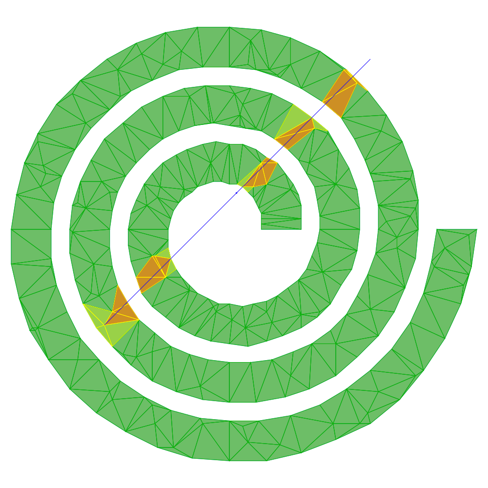

<!-- AUTO-GENERATED from doc/raw/data_structures.md by doc/raw/doxylink.py — do not edit; edit the raw version and regenerate. -->

<picture>
  <source media="(prefers-color-scheme: dark)" srcset="figures/logotextdark.svg"/>
  
</picture>

[.svg)](https://en.wikipedia.org/wiki/C%2B%2B#Standardization)
[.svg)](https://opensource.org/licenses/MIT)
[.svg)](https://gfonsecabr.github.io/pgl/benchmarks/index.html)

 

> ⚠️ **Work in Progress**: This library is still under construction and contains **bugs and missing features**. Use in production environments is not recommended.

## Data Structures

### Shape Tree

`ShapeTree<Shape>` is a container for bounded shapes. The tree is built once and answers range queries against an arbitrary query shape `q`. If the tree stores $n$ points, then it is a kd-tree, with $O(\sqrt{n})$ query time for orthogonal range counting and $O(\log n)$ height. For large intersecting shapes, the tree will be similar to storing the shapes in a vector and examining all of them, but with a much larger construction time.

- `ShapeTree<Shape>(V)` builds the tree over the shapes in container `V`. An optional second argument sets the leaf size (default 8): the maximum number of shapes kept at a leaf.

The query methods come in two families. The *intersecting* family matches stored shapes `s` with `s.intersects(q)`; the *contained* family matches stored shapes `s` with `q.contains(s)`. Each family offers the same five operations:

- [`countIntersecting(q)`](https://gfonsecabr.github.io/pgl/classpgl_1_1ShapeTree.html#ab9a97f8962f28bea8a93e59c7e959014 "Counts the stored shapes intersecting a query shape.") / [`countContainedIn(q)`](https://gfonsecabr.github.io/pgl/classpgl_1_1ShapeTree.html#aae23593e5f3cee436125f3287da6b4d5 "Counts the stored shapes contained in a query shape.") return the number of matching stored shapes.

- [`reportIntersecting(q)`](https://gfonsecabr.github.io/pgl/classpgl_1_1ShapeTree.html#acfd0b343eb6267a71f22ef7f5adf6ac7 "Returns copies of the stored shapes intersecting a query shape.") / [`reportContainedIn(q)`](https://gfonsecabr.github.io/pgl/classpgl_1_1ShapeTree.html#a74aaaaabb391d4828371fdd2a74b9215 "Returns copies of the stored shapes contained in a query shape.") return a vector with a copy of each matching stored shape.

- [`visitIntersecting(q, f)`](https://gfonsecabr.github.io/pgl/classpgl_1_1ShapeTree.html#a63c5008738d8300bd823a4288c421e50 "Calls fn on each stored shape intersecting a query shape.") / [`visitContainedIn(q, f)`](https://gfonsecabr.github.io/pgl/classpgl_1_1ShapeTree.html#a8c0868aea15e190a8e54895f7c0753fe "Calls fn on each stored shape contained in a query shape.") call `f(s)` on each matching stored shape `s` as it is found. If `f` returns `true` the visit stops.

- [`emptyIntersecting(q)`](https://gfonsecabr.github.io/pgl/classpgl_1_1ShapeTree.html#a8dce1815d2e4ac57b72dcc11ba22a898 "Returns whether no stored shape intersects a query shape.") / [`emptyContainedIn(q)`](https://gfonsecabr.github.io/pgl/classpgl_1_1ShapeTree.html#aa6e8876bbef51debe667a37b5086009a "Returns whether no stored shape is contained in a query shape.") return true if no stored shape matches.

- [`sumIntersecting(q)`](https://gfonsecabr.github.io/pgl/classpgl_1_1ShapeTree.html#ae05cf1c45fe7e9c0db0979e9c0fef5d6 "Sums the weights of the stored shapes intersecting a query shape.") / [`sumContainedIn(q)`](https://gfonsecabr.github.io/pgl/classpgl_1_1ShapeTree.html#a8809bb7ad02988ac7dcae36e71fb4d50 "Sums the weights of the stored shapes contained in a query shape.") return the sum of a weight over the matching stored shapes. The weight is given by an optional `WeightFn` template parameter mapping a shape to any type with `operator+` (`ShapeTree<Shape, WeightFn>`); the weight function is passed to the constructor and ignored by default.

- [`nearestNeighbor(q)`](https://gfonsecabr.github.io/pgl/classpgl_1_1ShapeTree.html#ab474ac9db17611ead980ea1ff63f3446 "Returns the stored shape nearest to a query shape.") returns the nearest stored shape by reference. [`kNearestNeighbors(q, k)`](https://gfonsecabr.github.io/pgl/classpgl_1_1ShapeTree.html#a834f6a690f2d7bc186b4cd1d35cf30f8 "Returns up to k stored shapes nearest to a query shape.") returns up to `k` nearest shapes as nearest-first copies.

- Other methods: [`begin`](https://gfonsecabr.github.io/pgl/classpgl_1_1ShapeTree.html#ac2840a2aea67a3f0ac06434f05059cfc "Returns an iterator to the first stored shape."), [`boundingBoxes`](https://gfonsecabr.github.io/pgl/classpgl_1_1ShapeTree.html#a44bafd1d3814f712f04f175897781cd2 "Returns every node's subtree bounding box in pre-order."), [`cbegin`](https://gfonsecabr.github.io/pgl/classpgl_1_1ShapeTree.html#a0e6c64798a6b433b5c5667cbfcd42828 "Returns an iterator to the first stored shape."), [`cend`](https://gfonsecabr.github.io/pgl/classpgl_1_1ShapeTree.html#a22cdcf6dd36d07181d92c5c88d49036a "Returns an iterator past the last stored shape."), [`empty`](https://gfonsecabr.github.io/pgl/classpgl_1_1ShapeTree.html#a08029ef8e2844225621d5d6c7444532c "Returns whether the tree is empty."), [`end`](https://gfonsecabr.github.io/pgl/classpgl_1_1ShapeTree.html#a2aefa6c4aec74adc3e8088671fb0c709 "Returns an iterator past the last stored shape."), [`erase`](https://gfonsecabr.github.io/pgl/classpgl_1_1ShapeTree.html#a448a617ddcb55d32e55a9aaec1324b90 "Removes one stored shape equal to shape."), [`has`](https://gfonsecabr.github.io/pgl/classpgl_1_1ShapeTree.html#a79f8e616b064b9319688f995c247d99d "Returns whether a shape equal to shape is stored in the tree."), [`nearestNeighborL1`](https://gfonsecabr.github.io/pgl/classpgl_1_1ShapeTree.html#a39724eb61293a4a47dc06fbe529b9b10 "Returns the stored shape nearest to a query shape under the L1 (Manhattan) metric."), [`nearestNeighborLInf`](https://gfonsecabr.github.io/pgl/classpgl_1_1ShapeTree.html#a2c6020b16ab1100e6467ca22136a80a3 "Returns the stored shape nearest to a query shape under the LInf (Chebyshev) metric."), [`rebuild`](https://gfonsecabr.github.io/pgl/classpgl_1_1ShapeTree.html#acd07b5b5fc1b7ae74565dd8a252706cd "Rebuilds the tree from the stored shapes, restoring its quality."), [`shapes`](https://gfonsecabr.github.io/pgl/classpgl_1_1ShapeTree.html#ac99194f3238dc21544ae1e76d69295dc "Returns the stored shapes in their internal order."), [`size`](https://gfonsecabr.github.io/pgl/classpgl_1_1ShapeTree.html#a3b69d00d3decdb9016cd6c78b9d8fb43 "Returns the number of stored shapes.").

Sending a tree to a [Canvas](canvas.md) with `canvas << tree` draws all node bounding boxes. Is is possible to insert a new element with [`insert`](https://gfonsecabr.github.io/pgl/classpgl_1_1ShapeTree.html#a0ccc82dec95517590154bd038214445d "Inserts a shape without rebalancing the existing tree."), but no rebalancing is performed.

  
   
  <em>A shape tree over 100 random triangles: the query triangle with the triangles it contains and intersects, plus the node bounding boxes.</em>

### Interval Tree

`IntervalTree<Shape, Axis>` is a mutable one-dimensional index over bounded
shapes. It stores the closed interval obtained by projecting each shape's
bounding box onto `Axis`, which is `ProjectionAxis::x` by default or
`ProjectionAxis::y` when selected explicitly. The stored shapes themselves are
preserved. Its projection-prefixed query family makes decisions only from those
one-dimensional intervals; its unprefixed family uses the projection to prune
candidates, then applies the corresponding exact two-dimensional predicate.

- `IntervalTree<Shape>(V)` inserts every shape in container `V`; [`insert(s)`](https://gfonsecabr.github.io/pgl/classpgl_1_1IntervalTree.html#a2f8d70f5f499a90566d2bf2d3bc4bf54 "Inserts shape and its selected closed bounding-box interval.")
  and [`erase(s)`](https://gfonsecabr.github.io/pgl/classpgl_1_1IntervalTree.html#a5232163e9152216e4602bfee044b5940 "Removes one stored shape equal to shape.") add and remove one equal stored shape while retaining
  red-black-tree balance. Equal projected intervals are stored independently.
  An insertion takes $O(\log n)$ time. A removal instead tombstones the node
  owning the shape, which stays in the tree, keeps it balanced, and matches
  nothing from then on; the index is rebuilt only once tombstones outnumber the
  live nodes, so a removal costs $O(\log n + k)$ amortized, where $k$ is the
  number of stored intervals sharing the projected endpoints of the removed
  shape. The stored shapes stay compact: only their order may change.

- [`countProjectionsIntersecting(q)`](https://gfonsecabr.github.io/pgl/classpgl_1_1IntervalTree.html#a3e9f0fb15e803efb81b60a27bee3dadc "Counts shapes whose projected interval intersects the projection of q."), [`reportProjectionsIntersecting(q)`](https://gfonsecabr.github.io/pgl/classpgl_1_1IntervalTree.html#ae15ed226417c72c9acc097047b1e69eb "Returns copies of shapes whose projected interval intersects that of q."),
  [`visitProjectionsIntersecting(q, f)`](https://gfonsecabr.github.io/pgl/classpgl_1_1IntervalTree.html#a4dbea883c9595f6b170f03abfba5fbeb "Visits projected-interval intersections, stopping early if fn returns true."), and [`emptyProjectionsIntersecting(q)`](https://gfonsecabr.github.io/pgl/classpgl_1_1IntervalTree.html#a4efb73d10446f444b0accf4097530670 "Returns whether no stored projected interval intersects the projection of q.")
  match shapes whose projected closed interval meets that of `q`; touching at
  an endpoint counts as intersection.

- [`countProjectionsContainedIn(q)`](https://gfonsecabr.github.io/pgl/classpgl_1_1IntervalTree.html#ae7512c04c575239858fc93b464ccab27 "Counts shapes whose projected interval is contained in the projection of q."), [`reportProjectionsContainedIn(q)`](https://gfonsecabr.github.io/pgl/classpgl_1_1IntervalTree.html#adf6864ce62642b2afab0aa927ab18f6d "Returns copies of shapes whose projected interval is contained in that of q."),
  [`visitProjectionsContainedIn(q, f)`](https://gfonsecabr.github.io/pgl/classpgl_1_1IntervalTree.html#a573f6fcda1d3678b53909a15fd48b0d9 "Visits projected intervals contained in q, stopping early if fn returns true."), and [`emptyProjectionsContainedIn(q)`](https://gfonsecabr.github.io/pgl/classpgl_1_1IntervalTree.html#adc67523854627f68ef2c8c992943198e "Returns whether no stored projected interval is contained in that of q.")
  match shapes whose entire projected closed interval is within that of `q`,
  including shared endpoints.

- [`countIntersecting(q)`](https://gfonsecabr.github.io/pgl/classpgl_1_1IntervalTree.html#a156229167292264d17c76144bb222538 "Counts stored shapes that geometrically intersect q."), [`reportIntersecting(q)`](https://gfonsecabr.github.io/pgl/classpgl_1_1IntervalTree.html#ab45e85ab0acaf3990602f9795873cf12 "Returns copies of stored shapes that geometrically intersect q."), [`visitIntersecting(q, f)`](https://gfonsecabr.github.io/pgl/classpgl_1_1IntervalTree.html#a6b243da0a63efc651e2b37edea4ab737 "Visits stored shapes that geometrically intersect q."),
  and [`emptyIntersecting(q)`](https://gfonsecabr.github.io/pgl/classpgl_1_1IntervalTree.html#a8cd86feabd58f266e7339d8028c92b00 "Returns whether no stored shape geometrically intersects q.") first prune by the selected projection and then
  test `shape.intersects(q)`. [`countContainedIn(q)`](https://gfonsecabr.github.io/pgl/classpgl_1_1IntervalTree.html#ae918a604763091e59b3c6652a4a3fc56 "Counts stored shapes geometrically contained in q."), [`reportContainedIn(q)`](https://gfonsecabr.github.io/pgl/classpgl_1_1IntervalTree.html#a139270ac2f3309e47b4015db43d3c30f "Returns copies of stored shapes geometrically contained in q."),
  [`visitContainedIn(q, f)`](https://gfonsecabr.github.io/pgl/classpgl_1_1IntervalTree.html#a14fa1cca09829a0b0e43099468220637 "Visits stored shapes geometrically contained in q."), and [`emptyContainedIn(q)`](https://gfonsecabr.github.io/pgl/classpgl_1_1IntervalTree.html#a5a39cac11c397647ef15094ac54c4c70 "Returns whether no stored shape is geometrically contained in q.") similarly test
  `q.contains(shape)`. These unprefixed methods return the same results as the
  corresponding [`ShapeTree`](https://gfonsecabr.github.io/pgl/classpgl_1_1ShapeTree.html "Static shape tree of bounded shapes.") methods over the same stored shapes.

Like [`ShapeTree`](https://gfonsecabr.github.io/pgl/classpgl_1_1ShapeTree.html "Static shape tree of bounded shapes."), report methods return copies of the stored shapes, visitors
receive them by const reference and may stop early by returning `true`, and
[`has`](https://gfonsecabr.github.io/pgl/classpgl_1_1IntervalTree.html#ac311ca8d07c24b2f8edc96676aa72dfd "Returns whether a shape equal to shape is stored."), [`size`](https://gfonsecabr.github.io/pgl/classpgl_1_1IntervalTree.html#ac55a6eeebf7559e1f64933a9a9f45aae "Returns the number of stored shapes."), [`empty`](https://gfonsecabr.github.io/pgl/classpgl_1_1IntervalTree.html#ad88be49dab6c9f09d0d58e40a02df8a0 "Returns whether no shape is stored."), [`shapes`](https://gfonsecabr.github.io/pgl/classpgl_1_1IntervalTree.html#a4cb6798a11ec9ab0a74ef855e4d60c42 "Returns the stored shapes in internal storage order."), and const iterators provide container-like
access. The tree is augmented with its subtree endpoint extrema, so irrelevant
subtrees are pruned during both query families. Nodes use 32-bit identifiers
and keep query data separate from insertion-only state, and an identifier is
also the index of the shape the node owns, tombstones being exactly the
identifiers past the last stored shape. A tree therefore holds at most
`2^32 - 2` nodes, shapes and tombstones together, so at least `2^31 - 1` shapes
always fit.

### Triangulation

[`Triangulation`](https://gfonsecabr.github.io/pgl/structpgl_1_1Triangulation.html "Triangulation whose connectivity may change and whose vertex set may grow.") stores a mutable triangulation of either a polygon or a point set: vertex coordinates never move once added, but new vertices can be inserted ([`insert`](https://gfonsecabr.github.io/pgl/structpgl_1_1Triangulation.html#aa8f49fe0459173b962e035688c00fc43 "Inserts p as a new vertex."), [`insertDelaunay`](https://gfonsecabr.github.io/pgl/structpgl_1_1Triangulation.html#a68f9c3c737c4d6dbeb79b0d9c54e2b86 "Inserts p as a new vertex and restores the constrained Delaunay property around it.")) and the connectivity changes through flips.

It may be constructed from a Polygon (constrained Delaunay triangulation), a container of points (Delaunay triangulation), a container of points plus a container of non-crossing segments (conforming constrained Delaunay: the segments become constrained edges and nothing is carved away), segments forming a complete triangulation, or triangles, always keeping labels. The polygon constructor optionally takes a container of extra interior points (added as vertices) and/or a container of interior segments (added as vertices and constrained edges); either may be omitted, and both are assumed to lie inside the polygon (not checked). Attention, the segments or triangles must define a valid triangulation (of the convex hull or any polygon), otherwise the behavior is undefined.

- [`locate(p)`](https://gfonsecabr.github.io/pgl/structpgl_1_1Triangulation.html#a29b96c32ebb52fddc7fd10eaeee4dbd8 "Finds the triangle containing the query point by walking the mesh.") returns a triangle containing point `p`, or none if `p` is outside, via a randomized visibility walk.

- Navigation: [`otherTriangle`](https://gfonsecabr.github.io/pgl/structpgl_1_1Triangulation.html#aa625a8ae9abbcedae55b710f7d14f256 "The triangle on the other side of shared from t."), [`edgeAdjacentTriangles`](https://gfonsecabr.github.io/pgl/structpgl_1_1Triangulation.html#a9001b8c30f9fabea449151c482a129d6 "The (up to three) triangles sharing an edge with t."), [`vertexAdjacentTriangles`](https://gfonsecabr.github.io/pgl/structpgl_1_1Triangulation.html#a876e7243b3b3570f1d7d3727a0c2390b "The triangles sharing at least one vertex with t (excluding t)."), [`incidentTriangles`](https://gfonsecabr.github.io/pgl/structpgl_1_1Triangulation.html#a6a46217a54fcaf96c7bce5d3e9625eaa "The (up to two) triangles incident to edge s.") (of an edge or of a vertex), the [`visitTriangles`](https://gfonsecabr.github.io/pgl/structpgl_1_1Triangulation.html#ae66b9330eca83b9768236c30f7fe064f "Calls fn(Triangle) on every triangle.")/[`visitEdges`](https://gfonsecabr.github.io/pgl/structpgl_1_1Triangulation.html#a199bd230951e914c4c169ab3283eaad0 "Calls fn(Segment) on every edge, with its stored label.") visitors, and the sorted [`triangles()`](https://gfonsecabr.github.io/pgl/structpgl_1_1Triangulation.html#adf13f4f217147acfad64a1c60294bbe0 "Returns all triangles, sorted.")/[`edges()`](https://gfonsecabr.github.io/pgl/structpgl_1_1Triangulation.html#a4d9f06c16b448a6094f121d3ff64675f "Returns all edges, sorted, each with its stored label.").

- Range searching: [`trianglesIntersecting(s)`](https://gfonsecabr.github.io/pgl/structpgl_1_1Triangulation.html#a0951e0ae30e494c3a336e99b1c214f20 "Returns the triangles met by s (a segment, (oriented) line, ray, or chain, in order, or a region query shape, in an unspecified order).") return the triangles that satisfy [`triangle.intersects(s)`](https://gfonsecabr.github.io/pgl/structpgl_1_1Triangulation.html#a44a3da24570a922992d8a639cf284c05 "True if the triangulated domain meets shape (A ∩ B ≠ ∅)."). The function has several variantions [`visitTrianglesIntersecting(s,f)`](https://gfonsecabr.github.io/pgl/structpgl_1_1Triangulation.html#a7edb5aad94b2d0b8bebbe14b30708403 "Visits every triangle met by the directed query s, in order.") calls the function `f` on these triangles and stops early if `f` returns `true`. If `s` is an oriented segment, oriented line, or ray, the triangles are visited in order. A polyline or a monotone chain is also traced in order, edge by edge, each triangle reported the first time the chain meets it (so a chain may leave the triangulated region and come back). The edge variations [`edgesIntersecting`](https://gfonsecabr.github.io/pgl/structpgl_1_1Triangulation.html#add516a5fb9be6e490e90d04334d8a95f "Returns the triangulation edges met by s.") and [`visitEdgesIntersecting`](https://gfonsecabr.github.io/pgl/structpgl_1_1Triangulation.html#a0e42fd474c4661c8f7eaed01a7a13767 "Visits every triangulation edge met by s.") list the edges instead of the triangles. The `…InteriorIntersecting` variantions filter with `interiorIntersects(s)`.

- Predicates against the domain — the region the triangulation covers, which is the polygon for the polygon constructors and the convex hull otherwise. [`contains(s)`](https://gfonsecabr.github.io/pgl/structpgl_1_1Triangulation.html#aaafc3c4e87cc92f987dd1b4b45b33b7c "True if the triangulated domain contains shape (A ⊇ B)."), [`interiorContains(s)`](https://gfonsecabr.github.io/pgl/structpgl_1_1Triangulation.html#ac8f4f9837036712a981d607662c46a7e "True if the domain's interior contains shape (A∖∂A ⊇ B)."), [`intersects(s)`](https://gfonsecabr.github.io/pgl/structpgl_1_1Triangulation.html#a44a3da24570a922992d8a639cf284c05 "True if the triangulated domain meets shape (A ∩ B ≠ ∅).") and [`interiorsIntersect(s)`](https://gfonsecabr.github.io/pgl/structpgl_1_1Triangulation.html#aa1ed2d5434f154fcba49c68efa8856d5 "True if the domain's interior meets shape's interior (A∖∂A ∩ B∖∂B ≠ ∅).") give exactly the answers the shape predicates of the same name give for that region as a [`Polygon`](https://gfonsecabr.github.io/pgl/structpgl_1_1Polygon.html "Closed simple polygon stored by its vertices."), boundary and all: a segment running along a polygon edge is contained and met, but neither interior-contained nor interior-intersecting. They work on the mesh, so the cost is proportional to the triangles `s` meets rather than to the size of the boundary. Every shape type is accepted: an unbounded one (line, oriented line, ray, half-plane) is never contained in the bounded domain, and the empty shape is contained by it but meets nothing. They answer a different question from [`has(t)`](https://gfonsecabr.github.io/pgl/structpgl_1_1Triangulation.html#a485c8ec5ba96b0e3ae38652d8a1e7478 "True if t is one of the triangles of this triangulation.") and [`has(s)`](https://gfonsecabr.github.io/pgl/structpgl_1_1Triangulation.html#a485c8ec5ba96b0e3ae38652d8a1e7478 "True if t is one of the triangles of this triangulation."), which ask whether a triangle or a segment is a *cell* of the mesh rather than how the domain covers it geometrically.

- [`flip(e)`](https://gfonsecabr.github.io/pgl/structpgl_1_1Triangulation.html#ae3a9971db0a8fa7716b554650d67921d "Flips edge s, replacing it by the opposite diagonal.") replaces the diagonal shared by two triangles. It returns the new edge obtained or none if the flip cannot be performed (non-convex quadrilateral or the edge is constrained). [`flippable(e)`](https://gfonsecabr.github.io/pgl/structpgl_1_1Triangulation.html#ae91e0a2cede91a1c5e9c57c86128b935 "True if edge s can be flipped (unconstrained, interior, convex quad).") simply returns if the flip can be performed without changing the triangulation. If we pass a container with edges in interior-disjoint quadrilaterals, the functions use parallel flips.

- [`insert(p)`](https://gfonsecabr.github.io/pgl/structpgl_1_1Triangulation.html#aa8f49fe0459173b962e035688c00fc43 "Inserts p as a new vertex.") adds point `p` as a new vertex, subdividing the triangle or edge containing it; a point strictly outside the convex hull grows the hull, joining `p` to every hull edge it sees (a constrained hull edge stays constrained and becomes interior). It returns `false` — leaving the triangulation unchanged — only if `p` is already a vertex. For a triangulation built from a polygon, `p` is assumed to lie in the closed polygon, like the constructor's extra points (not checked). [`insertDelaunay(p)`](https://gfonsecabr.github.io/pgl/structpgl_1_1Triangulation.html#a68f9c3c737c4d6dbeb79b0d9c54e2b86 "Inserts p as a new vertex and restores the constrained Delaunay property around it.") additionally restores the constrained Delaunay property around the new vertex by Lawson flips (never flipping constrained edges): a triangulation that was constrained Delaunay stays constrained Delaunay.

- [`asGraph()`](https://gfonsecabr.github.io/pgl/structpgl_1_1Triangulation.html#a65444fde473c8410c150f5df6af1bc08 "Returns the mesh's vertices and edges as a Graph.") returns the 1-skeleton of the mesh as a `Graph<PointType>`: its vertices are the [`numVertices()`](https://gfonsecabr.github.io/pgl/structpgl_1_1Triangulation.html#a8f74529903bc2807ee9b3b4f7b3cb704 "Number of real vertices (excludes the ghost vertex).") stored points and its edges are the [`numEdges()`](https://gfonsecabr.github.io/pgl/structpgl_1_1Triangulation.html#a92fa1929d53d876aca62b9f4b04ce4a3 "Number of undirected edges incident to the visible triangulation.") edges of the visible mesh. A point identifies a vertex of a triangulation, so the graph is keyed by the points themselves rather than by handles, and edge labels, which a graph has no place for, are dropped. A vertex left without any in-domain edge — one duplicated or collinear with every other point, which carries no triangle — comes back as an isolated graph vertex. The ghost vertex closing the mesh at infinity is internal and is not one of them.

- [`voronoiDiagram()`](https://gfonsecabr.github.io/pgl/structpgl_1_1Triangulation.html#afb6e1ee72b6120aecb34db17618b6b73 "Returns the Voronoi diagram dual to this Delaunay triangulation.") returns the unbounded Arrangement dual to the current triangulation. The triangulation must be nonempty and its current real triangles must form a Delaunay triangulation of all stored vertices. The result uses exact rational vertices by default for integral input. Each face is labeled with the point that generated its Voronoi cell, so [`diagram.label(diagram.locateFace(q))`](https://gfonsecabr.github.io/pgl/structpgl_1_1Triangulation.html#a4808794fe312d05e07ab10cbb4c189a5 "Returns a reference to the label stored for triangle t.") returns the nearest site. At a Voronoi edge or vertex, `locateFace` selects one tied site by its usual infinitesimal-perturbation rule; use `locateCell`, then inspect the incident faces, to recover every tied site.

- [`convexPartition()`](https://gfonsecabr.github.io/pgl/structpgl_1_1Triangulation.html#aafbc40eb662b7f172fa337331dd75422 "The domain cut into convex pieces with pairwise disjoint interiors.") returns a set of interior disjoint convex polygons that covers the domain, where each convex polygon is the union of one or more triangles. The result is guaranteed within a factor of four of the fewest convex pieces possible. A constrained edge is never deleted, so a partition can be shaped by the constraints the triangulation was built with. `Polygon::convexPartition()` and `PolygonWithHoles::convexPartition()` are shorthands for `triangulation().convexPartition()`. A convex polygon comes back as a single piece.

- [`convexCovering()`](https://gfonsecabr.github.io/pgl/structpgl_1_1Triangulation.html#a4c5d9617e71751a0019af9490fd76c4b "Covers the domain with a greedily selected set of convex polygons.") grows one convex candidate independently from every triangle, then greedily selects candidates whose triangle sets cover the domain and removes redundant selections. The resulting convexes may overlap, are not guaranteed minimum, and never cross a constrained edge. `PolygonWithHoles::convexCovering()` is a shorthand for this method. `Polygon::convexCovering()` instead internally builds the SoCG 2023 full-visibility subgraph by a dual-graph BFS, applies a vertex clique cover, and takes the convex hull of each clique; that specialized graph construction is not part of the public [`Triangulation`](https://gfonsecabr.github.io/pgl/structpgl_1_1Triangulation.html "Triangulation whose connectivity may change and whose vertex set may grow.") API.

- Other methods: [`checkInvariants`](https://gfonsecabr.github.io/pgl/structpgl_1_1Triangulation.html#a3f9750066fb8ff41030cdb1a54c02903 "Checks the structural invariants (orientation + neighbor symmetry). Intended for debug assertions."), [`clearVisibilityGraph`](https://gfonsecabr.github.io/pgl/structpgl_1_1Triangulation.html#adbd74d1387b607a884e10efae49a37d1 "Returns the clear visibility graph of the mesh vertices."), [`clearlyVisibleVertices`](https://gfonsecabr.github.io/pgl/structpgl_1_1Triangulation.html#acf558d9f546dc683eb1df21f1c5a77f4 "The mesh vertices clearly visible from query."), [`edgesInteriorIntersecting`](https://gfonsecabr.github.io/pgl/structpgl_1_1Triangulation.html#ad578c0fcdbecf0822a6673f957662840 "Returns the triangulation edges whose interior s crosses."), [`empty`](https://gfonsecabr.github.io/pgl/structpgl_1_1Triangulation.html#a7d3f30955d60e885571d998bcfcb89ee "True if the triangulation stores no in-domain triangles."), [`isConstrained`](https://gfonsecabr.github.io/pgl/structpgl_1_1Triangulation.html#ae7291714506e150f83dfb5992cffc8c5 "True if edge s is flagged as constrained."), [`numTriangles`](https://gfonsecabr.github.io/pgl/structpgl_1_1Triangulation.html#af888959051dec124c651e2037ad9b3ef "Number of triangles (excludes ghost and out-of-domain fill triangles)."), [`reducedVisibilityGraph`](https://gfonsecabr.github.io/pgl/structpgl_1_1Triangulation.html#a071b3ab30404b2e1a117f6bbb5b2959b "Returns the reduced visibility graph of the mesh vertices."), [`regularizedVisiblePolygon`](https://gfonsecabr.github.io/pgl/structpgl_1_1Triangulation.html#a289c57eec01a32a56c8858240ef93cf3 "The region of the domain visible from query, regularized."), [`setConstrained`](https://gfonsecabr.github.io/pgl/structpgl_1_1Triangulation.html#aeafdd8ead5d9e6c09356e3438f9b3a9e "Flags (or clears) edge s as constrained on both incident sides."), [`trianglesInteriorIntersecting`](https://gfonsecabr.github.io/pgl/structpgl_1_1Triangulation.html#a8602cbad7ccc5220d7579c4e00b5211b "Returns the triangles whose interior s enters."), [`visibilityGraph`](https://gfonsecabr.github.io/pgl/structpgl_1_1Triangulation.html#a141876bf80db34393696b8cae8495ca0 "Returns the visibility graph of the mesh vertices."), [`visibleVertices`](https://gfonsecabr.github.io/pgl/structpgl_1_1Triangulation.html#a3ec93b7700354398247e96c0ee9ba4db "The mesh vertices visible from query."), [`visitEdgesInteriorIntersecting`](https://gfonsecabr.github.io/pgl/structpgl_1_1Triangulation.html#abc25304f496ee61b356712996cdbdb99 "Visits the triangulation edges whose interior s crosses."), [`visitTrianglesInteriorIntersecting`](https://gfonsecabr.github.io/pgl/structpgl_1_1Triangulation.html#a7f0e0e1b6da50b1dd0242ab9ed40cffa "Visits the triangles whose interior s actually enters.").

  
   
  <em>The constrained Delaunay triangulation of a polygon with points inside. Highlighting the triangles a segment meets and those whose interior it actually intersects.</em>

### Arrangement

`Arrangement<PointType, Label>` is the subdivision of the plane induced by segments, rays and lines. Its finite *vertices* are finite input endpoints, isolated input points, crossings and the ends of overlaps; its *edges* are the atomic segment, ray or line pieces between them; and its *faces* are the connected components of the complement. Every finite point of the plane belongs to exactly one cell.

The [`Arrangement`](https://gfonsecabr.github.io/pgl/classpgl_1_1Arrangement.html "The planar subdivision induced by a set of one-dimensional shapes.") class template represents an arrangement whose topology is fixed after construction. It is represented as a doubly connected edge list. Each edge is a pair of twin halfedges, and the face of a halfedge is always the one on its **left**, so a bounded face is enclosed by a counterclockwise cycle and the outer boundary of a connected piece of the input runs clockwise. All unbounded edge ends meet at one symbolic vertex at infinity, ordered by their exact escape direction and transverse carrier order; no clipping frame or fictitious edge is introduced. Face 0 is an unbounded face, but a line or a pair of rays can create several unbounded faces. The empty arrangement has only face 0. The handle types belong to the arrangement specialization: `pgl::Arrangement<>::VertexId`, `pgl::Arrangement<>::HalfedgeId` and `pgl::Arrangement<>::FaceId`.

Construction is exact, but the vertices must be representable: two carriers with integral defining points can cross at a rational point, so the default vertex type is `EPoint`, and an integral one is adequate only when every crossing has integer coordinates (orthogonal or interior-disjoint segment input, for example). A 32-bit `int` number type is roughly 20 times faster than `ERational` and can safely contain coordinates up to $10^8$ without an overflow.

- `Arrangement<>(V)` builds the arrangement of the shapes in container `V`. It accepts points, segments and oriented segments, polylines and monotone chains, boundaries of triangles, rectangles, convexes, polygons, polygons with holes, lines, oriented lines, rays, and a [`Shape`](https://gfonsecabr.github.io/pgl/structpgl_1_1Shape.html "Runtime variant wrapper over the supported primitive shapes.") variant holding any of them. The input may cross, overlap collinearly, repeat, share endpoints or dangle with a free end. Overlapping stretches of segments, rays and lines are merged into atomic edges, each of which remembers every input shape that covers it.

- `Arrangement<>(V, P)` additionally makes every point of container `P` a vertex, wherever it falls: a point on a shape splits it there, and a point on nothing becomes a vertex incident to no edge, in the interior of the face holding it. A point in the shape range does the same thing; passing the points apart is a convenience for the callers whose points and shapes come from different places.

- Cells: [`vertexCount()`](https://gfonsecabr.github.io/pgl/classpgl_1_1Arrangement.html#a9bfe5b4cb80249fc1de127b50d919188 "Returns the number of finite vertices."), [`edgeCount()`](https://gfonsecabr.github.io/pgl/classpgl_1_1Arrangement.html#a08f11793b25ddd2fb556024f743c0b5d "Returns the number of edges, i.e. half the number of halfedges.") and [`faceCount()`](https://gfonsecabr.github.io/pgl/classpgl_1_1Arrangement.html#a51d90b5e5695c1ca8a8d8b6c661ff33c "Returns the number of faces, including every unbounded face.") report the numbers of finite vertices, geometric edges and faces, respectively; every unbounded face is included. [`vertexCount()`](https://gfonsecabr.github.io/pgl/classpgl_1_1Arrangement.html#a9bfe5b4cb80249fc1de127b50d919188 "Returns the number of finite vertices.") therefore always equals [`vertices().size()`](https://gfonsecabr.github.io/pgl/classpgl_1_1Arrangement.html#a2bb65a8786775e6483bcf31c977d19d9 "Returns the position of every finite vertex, in VertexId index order."), and the finite vertex handle indices are `[0, vertexCount())`. When present, the symbolic infinity vertex is not included in either count or vector. Its handle index is [`vertexCount()`](https://gfonsecabr.github.io/pgl/classpgl_1_1Arrangement.html#a9bfe5b4cb80249fc1de127b50d919188 "Returns the number of finite vertices.") and [`isFictitious(v)`](https://gfonsecabr.github.io/pgl/classpgl_1_1Arrangement.html#a5f478284cef3adb80cf2d2352f41619e "Tells whether a vertex is the symbolic point at infinity.") identifies it; [`isUnbounded()`](https://gfonsecabr.github.io/pgl/classpgl_1_1Arrangement.html#a4c561c065cadb4d7b36ef2c1b2fbe4f8 "Tells whether the arrangement contains an unbounded edge.") tells whether that infinity vertex exists, equivalently whether the arrangement contains any unbounded edge. The method [`edges()`](https://gfonsecabr.github.io/pgl/classpgl_1_1Arrangement.html#a658e5933985b5519b6ff1bffe872182d "Returns every edge as a segment, line, or ray.") returns one `EdgeType` (`variant<SegmentType, LineType, RayType>`) per edge, in edge-index order. [`boundedEdges()`](https://gfonsecabr.github.io/pgl/classpgl_1_1Arrangement.html#a16442f32a0a800dde923998ad4a14b47 "Returns the bounded edges, omitting every ray and line.") returns only the `SegmentType` alternatives.

- Handles: Indexing with a handle gives the cell's geometry. `a[v]` is the position of a finite vertex and throws `std::logic_error` for the infinity vertex. `a[h]` is a `HalfedgeType` (`variant<OrientedSegmentType, OrientedLineType, RayType>`) carrying the edge label. The two halfedges of a segment or line return opposite orientations. A ray has only one finite source, so both halfedges return the same `RayType`, although they remain distinct oppositely directed topological halfedges.

- Edge and vertex incidence: [`isUnbounded(h)`](https://gfonsecabr.github.io/pgl/classpgl_1_1Arrangement.html#a4c561c065cadb4d7b36ef2c1b2fbe4f8 "Tells whether the arrangement contains an unbounded edge.") tells whether the edge reaches the symbolic infinity vertex and has the same value for both of its halfedges. A ray has one finite endpoint and one infinity endpoint; both endpoints of a line are infinity. [`outgoingHalfedges(v)`](https://gfonsecabr.github.io/pgl/classpgl_1_1Arrangement.html#ad388b90580685275b4259621a226c5f9 "Returns every halfedge leaving a vertex, in clockwise order.") returns every halfedge leaving a vertex in clockwise order and is empty for an isolated vertex. It also accepts the infinity handle, returning the angularly ordered fan of unbounded ends. [`degree(v)`](https://gfonsecabr.github.io/pgl/classpgl_1_1Arrangement.html#abbf8bb0c7267ae2824a31bd6d4a8b8e5 "Returns the number of halfedges leaving a vertex.") returns how many there are without building the vector, which is one halfedge per incident edge end: a vertex where `k` lines cross has degree `2k`.

- [`asGraph()`](https://gfonsecabr.github.io/pgl/classpgl_1_1Arrangement.html#a5c299514a909c3d750f9faff91d3e196 "Returns the vertex-edge incidence structure as a Graph.") returns the vertex-edge incidence structure as a `Graph<VertexId>`: every vertex is a graph vertex, isolated ones included, and every edge joins the handles of its two endpoints. The symbolic infinity vertex is one of them whenever the arrangement has it, so a ray reaches it there just as it does in the halfedge structure. The graph is keyed by handles rather than points because the infinity vertex has no point; `a[v]` recovers the position of a finite one. A [`Graph`](https://gfonsecabr.github.io/pgl/classpgl_1_1Graph.html "Undirected simple graph stored as adjacency sets.") is simple, so a line, whose two ends are that same infinity vertex, contributes a self-loop and hence no graph edge, and two edges sharing both of their endpoints — two rays leaving one vertex, meeting again at infinity — coalesce into one.

- [`witness(v)`](https://gfonsecabr.github.io/pgl/classpgl_1_1Arrangement.html#af441a5410fccd05e29db0b5cc47bfe6f "Returns the vertex itself, as the witness of a zero-dimensional cell."), [`witness(h)`](https://gfonsecabr.github.io/pgl/classpgl_1_1Arrangement.html#af441a5410fccd05e29db0b5cc47bfe6f "Returns the vertex itself, as the witness of a zero-dimensional cell.") and [`witness(f)`](https://gfonsecabr.github.io/pgl/classpgl_1_1Arrangement.html#af441a5410fccd05e29db0b5cc47bfe6f "Returns the vertex itself, as the witness of a zero-dimensional cell.") return a point of a cell, one name for the three families: the vertex itself, an interior point of an edge, and a point strictly inside a bounded face. [`witness(v)`](https://gfonsecabr.github.io/pgl/classpgl_1_1Arrangement.html#af441a5410fccd05e29db0b5cc47bfe6f "Returns the vertex itself, as the witness of a zero-dimensional cell.") throws for the infinity vertex. The face witness is the cheap one — a diagonal midpoint or an ear's interior point, dividing coordinates by two or four — whenever the boundary is a single simple ring, and otherwise the more expensive ratio obtained by leaving a boundary edge along the inward normal.

- Faces: [`isUnbounded(f)`](https://gfonsecabr.github.io/pgl/classpgl_1_1Arrangement.html#a4c561c065cadb4d7b36ef2c1b2fbe4f8 "Tells whether the arrangement contains an unbounded edge.") identifies every unbounded face. [`outerBoundaryOf(f)`](https://gfonsecabr.github.io/pgl/classpgl_1_1Arrangement.html#af8902ab9cdd64b29cb4ea514c780a0e9 "Returns the halfedges of a face's counterclockwise outer boundary.") returns the halfedges of a bounded face's counterclockwise outer boundary and is empty for an unbounded face. [`innerBoundariesOf(f)`](https://gfonsecabr.github.io/pgl/classpgl_1_1Arrangement.html#a6ce69c84e03c1a730b8e85e4a4fe4f60 "Returns the halfedges of every clockwise inner boundary cycle.") returns one vector per clockwise inner boundary; for an unbounded face, a boundary that reaches infinity is represented here too. [`boundaryOf(f)`](https://gfonsecabr.github.io/pgl/classpgl_1_1Arrangement.html#ab6759442f288fc2db8514dddd87b59c3 "Returns every halfedge bounding a face, outer cycle first.") concatenates the outer boundary when present and then every inner boundary, preserving traversal order; it is empty for the empty arrangement's sole face. [`hasSimpleBoundary(f)`](https://gfonsecabr.github.io/pgl/classpgl_1_1Arrangement.html#a3224e1107d50043c33d7f6728b9dc979 "Tells whether a face's boundary is a single simple ring: no hole, and no edge with the face on both sides.") says whether the face has neither a hole nor an edge with the face on both sides.

- [`polygonWithHoles(f)`](https://gfonsecabr.github.io/pgl/classpgl_1_1Arrangement.html#a205ae05e50d60caab291b28fc602c743 "Returns the closure of a bounded face as a region.") returns the closure of a bounded face as a [`PolygonWithHoles`](https://gfonsecabr.github.io/pgl/structpgl_1_1PolygonWithHoles.html "Closed region bounded by one outer simple polygon minus disjoint polygonal holes.") and throws `std::logic_error` for an unbounded or invalid face handle. The result is *regularized*: a dangling edge sticking into the face is dropped, and a boundary cycle that pinches shut at a vertex is cut there into one ring per side. The remaining vertices are kept as they are, so a vertex in the middle of a straight stretch of boundary stays in the ring.

- [`halfplaneIntersection(f)`](https://gfonsecabr.github.io/pgl/classpgl_1_1Arrangement.html#aac2785cf3263014e41da06c326372616 "Returns the outer boundary constraints of a face as a half-plane intersection, ignoring holes.") returns the intersection of the supporting half-planes of the face's outer boundary, ignoring holes and two-sided slit or dangling edges. Its optional `ResultNumber` template argument selects the defining-point coordinate type. The method accepts bounded and unbounded faces and throws `std::logic_error` only for an invalid handle. For an unbounded face it uses boundary walks that reach infinity and ignores bounded inner boundaries; the empty arrangement and the exterior of an isolated bounded component therefore produce the whole plane. The result equals the face with its holes filled when the outer boundary is convex. Its half-planes use the defining coordinates already stored for each arrangement edge, so requesting an integral `ResultNumber` can truncate fractional split coordinates.

- Labels and history: [`label(h)`](https://gfonsecabr.github.io/pgl/classpgl_1_1Arrangement.html#a59a9ea3992f564c1797a1569afc1f17d "Returns the label an edge inherited from the input shape that produced it.") is the label an edge inherited from the input shape that produced it and [`label(f)`](https://gfonsecabr.github.io/pgl/classpgl_1_1Arrangement.html#a59a9ea3992f564c1797a1569afc1f17d "Returns the label an edge inherited from the input shape that produced it.") the label of a face, which starts default-constructed since nothing in the input is a face; both have a mutable overload, so a caller can write back whatever classification it ran per cell. [`originsOf(h)`](https://gfonsecabr.github.io/pgl/classpgl_1_1Arrangement.html#a9297bbde7dbcd2b664e579112efb837b "Returns the positions, in the range the arrangement was built from, of every input shape that produced an edge.") lists the positions, in the range the arrangement was built from, of every input shape that produced an edge — more than one exactly when input shapes overlap along it, sorted and without repetition. [`originsOf(v)`](https://gfonsecabr.github.io/pgl/classpgl_1_1Arrangement.html#a9297bbde7dbcd2b664e579112efb837b "Returns the positions, in the range the arrangement was built from, of every input shape that produced an edge.") lists the same positions for every input shape passing through a vertex, the union over its incident edges, again sorted and without repetition; an isolated vertex is incident to no edge and has no origins, even when an input point put it there.

- [`locateCell(p)`](https://gfonsecabr.github.io/pgl/classpgl_1_1Arrangement.html#a20a88708be61b0431bf65e3b944b824a "Returns the vertex, edge, or face containing a point.") returns a `CellId`, which is a `variant<VertexId, HalfedgeId, FaceId>` identifying the cell that actually contains the point, while [`locateFace(p)`](https://gfonsecabr.github.io/pgl/classpgl_1_1Arrangement.html#a95d36d4248271458151cc640bf838704 "Returns the face containing a point.") returns the face containing a point (a point on an edge or a vertex belongs to no face, and the answer is then the face an infinitesimal displacement of the query). The two methods scans the edges one by one in linear time, unless [`buildPointLocation()`](https://gfonsecabr.github.io/pgl/classpgl_1_1Arrangement.html#af73b4d7888dfb82faaabaf0156b208a5 "Builds the randomized trapezoidal point-location index.") has been called previously. After that it uses an exact randomized trapezoidal map and search DAG with expected logarithmic query time. [`hasPointLocation()`](https://gfonsecabr.github.io/pgl/classpgl_1_1Arrangement.html#a0ffabaaa3d0a89074ae83a6b3a6f8321 "Tells whether locateFace currently uses the point-location index.") reports if the map has been built and [`clearPointLocation()`](https://gfonsecabr.github.io/pgl/classpgl_1_1Arrangement.html#a7a17361bda2910fe462e306176dfc73f "Releases this arrangement's reference to its point-location index.") releases this arrangement's reference to the map. Building takes expected `O(E log E)` time and `O(E)` space, and has an overload accepting a random-bit generator.

- [`visitIntersecting(r, fn)`](https://gfonsecabr.github.io/pgl/classpgl_1_1Arrangement.html#a474a1cc6cbbf1643235f330a0aa9aa32 "Visits the vertices and edges met by a directed curve, in order.") walks the cells a directed curve meets, in order along the curve, calling `fn` with an `IntersectionId` — a `variant<HalfedgeId, VertexId>` naming a vertex or an edge. The query may be an [`OrientedSegment`](https://gfonsecabr.github.io/pgl/structpgl_1_1OrientedSegment.html "Directed segment preserving source-to-target order plus optional segment label."), an [`OrientedLine`](https://gfonsecabr.github.io/pgl/structpgl_1_1OrientedLine.html "Directed infinite line with left/right side semantics plus optional line label."), a [`Ray`](https://gfonsecabr.github.io/pgl/structpgl_1_1Ray.html "Half-infinite line starting from one source point plus optional ray label."), a [`MonotoneChain`](https://gfonsecabr.github.io/pgl/structpgl_1_1MonotoneChain.html "Weakly x-monotone polyline stored by lexicographically sorted vertices.") or a [`Polyline`](https://gfonsecabr.github.io/pgl/structpgl_1_1Polyline.html "Open polygonal chain stored in traversal order; may self-intersect."). Where the curve meets an edge only at one of its endpoints, the vertex there stands for the contact and the edge is not reported for it; a straight piece meeting that same edge away from its endpoints still reports the edge. An edge is named by one of its two twin halfedges, and a chain meeting the same cell more than once reports it at its first encounter. A visitor returning `bool` stops the walk by returning `true`, one returning `void` never stops it, and the method returns whether the visitor stopped early.

- [`reportIntersecting(r)`](https://gfonsecabr.github.io/pgl/classpgl_1_1Arrangement.html#a1b4345f0c7e1facd1376e8a7c127b4c3 "Returns every vertex and edge met by a directed curve, in order.") collects the same cells into a `vector<IntersectionId>`, [`firstIntersecting(r)`](https://gfonsecabr.github.io/pgl/classpgl_1_1Arrangement.html#a5862ce4aad1add7a6c1c3a40f664406b "Returns the first vertex or edge met by a directed curve.") returns only the first as an `optional<IntersectionId>`, and [`emptyIntersecting(r)`](https://gfonsecabr.github.io/pgl/classpgl_1_1Arrangement.html#a202256304a61715926954c0eb9e0d03c "Returns whether a directed curve meets no vertex or edge.") reports whether the curve meets no cell at all.

- Without a point-location index the walk scans every vertex and edge. After [`buildPointLocation()`](https://gfonsecabr.github.io/pgl/classpgl_1_1Arrangement.html#af73b4d7888dfb82faaabaf0156b208a5 "Builds the randomized trapezoidal point-location index."), it searches the trapezoidal map earliest-first, so a visitor that stops early stops the search with it: the cost is proportional to the part of the query lying before the last cell reported, rather than to the whole query. [`firstIntersecting(r)`](https://gfonsecabr.github.io/pgl/classpgl_1_1Arrangement.html#a5862ce4aad1add7a6c1c3a40f664406b "Returns the first vertex or edge met by a directed curve.") on a long or unbounded curve therefore pays only for its beginning. The work is output-sensitive rather than bounded by `E`, since a query can cross many trapezoids without meeting a cell.

The following methods expose the representation directly. They are useful when implementing algorithms on the subdivision, but ordinary face extraction and point location do not require them.

- [`halfedgeCount()`](https://gfonsecabr.github.io/pgl/classpgl_1_1Arrangement.html#a6be0d6fc0290903229de2381a0d21e94 "Returns the number of halfedges: always even, twins being adjacent.") is twice [`edgeCount()`](https://gfonsecabr.github.io/pgl/classpgl_1_1Arrangement.html#a08f11793b25ddd2fb556024f743c0b5d "Returns the number of edges, i.e. half the number of halfedges."). Halfedges have consecutive handles and twin pairs are adjacent, so they can be enumerated without allocating a vector:

- [`twin(h)`](https://gfonsecabr.github.io/pgl/classpgl_1_1Arrangement.html#ae9cbf6c800e81f9844448c4955605400 "Returns the halfedge running along the same edge the other way.") returns the halfedge of the same edge in the opposite topological direction. [`next(h)`](https://gfonsecabr.github.io/pgl/classpgl_1_1Arrangement.html#ad26b2743252be523aaa112695da9229f "Returns the next halfedge along the boundary of the face on the left.") returns the following halfedge along the boundary of the face on the left. Repeatedly following [`next`](https://gfonsecabr.github.io/pgl/classpgl_1_1Arrangement.html#ad26b2743252be523aaa112695da9229f "Returns the next halfedge along the boundary of the face on the left.") traverses one boundary cycle.

- [`source(h)`](https://gfonsecabr.github.io/pgl/classpgl_1_1Arrangement.html#a3e855a4641eb8f76ce19e455ec4f7d4f "Returns the vertex a halfedge leaves.") and [`target(h)`](https://gfonsecabr.github.io/pgl/classpgl_1_1Arrangement.html#aac4567b70d33c495d2e73e7411826415 "Returns the vertex a halfedge arrives at.") return the endpoint handles in traversal order, and [`face(h)`](https://gfonsecabr.github.io/pgl/classpgl_1_1Arrangement.html#ab0f9eb9a9380adc8e30e4d511c1d808b "Returns the face to the left of a halfedge.") returns the face on the left. For a ray, one endpoint is the symbolic infinity vertex; for a line, both endpoint handles name that same vertex.

- [`outgoing(v)`](https://gfonsecabr.github.io/pgl/classpgl_1_1Arrangement.html#abc89a3616eccf001896fd74946214090 "Returns one halfedge leaving a vertex, or the invalid handle when the vertex is isolated.") returns one halfedge leaving a vertex, or the invalid handle when the vertex is isolated. It is the starting halfedge returned first by [`outgoingHalfedges(v)`](https://gfonsecabr.github.io/pgl/classpgl_1_1Arrangement.html#ad388b90580685275b4259621a226c5f9 "Returns every halfedge leaving a vertex, in clockwise order.").

- [`outerCycle(f)`](https://gfonsecabr.github.io/pgl/classpgl_1_1Arrangement.html#a05069bcdb1916a1d21ba617d892285d9 "Returns a halfedge of the face's outer boundary cycle, which runs counterclockwise, or the invalid handle for an unbounded face.") returns one halfedge of a bounded face's counterclockwise outer cycle and the invalid handle for an unbounded face. [`innerCycles(f)`](https://gfonsecabr.github.io/pgl/classpgl_1_1Arrangement.html#a074077c8678609fe02321d7865457327 "Returns one halfedge of each of the face's inner boundary cycles, each of which runs clockwise.") returns one starting halfedge per clockwise inner cycle; an unbounded face's boundary walks through infinity are represented as inner cycles. Prefer [`outerBoundaryOf(f)`](https://gfonsecabr.github.io/pgl/classpgl_1_1Arrangement.html#af8902ab9cdd64b29cb4ea514c780a0e9 "Returns the halfedges of a face's counterclockwise outer boundary.") and [`innerBoundariesOf(f)`](https://gfonsecabr.github.io/pgl/classpgl_1_1Arrangement.html#a6ce69c84e03c1a730b8e85e4a4fe4f60 "Returns the halfedges of every clockwise inner boundary cycle.") when the complete vectors are wanted.

There are no fictitious halfedges: every halfedge represents part of an input segment, ray or line.

### Graph

`Graph<Vertex>` is an undirected simple graph stored as adjacency sets, where `Vertex` is any hashable and equality-comparable type. It is the combinatorial companion of the geometric structures: visibility graph, triangulation, and arrangement.

- `Graph<Vertex>()` builds an empty graph and `Graph<Vertex>(E)` takes a vector of `std::array<Vertex, 2>` endpoint pairs. [`addVertex(v)`](https://gfonsecabr.github.io/pgl/classpgl_1_1Graph.html#a24ad00aef263704a6de29e91790b002c "Adds a vertex if it is not already present.") adds an isolated vertex and [`addEdge(u, v)`](https://gfonsecabr.github.io/pgl/classpgl_1_1Graph.html#ad16a529b19566b14e7f8c39ad15352c7 "Adds an undirected edge and its endpoints.") adds an edge along with any endpoint still missing. [`removeEdge(u, v)`](https://gfonsecabr.github.io/pgl/classpgl_1_1Graph.html#ad995dddec014774cc4ab4d3350190c23 "Removes an undirected edge if it is present.") leaves the endpoints in place, [`removeVertex(v)`](https://gfonsecabr.github.io/pgl/classpgl_1_1Graph.html#a01dd69e09bf6d97010dc4b821fba0e68 "Removes a vertex and every incident edge.") deletes every incident edge with the vertex, and [`clear()`](https://gfonsecabr.github.io/pgl/classpgl_1_1Graph.html#ab3e3b01b7a1ce196c1cc6dbf9ab59c55 "Removes every vertex and edge.") empties the graph.

- [`containsVertex(v)`](https://gfonsecabr.github.io/pgl/classpgl_1_1Graph.html#a13af1a574d1154a8b648d267220bbd36 "Tests whether a vertex is present."), [`containsEdge(u, v)`](https://gfonsecabr.github.io/pgl/classpgl_1_1Graph.html#ad761712593286f9ec5dcb24ebc8d601a "Tests whether an undirected edge is present."), [`vertexCount()`](https://gfonsecabr.github.io/pgl/classpgl_1_1Graph.html#a30d9b1889a6c6dbc67e2327a41c7772a "Returns the number of vertices."), [`edgeCount()`](https://gfonsecabr.github.io/pgl/classpgl_1_1Graph.html#ac91e80daafc93037fc43615c3b8cc97f "Returns the number of undirected edges.") and [`maxDegree()`](https://gfonsecabr.github.io/pgl/classpgl_1_1Graph.html#afba58d8033ea13a134d53b4b5ef58c86 "Returns the largest vertex degree.") inspect the graph, while [`degree(v)`](https://gfonsecabr.github.io/pgl/classpgl_1_1Graph.html#aa0e56dc340b090366e972cfd1b984511 "Returns the degree of a vertex.") returns the number of neighbors of a vertex or `-1` when it is absent. [`vertices()`](https://gfonsecabr.github.io/pgl/classpgl_1_1Graph.html#af171cf5f5b0b5a021afbffa7d3ffedaa "Returns a lazy view over the vertices.") returns a lazy view of the vertices, which are the keys of the adjacency map and come out as const references in unspecified order, [`neighbors(v)`](https://gfonsecabr.github.io/pgl/classpgl_1_1Graph.html#ab7d1d5987dba69f7c1ab020a6507f645 "Returns the neighbors of a vertex.") returns the adjacency set by const reference and throws `std::out_of_range` for an absent vertex, and [`closedNeighbors(v)`](https://gfonsecabr.github.io/pgl/classpgl_1_1Graph.html#ac7b11522a0d8be5669b71c3167430ab5 "Returns a vertex together with all of its neighbors.") returns a copy of that set including `v` itself. Iterating over a graph with its forward iterators visits every vertex as a const reference, since modifying one in place would invalidate the hash table.

- [`edges()`](https://gfonsecabr.github.io/pgl/classpgl_1_1Graph.html#ad05e39af26a52b0665de5125409ae9be "Returns a lazy view over the undirected edges.") returns a lazy view of the edges, each as a `std::array<Vertex, 2>` holding its two endpoints in increasing order, which requires a totally ordered `Vertex` unlike the rest of the graph. The view allocates nothing and walks the adjacency sets in place, dropping the direction of each edge that would come out decreasing, so every edge is visited exactly once but in unspecified order. Like [`vertices()`](https://gfonsecabr.github.io/pgl/classpgl_1_1Graph.html#af171cf5f5b0b5a021afbffa7d3ffedaa "Returns a lazy view over the vertices."), it refers to the graph, and modifying the graph invalidates it. Iterating it all costs $O(n + m)$ for a graph with $n$ vertices and $m$ edges, which is also what reaching the first edge may cost when many vertices are isolated.

- [`bfs(v)`](https://gfonsecabr.github.io/pgl/classpgl_1_1Graph.html#a96aca939c3e4cc060cb72088a66326da "Traverses a connected component in breadth-first order.") returns the connected component of `v` in breadth-first order and [`bfs(v, k)`](https://gfonsecabr.github.io/pgl/classpgl_1_1Graph.html#a96aca939c3e4cc060cb72088a66326da "Traverses a connected component in breadth-first order.") stops after `k` vertices; both return nothing when `v` is absent. [`components()`](https://gfonsecabr.github.io/pgl/classpgl_1_1Graph.html#a59f105712a9dbeda92cc0703c4a17fa3 "Returns the graph's connected components.") returns the connected components, largest first, an isolated vertex forming a one-vertex component.

- [`biconnectedComponents()`](https://gfonsecabr.github.io/pgl/classpgl_1_1Graph.html#a7d824006e09e9f7780cfc28d38922a71 "Returns the vertex-biconnected blocks of the graph.") returns the vertex sets of the vertex-biconnected blocks, largest first, using an iterative version of Tarjan's depth-first search whose memory does not grow with recursion depth. A bridge comes back as a two-vertex block, an articulation vertex belongs to more than one block, and an isolated vertex, defining no edge, belongs to none.

- [`cliqueCover()`](https://gfonsecabr.github.io/pgl/classpgl_1_1Graph.html#aa78575482ac3111a487f986b26eb27ba "Computes a vertex clique cover using the DSATUR heuristic.") partitions the vertices into cliques, largest first, by running the DSATUR coloring heuristic on the complement graph: vertices sharing a color are pairwise adjacent here. Every vertex appears in exactly one clique, but the number of cliques is not guaranteed minimum.

- [`spanningTree(w)`](https://gfonsecabr.github.io/pgl/classpgl_1_1Graph.html#a6502db7f7bf67c808b5108926d5c5e1c "Computes a minimum spanning forest using Prim's algorithm.") returns a minimum spanning tree as another graph, where the edge weight function `w(u, v)` chooses its own number type: any copyable type ordered by `<`, exact rationals included. It should be symmetric, otherwise which of the two values is used for an edge is unspecified. Prim's algorithm grows the tree from a lazy binary heap (`std::priority_queue`) of frontier edges, in $O(m \log m)$ time with one weight evaluation per edge for a graph with $m$ edges. Ties between equally heavy edges are broken arbitrarily. A disconnected graph produces one minimum spanning tree per connected component, so the result always has the same vertices and the same components as the graph it comes from, isolated vertices included.

- [`shortestPath(s, t, w)`](https://gfonsecabr.github.io/pgl/classpgl_1_1Graph.html#ab58eb2a3ec3b553dbecb29228beed1c5 "Computes a shortest path between two vertices using Dijkstra's algorithm.") returns the vertices of a shortest path from `s` to `t`, both included, under the same kind of edge weight function as [`spanningTree(w)`](https://gfonsecabr.github.io/pgl/classpgl_1_1Graph.html#a6502db7f7bf67c808b5108926d5c5e1c "Computes a minimum spanning forest using Prim's algorithm.") with the added requirement that weights are non-negative and add up with `+`. Neither condition is checked, and the path is unspecified when either fails. The algorithm stops as soon as `t` is settled, in $O(m \log m)$ time with $O(m)$ weight evaluations for a graph with $m$ edges. The path from a vertex to itself is that vertex alone, and an empty result means there is none, whether because `s` and `t` lie in different components or because one of them is absent. Ties between equally long paths are broken arbitrarily.

- Other methods: [`begin`](https://gfonsecabr.github.io/pgl/classpgl_1_1Graph.html#a72aa75f6f15eb20a51ba508cd18bd6f0 "Returns an iterator to the first vertex."), [`cbegin`](https://gfonsecabr.github.io/pgl/classpgl_1_1Graph.html#af7f48a022081a0745eed10697520ae67 "Returns a const iterator to the first vertex."), [`cend`](https://gfonsecabr.github.io/pgl/classpgl_1_1Graph.html#a3738210cb724ab8391243e3a697e1a5d "Returns the const end iterator."), [`end`](https://gfonsecabr.github.io/pgl/classpgl_1_1Graph.html#acf81abbd8447493d04cde3a3701f6604 "Returns the end iterator.").
