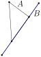
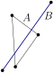
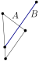
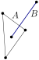
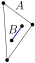
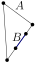

<!-- AUTO-GENERATED from doc/raw/shape_methods.md by doc/raw/doxylink.py — do not edit; edit the raw version and regenerate. -->


<picture>
  <source media="(prefers-color-scheme: dark)" srcset="figures/logotextdark.svg"/>
  
</picture>

[](https://github.com/gfonsecabr/pgl/actions/workflows/tests.yml)
[.svg)](https://en.wikipedia.org/wiki/C%2B%2B#Standardization)
[.svg)](https://opensource.org/licenses/MIT)
[.svg)](https://gfonsecabr.github.io/pgl/benchmarks/index.html)

<br/>

> ⚠️ **Work in Progress**: This library is still under construction and contains **bugs and missing features**. Use in production environments is not recommended.

## Methods Common to Most Shapes

### Predicates

Any two shapes `A`,`B` support the following [predicates](#predicates), where $\partial A$ denotes the manifold boundary of $A$. Notice that the boundary of a one-dimensional shape is defined as its endpoints (see also [shapes](shapes.md)).

| Predicate | Definition | Question |
| --------- | ---------- | --------- |
| `A.contains(B)` | $A \supseteq B$ | Does `A` contain `B`? |
| `A.boundaryContains(B)` | $\partial A \supseteq B$ | Does the boundary of `A` contain `B`? |
| `A.interiorContains(B)` | $(A \setminus \partial A) \supseteq B$ | Does the interior of `A` contain `B`? |
| `A.intersects(B)` | $A \cap B \neq \emptyset$ | Do `A` and `B` intersect? |
| `A.interiorsIntersect(B)` | $(A \setminus \partial A) \cap (B \setminus \partial B) \neq \emptyset$ | Do the interiors of `A` and `B` intersect? |
| `A.separates(B)` | $B \setminus A$ disconnected | Does the removal of `A` separate `B`? |
| `A.crosses(B)` | $A \setminus B$ and $B \setminus A$ disconnected | Does the removal of each of `A` and `B` separate the other? |

The following table illustrates the result of the predicates for a triangle and a line segment.

| Predicate |  |  |  |  |  |  |  |  |
| --- | --- | --- | --- | --- | --- | --- | --- | --- |
| `A.contains(B)`           | ❌ | ❌ | ❌ | ❌ | ❌ | ✅ | ✅ | ✅ |
| `B.contains(A)`           | ❌ | ❌ | ❌ | ❌ | ❌ | ❌ | ❌ | ❌ |
| `A.boundaryContains(B)`   | ❌ | ❌ | ❌ | ❌ | ❌ | ❌ | ❌ | ✅ |
| `B.boundaryContains(A)`   | ❌ | ❌ | ❌ | ❌ | ❌ | ❌ | ❌ | ❌ |
| `A.interiorContains(B)`   | ❌ | ❌ | ❌ | ❌ | ❌ | ❌ | ✅ | ❌ |
| `B.interiorContains(A)`   | ❌ | ❌ | ❌ | ❌ | ❌ | ❌ | ❌ | ❌ |
| `A.intersects(B)`         | ❌ | ✅ | ✅ | ✅ | ✅ | ✅ | ✅ | ✅ |
| `A.interiorsIntersect(B)` | ❌ | ❌ | ✅ | ✅ | ✅ | ✅ | ✅ | ❌ |
| `A.separates(B)`          | ❌ | ❌ | ✅ | ❌ | ❌ | ❌ | ❌ | ❌ |
| `B.separates(A)`          | ❌ | ❌ | ✅ | ✅ | ❌ | ❌ | ❌ | ❌ |
| `A.crosses(B)`            | ❌ | ❌ | ✅ | ❌ | ❌ | ❌ | ❌ | ❌ |

All predicates are calculated exactly for integers (except for possible overflows detailed in [types](types.md)).


### Operators

Shapes are translated by adding or subtracting a point. The point coordinates
are added to, or subtracted from, every defining point of the shape.

```c++
pgl::Point p = {2,3}, q = {4,5};
pgl::Segment s = {p, q},    //  s = (2,3)--(4,5)
             t1 = p + s,    // t1 = (4,6)--(6,8)
             t2 = s - p;    // t2 = (0,0)--(2,2)
```

In-place translations use `+=` and `-=`.
Scaling around the origin uses the operator `*` or `*=` with a scalar.

```c++
pgl::Segment s = {2, 3, 4, 5};    //  s = (2,3)--(4,5)
s += pgl::Point(1,2);             //  s = (3,5)--(5,7)
s *= 10;                          //  s = (30,50)--(50,70)
```

If we want to scale around a particular point `p`, we can use a combination of the previous operators:

```c++
pgl::Segment s = {2,3,4,5};   // s = (2,3)--(4,5)
pgl::Point p = s.midpoint();  // p = (3,4)
pgl::Segment t = 3*(s-p) + p; // t = (0,1)--(6,7)
```

### Transformations

`pgl::Transformation<Number>` stores a general affine map — a 2x2 linear part
plus a translation — as a 2x3 matrix. It is applied to a point or shape, and
composed with another transformation, with the same operator `*`, so
`t1 * t2 * shape` both composes and applies left to right (applying the
right-hand transformation first).

```c++
pgl::Segment s = {0,0,5,5};
auto t = pgl::Transformation<int>::rotation90(1) * pgl::Transformation<int>::translation(2,0);
auto rotated = t * s;
```

Factories cover the common exact cases: `identity()`, `translation(dx,dy)`,
`scaling(sx,sy=sx)`, `rotation90(k=1)` (exact multiples of 90 degrees),
`shearX(k)`, `shearY(k)`, `reflectionX()`, `reflectionY()`. An arbitrary-angle
`rotation<ResultNumber=double>(radians)` is also available but, unlike
`rotation90`, requires an explicit floating-point `ResultNumber` since a
general angle is generally irrational.

`determinant()` is negative exactly when the transformation reverses
orientation (a reflection, or an odd number of shears/reflections composed
together). Shapes with a winding or normalization invariant ([`Triangle`](https://gfonsecabr.github.io/pgl/structpgl_1_1Triangle.html "Closed triangle stored by three vertices."),
[`Convex`](https://gfonsecabr.github.io/pgl/structpgl_1_1Convex.html "Closed convex polygon stored by its vertices."), [`MonotoneChain`](https://gfonsecabr.github.io/pgl/structpgl_1_1MonotoneChain.html "Weakly x-monotone polyline stored by lexicographically sorted vertices."), [`Polygon`](https://gfonsecabr.github.io/pgl/structpgl_1_1Polygon.html "Closed simple polygon stored by its vertices.")) renormalize automatically through their
own constructors, and [`Halfplane`](https://gfonsecabr.github.io/pgl/structpgl_1_1Halfplane.html "Closed half-plane defined by an oriented boundary line.") swaps its source and target to keep the same
interior, mirroring the existing negative-scalar handling already used by
`scaledUpX`.

`inverse<ResultNumber = Number>()` returns the inverse transformation.
**Warning:** this divides by `determinant()`, so for an integral `Number` it
is inexact unless `ResultNumber` is a type such as `Rational<Number>` that
represents the division exactly.

[`Transformation`](https://gfonsecabr.github.io/pgl/structpgl_1_1Transformation.html "Affine transformation stored as a 2x3 matrix.") is applied to every shape except [`Rectangle`](https://gfonsecabr.github.io/pgl/structpgl_1_1Rectangle.html "Axis-aligned rectangle stored by minimum and maximum corners.") and [`Disk`](https://gfonsecabr.github.io/pgl/structpgl_1_1Disk.html "Closed Euclidean disk stored by boundary points plus optional disk label."): a
general affine map turns a rectangle into a parallelogram and a disk into an
ellipse, and neither class can represent that, so there is no such overload —
applying one is a compile error.

### Intersection

The intersection of any two shapes may be calculated as follows. Note that the intersection of any two shapes is always an [`std::optional`](https://en.cppreference.com/w/cpp/utility/optional.html) since the two shapes may not intersect. Since the intersection may have different types that depend on the two shapes, we sometimes use an
[`std::variant`](https://en.cppreference.com/w/cpp/utility/variant.html). For example, the intersection of two segments may be a point or a segment. Furthermore, some shapes such as simple polygons may have disconnected intersections. In such cases, an [`std::vector`](https://en.cppreference.com/w/cpp/container/vector.html) with several objects is returned.

```c++
pgl::Segment s = {0,0,5,5}, t = {0,3,5,3};
auto isec(s.intersection(t));
// The type of isec here is std::optional<std::variant<pgl::Point,pgl::Segment>>
pgl::Point p = std::get<0>(*isec);
// p = (3,3)
```

When the intersection can be represented as a [`Shape`](https://gfonsecabr.github.io/pgl/structpgl_1_1Shape.html "Runtime variant wrapper over the supported primitive shapes."), you can convert directly:

```c++
pgl::Segment s = {0,0,5,5}, t = {0,3,5,3};
pgl::Shape isec(s.intersection(t));
pgl::Point<> p(isec);
// p = (3,3)
```

### Other Methods for Shapes

- `rotated90(int k = 1)`: Returns the shape rotated by `90k` degrees around the
  origin.

- `rotate90(int k = 1)`: Rotates the shape by `90k` degrees around the origin.

- `scaledUpX(Number)`: Returns the shape with the x-coordinate multiplied by a
  number.

- `scaleUpX(Number)`: Multiplies the x-coordinate by a number.

- `scaledUpY(Number)`: Returns the shape with the y-coordinate multiplied by a
  number.

- `scaleUpY(Number)`: Multiplies the y-coordinate by a number.

- `scaledDownX(Number)`: Returns the shape with the x-coordinate divided by a
  number.

- `scaleDownX(Number)`: Divides the x-coordinate by a number.

- `scaledDownY(Number)`: Returns the shape with the y-coordinate divided by a
  number.

- `scaleDownY(Number)`: Divides the y-coordinate by a number.

- `squaredDistance<ResultNumber = NumberType>(Shape)`: Returns the squared
  distance, computed in `ResultNumber` (default: the shape's coordinate type),
  mirroring `intersection`. **Warning:** distances to a line, segment or ray
  divide by a squared length, so with an integer `ResultNumber` the result is
  truncated; request a floating-point or [`Rational`](https://gfonsecabr.github.io/pgl/classpgl_1_1Rational.html "Exact rational number class template.") type, e.g.
  `a.squaredDistance<double>(b)`, for an accurate value. Distances between
  points and between axis-aligned rectangles use no division and are exact.

- `squaredHausdorffDistance<ResultNumber = NumberType>(Shape)`: Returns the
  squared Hausdorff distance, with the same `ResultNumber` convention and
  truncation warning as `squaredDistance`. Defined for every pair among
  [`Point`](https://gfonsecabr.github.io/pgl/structpgl_1_1Point.html "Two-dimensional point with optional label payload."), [`Segment`](https://gfonsecabr.github.io/pgl/structpgl_1_1Segment.html "Unoriented closed segment between two endpoints plus optional segment label."), [`OrientedSegment`](https://gfonsecabr.github.io/pgl/structpgl_1_1OrientedSegment.html "Directed segment preserving source-to-target order plus optional segment label."), [`Rectangle`](https://gfonsecabr.github.io/pgl/structpgl_1_1Rectangle.html "Axis-aligned rectangle stored by minimum and maximum corners."), [`Triangle`](https://gfonsecabr.github.io/pgl/structpgl_1_1Triangle.html "Closed triangle stored by three vertices."), and [`Convex`](https://gfonsecabr.github.io/pgl/structpgl_1_1Convex.html "Closed convex polygon stored by its vertices.")
  — all bounded, convex shapes, so the directed distance in either direction
  is always attained at a vertex. Not defined for [`Line`](https://gfonsecabr.github.io/pgl/structpgl_1_1Line.html "Unoriented infinite line."), [`OrientedLine`](https://gfonsecabr.github.io/pgl/structpgl_1_1OrientedLine.html "Directed infinite line with left/right side semantics plus optional line label."),
  [`Ray`](https://gfonsecabr.github.io/pgl/structpgl_1_1Ray.html "Half-infinite line starting from one source point plus optional ray label."), or [`Halfplane`](https://gfonsecabr.github.io/pgl/structpgl_1_1Halfplane.html "Closed half-plane defined by an oriented boundary line.") (unbounded, so the Hausdorff distance to or from them
  is generally infinite), nor yet for [`Disk`](https://gfonsecabr.github.io/pgl/structpgl_1_1Disk.html "Closed Euclidean disk stored by boundary points plus optional disk label."), [`MonotoneChain`](https://gfonsecabr.github.io/pgl/structpgl_1_1MonotoneChain.html "Weakly x-monotone polyline stored by lexicographically sorted vertices."), or [`Polygon`](https://gfonsecabr.github.io/pgl/structpgl_1_1Polygon.html "Closed simple polygon stored by its vertices.").

- `distanceL1(Shape)` / `distanceLInf(Shape)`: Return the Manhattan (L1) or
  Chebyshev (LInf) distance to the given shape. Neither metric needs
  squaring to stay exact, so [`Point`](https://gfonsecabr.github.io/pgl/structpgl_1_1Point.html "Two-dimensional point with optional label payload.")-to-[`Point`](https://gfonsecabr.github.io/pgl/structpgl_1_1Point.html "Two-dimensional point with optional label payload.") returns an exact value with
  no `ResultNumber` template. Every other pair is
  `distanceL1<ResultNumber = NumberType>(Shape)` /
  `distanceLInf<ResultNumber = NumberType>(Shape)`, with the same
  `ResultNumber` convention and truncation warning as `squaredDistance` (a
  non-axis-aligned segment, ray, or line generally has a fractional exact
  distance). Defined for every pair among [`Point`](https://gfonsecabr.github.io/pgl/structpgl_1_1Point.html "Two-dimensional point with optional label payload."), [`Segment`](https://gfonsecabr.github.io/pgl/structpgl_1_1Segment.html "Unoriented closed segment between two endpoints plus optional segment label."),
  [`OrientedSegment`](https://gfonsecabr.github.io/pgl/structpgl_1_1OrientedSegment.html "Directed segment preserving source-to-target order plus optional segment label."), [`Line`](https://gfonsecabr.github.io/pgl/structpgl_1_1Line.html "Unoriented infinite line."), [`OrientedLine`](https://gfonsecabr.github.io/pgl/structpgl_1_1OrientedLine.html "Directed infinite line with left/right side semantics plus optional line label."), [`Ray`](https://gfonsecabr.github.io/pgl/structpgl_1_1Ray.html "Half-infinite line starting from one source point plus optional ray label."), [`Halfplane`](https://gfonsecabr.github.io/pgl/structpgl_1_1Halfplane.html "Closed half-plane defined by an oriented boundary line."), [`Rectangle`](https://gfonsecabr.github.io/pgl/structpgl_1_1Rectangle.html "Axis-aligned rectangle stored by minimum and maximum corners."),
  [`Triangle`](https://gfonsecabr.github.io/pgl/structpgl_1_1Triangle.html "Closed triangle stored by three vertices."), [`Convex`](https://gfonsecabr.github.io/pgl/structpgl_1_1Convex.html "Closed convex polygon stored by its vertices."), [`MonotoneChain`](https://gfonsecabr.github.io/pgl/structpgl_1_1MonotoneChain.html "Weakly x-monotone polyline stored by lexicographically sorted vertices."), and [`Polygon`](https://gfonsecabr.github.io/pgl/structpgl_1_1Polygon.html "Closed simple polygon stored by its vertices."), plus [`Disk`](https://gfonsecabr.github.io/pgl/structpgl_1_1Disk.html "Closed Euclidean disk stored by boundary points plus optional disk label.")-[`Point`](https://gfonsecabr.github.io/pgl/structpgl_1_1Point.html "Two-dimensional point with optional label payload."): like [`Disk`](https://gfonsecabr.github.io/pgl/structpgl_1_1Disk.html "Closed Euclidean disk stored by boundary points plus optional disk label.")'s
  other overloads this always returns `double`, since there is no closed
  form for the distance from a point to a circle under either metric and it
  is instead found with a numeric search. The remaining [`Disk`](https://gfonsecabr.github.io/pgl/structpgl_1_1Disk.html "Closed Euclidean disk stored by boundary points plus optional disk label.") pairs ([`Disk`](https://gfonsecabr.github.io/pgl/structpgl_1_1Disk.html "Closed Euclidean disk stored by boundary points plus optional disk label.")
  against any shape other than [`Point`](https://gfonsecabr.github.io/pgl/structpgl_1_1Point.html "Two-dimensional point with optional label payload."), and [`Disk`](https://gfonsecabr.github.io/pgl/structpgl_1_1Disk.html "Closed Euclidean disk stored by boundary points plus optional disk label.")-[`Disk`](https://gfonsecabr.github.io/pgl/structpgl_1_1Disk.html "Closed Euclidean disk stored by boundary points plus optional disk label.")) are not yet
  implemented — see [todo](todo.md).

- `hausdorffDistanceL1(Shape)` / `hausdorffDistanceLInf(Shape)`: Return the
  L1 or LInf Hausdorff distance, with the same `ResultNumber` convention as
  `distanceL1` / `distanceLInf`. Defined for the same pairs as
  `squaredHausdorffDistance`: [`Point`](https://gfonsecabr.github.io/pgl/structpgl_1_1Point.html "Two-dimensional point with optional label payload."), [`Segment`](https://gfonsecabr.github.io/pgl/structpgl_1_1Segment.html "Unoriented closed segment between two endpoints plus optional segment label."), [`OrientedSegment`](https://gfonsecabr.github.io/pgl/structpgl_1_1OrientedSegment.html "Directed segment preserving source-to-target order plus optional segment label."),
  [`Rectangle`](https://gfonsecabr.github.io/pgl/structpgl_1_1Rectangle.html "Axis-aligned rectangle stored by minimum and maximum corners."), [`Triangle`](https://gfonsecabr.github.io/pgl/structpgl_1_1Triangle.html "Closed triangle stored by three vertices."), and [`Convex`](https://gfonsecabr.github.io/pgl/structpgl_1_1Convex.html "Closed convex polygon stored by its vertices.").

- `bbox()`: Returns the minimum bounding box of the shape.

- `fbox<T>()`: Returns a bounding box of the shape using floating point coordinates of type `T`. The bounding box may not be minimum but must contain the entire shape. The `min` coordinates are rounded down and the `max` are rounded up to the nearest floating point. If `!s1.fbox().intersects(s2.fbox()))` then `!s1.bbox().intersects(s2.bbox()))`. Also, if `s1.fbox().crosses(s2.fbox()))` then `s1.bbox().crosses(s2.bbox()))`.

- `area()`: Returns the area.

- `twiceArea()`: Returns two times the area.

- `diameter()`: Returns a segment that defines the diameter.

- `pointInside()`: Returns a point strictly in the interior of the shape. Uses
  only division by a power of 2.

- `pointInsideInteriorContainedIn(other)`: Returns true if some point in this
  shape's relative interior lies in the strict interior of the argument `other`.
  It uses the `pointInside()` witness, scaling both shapes to keep the witness
  exact when integer truncation would round it onto the boundary.

- `verticesContain(p)`: Returns true if there exists a value `i` such that `s[i] == p` for the shape `s`. Notice that two shapes (for example lines) may be equal (according to `==`) but still behave differently for verticesContain if they are defined by different points.

## Iterating

There are several methods to iterate through vertices, edges, or oriented
edges. An [`std::array`](https://en.cppreference.com/w/cpp/container/array.html)
is used for shapes of constant size and an
[`std::vector`](https://en.cppreference.com/w/cpp/container/vector.html) is
used otherwise.

- `vertices()`: Returns an `std::array` or an `std::vector` of [`Point`](https://gfonsecabr.github.io/pgl/structpgl_1_1Point.html "Two-dimensional point with optional label payload.") that are
  the vertices. 

- `edges()`: Returns an `std::array` or an `std::vector` of [`Segment`](https://gfonsecabr.github.io/pgl/structpgl_1_1Segment.html "Unoriented closed segment between two endpoints plus optional segment label.") that are
  the edges.

- `orientedEdges()`: Returns an `std::array` or an `std::vector` of
  [`OrientedSegment`](https://gfonsecabr.github.io/pgl/structpgl_1_1OrientedSegment.html "Directed segment preserving source-to-target order plus optional segment label.") that are the edges in counterclockwise order. Not defined
  for [`Disk`](https://gfonsecabr.github.io/pgl/structpgl_1_1Disk.html "Closed Euclidean disk stored by boundary points plus optional disk label.").

- `begin()`, `end()`, `edgesBegin()`, `edgesEnd()`, `orientedEdgesBegin()`,
  `orientedEdgesEnd()`: Same as `vertices()`, `edges()`, and
  `orientedEdges()` above, but for iterators that take `O(1)` time per element
  visited.

### Indexed access

Every shape exposes a uniform indexed-access interface over its defining
points (or, for [`Point`](https://gfonsecabr.github.io/pgl/structpgl_1_1Point.html "Two-dimensional point with optional label payload."), its two coordinates):

- `size()`: Returns the number of indexable elements.

- `s[i]`: Returns the `i`-th element.

- `s.get(i)`: Same as `s[i]` but `i` is taken modulo `s.size()`, so negative
  values wrap from the end.

- `s.index(p)`: Returns the smallest index `i` such that `s[i] == p`, or -1
  if no such index exists.

```c++
pgl::Convex c({{0,0},{4,0},{4,3},{0,3}});
c[2];           // (4,3)
c.get(-1);      // (0,3) same as c[3]
c.get(5);       // (4,0) same as c[1]
c.index({4,3}); // 2 since c[2] == {4,3}
```


The runtime [`Shape`](https://gfonsecabr.github.io/pgl/structpgl_1_1Shape.html "Runtime variant wrapper over the supported primitive shapes.") wrapper exposes `size()`, `operator[]`, and `get()` that
dispatch to the wrapped alternative. Because [`Point`](https://gfonsecabr.github.io/pgl/structpgl_1_1Point.html "Two-dimensional point with optional label payload.")'s
indexed access yields a coordinate rather than a [`Point`](https://gfonsecabr.github.io/pgl/structpgl_1_1Point.html "Two-dimensional point with optional label payload."), `Shape::operator[]`
and `Shape::get` throw `std::logic_error` if the wrapped value is a [`Point`](https://gfonsecabr.github.io/pgl/structpgl_1_1Point.html "Two-dimensional point with optional label payload.").


