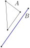
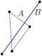
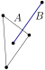
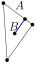
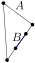

<!-- AUTO-GENERATED from doc/raw/shape_methods.md by doc/raw/doxylink.py — do not edit; edit the raw version and regenerate. -->


<picture>
  <source media="(prefers-color-scheme: dark)" srcset="figures/logotextdark.svg"/>
  
</picture>

[](https://github.com/gfonsecabr/pgl/actions/workflows/tests.yml)
[.svg)](https://en.wikipedia.org/wiki/C%2B%2B#Standardization)
[.svg)](https://opensource.org/licenses/MIT)
[.svg)](https://gfonsecabr.github.io/pgl/benchmarks/index.html)

<br/>

> ⚠️ **Work in Progress**: This library is still under construction and contains **bugs and missing features**. Use in production environments is not recommended.

## Methods Common to Most Shapes

### Predicates

Any two shapes `A`,`B` support the following [predicates](#predicates), where $\partial A$ denotes the manifold boundary of $A$. Notice that the boundary of a one-dimensional shape is defined as its endpoints (see also [shapes](shapes.md)).

| Predicate | Definition | Question |
| --------- | ---------- | --------- |
| `A.contains(B)` | $A \supseteq B$ | Does `A` contain `B`? |
| `A.boundaryContains(B)` | $\partial A \supseteq B$ | Does the boundary of `A` contain `B`? |
| `A.interiorContains(B)` | $(A \setminus \partial A) \supseteq B$ | Does the interior of `A` contain `B`? |
| `A.intersects(B)` | $A \cap B \neq \emptyset$ | Do `A` and `B` intersect? |
| `A.interiorsIntersect(B)` | $(A \setminus \partial A) \cap (B \setminus \partial B) \neq \emptyset$ | Do the interiors of `A` and `B` intersect? |
| `A.separates(B)` | $B \setminus A$ disconnected | Does the removal of `A` separate `B`? |
| `A.crosses(B)` | $A \setminus B$ and $B \setminus A$ disconnected | Does the removal of each of `A` and `B` separate the other? |

The following table illustrates the result of the predicates for a triangle and a line segment.

| Predicate |  |  |  |  |  |  |  |  |
| --- | --- | --- | --- | --- | --- | --- | --- | --- |
| `A.contains(B)`           | ❌ | ❌ | ❌ | ❌ | ❌ | ✅ | ✅ | ✅ |
| `B.contains(A)`           | ❌ | ❌ | ❌ | ❌ | ❌ | ❌ | ❌ | ❌ |
| `A.boundaryContains(B)`   | ❌ | ❌ | ❌ | ❌ | ❌ | ❌ | ❌ | ✅ |
| `B.boundaryContains(A)`   | ❌ | ❌ | ❌ | ❌ | ❌ | ❌ | ❌ | ❌ |
| `A.interiorContains(B)`   | ❌ | ❌ | ❌ | ❌ | ❌ | ❌ | ✅ | ❌ |
| `B.interiorContains(A)`   | ❌ | ❌ | ❌ | ❌ | ❌ | ❌ | ❌ | ❌ |
| `A.intersects(B)`         | ❌ | ✅ | ✅ | ✅ | ✅ | ✅ | ✅ | ✅ |
| `A.interiorsIntersect(B)` | ❌ | ❌ | ✅ | ✅ | ✅ | ✅ | ✅ | ❌ |
| `A.separates(B)`          | ❌ | ❌ | ✅ | ❌ | ❌ | ❌ | ❌ | ❌ |
| `B.separates(A)`          | ❌ | ❌ | ✅ | ✅ | ❌ | ❌ | ❌ | ❌ |
| `A.crosses(B)`            | ❌ | ❌ | ✅ | ❌ | ❌ | ❌ | ❌ | ❌ |

All predicates are calculated exactly for integers (except for possible overflows detailed in [types](types.md)).


### Operators

Shapes are translated by adding or subtracting a point. The point coordinates
are added to, or subtracted from, every defining point of the shape.

```c++
pgl::Point p = {2,3}, q = {4,5};
pgl::Segment s = {p, q},    //  s = (2,3)--(4,5)
             t1 = p + s,    // t1 = (4,6)--(6,8)
             t2 = s - p;    // t2 = (0,0)--(2,2)
```

Adding a point is the special case of adding two shapes, which is their
[Minkowski sum](#minkowski-sum).

In-place translations use `+=` and `-=`.
Scaling around the origin uses the operator `*` or `*=` with a scalar.

```c++
pgl::Segment s = {2, 3, 4, 5};    //  s = (2,3)--(4,5)
s += pgl::Point(1,2);             //  s = (3,5)--(5,7)
s *= 10;                          //  s = (30,50)--(50,70)
```

If we want to scale around a particular point `p`, we can use a combination of the previous operators:

```c++
pgl::Segment s = {2,3,4,5};   // s = (2,3)--(4,5)
auto exactMidpoint = s.midpoint(); // Point<ERational>(3,4) by default
pgl::Point p = s.midpoint<int>();  // safe here because this midpoint is integral
pgl::Segment t = 3*(s-p) + p; // t = (0,1)--(6,7)
```

### Transformations

`pgl::Transformation<Number>` stores a general affine map — a 2x2 linear part
plus a translation — as a 2x3 matrix. It is applied to a point or shape, and
composed with another transformation, with the same operator `*`, so
`t1 * t2 * shape` both composes and applies left to right (applying the
right-hand transformation first).

```c++
pgl::Segment s = {0,0,5,5};
auto t = pgl::Transformation<int>::rotation90(1) * pgl::Transformation<int>::translation(2,0);
auto rotated = t * s;
```

Factories cover the common exact cases: `identity()`, `translation(dx,dy)`, `scaling(sx,sy=sx)`, `rotation90(k=1)` (exact multiples of 90 degrees), `shearX(k)`, `shearY(k)`, `reflectionX()`, `reflectionY()`. An arbitrary-angle `rotation<ResultNumber=double>(radians)` is also available but, unlike `rotation90`, returns a floating-point transformation since a general angle is generally irrational. The default is `double`; an explicitly requested result type must also be floating-point.

`determinant()` is negative exactly when the transformation reverses
orientation (a reflection, or an odd number of shears/reflections composed
together). Shapes with a winding or normalization invariant ([`Triangle`](https://gfonsecabr.github.io/pgl/structpgl_1_1Triangle.html "Closed triangle stored by three vertices."),
[`Convex`](https://gfonsecabr.github.io/pgl/structpgl_1_1Convex.html "Closed convex polygon stored by its vertices."), [`MonotoneChain`](https://gfonsecabr.github.io/pgl/structpgl_1_1MonotoneChain.html "Weakly x-monotone polyline stored by lexicographically sorted vertices."), [`Polygon`](https://gfonsecabr.github.io/pgl/structpgl_1_1Polygon.html "Closed simple polygon stored by its vertices.")) renormalize automatically through their
own constructors, and [`Halfplane`](https://gfonsecabr.github.io/pgl/structpgl_1_1Halfplane.html "Closed half-plane defined by an oriented boundary line.") swaps its source and target to keep the same
interior, mirroring the existing negative-scalar handling already used by
`scaledUpX`.

`inverse<ResultNumber>()` returns the inverse transformation. Integral transformations therefore return an exact `Transformation<ERational>` by default; floating-point and rational matrix types retain their own number type. An explicitly requested integral `ResultNumber` can still truncate the division by `determinant()`.

[`Transformation`](https://gfonsecabr.github.io/pgl/structpgl_1_1Transformation.html "Affine transformation stored as a 2x3 matrix.") is applied to every shape except [`Rectangle`](https://gfonsecabr.github.io/pgl/structpgl_1_1Rectangle.html "Axis-aligned rectangle stored by minimum and maximum corners.") and [`Disk`](https://gfonsecabr.github.io/pgl/structpgl_1_1Disk.html "Closed Euclidean disk stored by boundary points plus optional disk label."): a
general affine map turns a rectangle into a parallelogram and a disk into an
ellipse, and neither class can represent that, so there is no such overload —
applying one is a compile error.

### Intersection

The intersection of any two shapes may be calculated as follows. Note that the intersection of any two shapes is always an [`std::optional`](https://en.cppreference.com/w/cpp/utility/optional.html) since the two shapes may not intersect. Since the intersection may have different types that depend on the two shapes, we sometimes use an
[`std::variant`](https://en.cppreference.com/w/cpp/utility/variant.html). For example, the intersection of two segments may be a point or a segment. Furthermore, some shapes such as simple polygons may have disconnected intersections. In such cases, an [`std::vector`](https://en.cppreference.com/w/cpp/container/vector.html) with several objects is returned.

```c++
pgl::Segment s = {0,0,5,5}, t = {0,3,5,3};
auto isec(s.intersection(t));
// The type is std::optional<std::variant<pgl::EPoint,pgl::ESegment>>:
// an integral receiver widens a construction that may divide to ERational.
pgl::EPoint p = std::get<0>(*isec);
// p = (3,3)
```

For visualization, a [Canvas](canvas.md) accepts these optional and variant
results directly; an empty intersection simply draws nothing. It also accepts
ranges of such results, which is convenient for disconnected intersections.

When the intersection can be represented as a [`Shape`](https://gfonsecabr.github.io/pgl/structpgl_1_1Shape.html "Runtime variant wrapper over the supported primitive shapes."), you can convert directly:

```c++
pgl::Segment s = {0,0,5,5}, t = {0,3,5,3};
pgl::EShape isec(s.intersection(t));
pgl::EPoint p(isec);
// p = (3,3)
```

A region clips a one-dimensional operand — a point, a segment, a line, a ray, a
polyline, a monotone chain — exactly as a polygon does, into the pieces the two
share, holes taken out and every ring kept:

```c++
pgl::Polygon<> hole({3,3, 7,3, 7,7, 3,7});
pgl::PolygonWithHoles<> annulus(square, std::vector{hole});
auto pieces = annulus.intersection(pgl::Segment(-5,5, 15,5));
// pieces == { Segment(0,5, 3,5), Segment(7,5, 10,5) } — the hole is out
```

[`PolygonWithHoles`](https://gfonsecabr.github.io/pgl/structpgl_1_1PolygonWithHoles.html "Closed region bounded by one outer simple polygon minus disjoint polygonal holes.") also carries a second `intersection` alongside this one, for
operands with area, returning regions rather than polygons, because it is the one
shape whose intersections can have holes; [`PolygonSet`](https://gfonsecabr.github.io/pgl/structpgl_1_1PolygonSet.html "Set of closed regions with pairwise disjoint interiors.") carries the same one. See
[Boolean Operations](#boolean-operations).

### Boolean Operations

The four boolean set operations on shapes with area all return a
[`PolygonSet`](shapes.md#polygon-set):

| call | result |
|---|---|
| `a.difference(b)` | $A \setminus B$, the part of `a` that `b` does not cover |
| `a.unionWith(b)` | $A \cup B$, the part either covers |
| `a.symmetricDifference(b)` | $A \mathbin{\triangle} B$, the part exactly one covers |
| `a.intersection(b)` | $A \cap B$, the part both cover — on [`PolygonWithHoles`](https://gfonsecabr.github.io/pgl/structpgl_1_1PolygonWithHoles.html "Closed region bounded by one outer simple polygon minus disjoint polygonal holes.") and [`PolygonSet`](https://gfonsecabr.github.io/pgl/structpgl_1_1PolygonSet.html "Set of closed regions with pairwise disjoint interiors.") only, see below |

The six shapes these operate on are [`Rectangle`](https://gfonsecabr.github.io/pgl/structpgl_1_1Rectangle.html "Axis-aligned rectangle stored by minimum and maximum corners."), [`Triangle`](https://gfonsecabr.github.io/pgl/structpgl_1_1Triangle.html "Closed triangle stored by three vertices."), [`Convex`](https://gfonsecabr.github.io/pgl/structpgl_1_1Convex.html "Closed convex polygon stored by its vertices."),
[`Polygon`](https://gfonsecabr.github.io/pgl/structpgl_1_1Polygon.html "Closed simple polygon stored by its vertices."), [`PolygonWithHoles`](https://gfonsecabr.github.io/pgl/structpgl_1_1PolygonWithHoles.html "Closed region bounded by one outer simple polygon minus disjoint polygonal holes.") and [`PolygonSet`](https://gfonsecabr.github.io/pgl/structpgl_1_1PolygonSet.html "Set of closed regions with pairwise disjoint interiors."): exactly the bounded shapes with
area, and exactly the ones a [`PolygonSet`](https://gfonsecabr.github.io/pgl/structpgl_1_1PolygonSet.html "Set of closed regions with pairwise disjoint interiors.") can always represent. The union is a
keyword in C++, hence `unionWith`.

`unionWith` is defined for **every ordered pair** of those six, since a union of
two of them is again one of them — a set of regions — however they lie. No other
pair has a union a [`PolygonSet`](https://gfonsecabr.github.io/pgl/structpgl_1_1PolygonSet.html "Set of closed regions with pairwise disjoint interiors.") can hold: a [`Point`](https://gfonsecabr.github.io/pgl/structpgl_1_1Point.html "Two-dimensional point with optional label payload."), a [`Segment`](https://gfonsecabr.github.io/pgl/structpgl_1_1Segment.html "Unoriented closed segment between two endpoints plus optional segment label."), a [`Polyline`](https://gfonsecabr.github.io/pgl/structpgl_1_1Polyline.html "Open polygonal chain stored in traversal order; may self-intersect.")
and a [`MonotoneChain`](https://gfonsecabr.github.io/pgl/structpgl_1_1MonotoneChain.html "Weakly x-monotone polyline stored by lexicographically sorted vertices.") leave a dangling piece with no area, a [`Halfplane`](https://gfonsecabr.github.io/pgl/structpgl_1_1Halfplane.html "Closed half-plane defined by an oriented boundary line."), a
[`Line`](https://gfonsecabr.github.io/pgl/structpgl_1_1Line.html "Unoriented infinite line."), a [`Ray`](https://gfonsecabr.github.io/pgl/structpgl_1_1Ray.html "Half-infinite line starting from one source point plus optional ray label.") and a [`HalfplaneIntersection`](https://gfonsecabr.github.io/pgl/structpgl_1_1HalfplaneIntersection.html "Intersection of closed half-planes; convex but possibly unbounded or empty.") may be unbounded, and a [`Disk`](https://gfonsecabr.github.io/pgl/structpgl_1_1Disk.html "Closed Euclidean disk stored by boundary points plus optional disk label.") is
round. The runtime [`Shape`](shapes.md#shape) wrapper offers `unionWith` over
that same grid, deciding at run time and throwing `std::logic_error` for the
pairs it does not cover. `difference` and `symmetricDifference` are narrower for now: they are
defined on [`Polygon`](https://gfonsecabr.github.io/pgl/structpgl_1_1Polygon.html "Closed simple polygon stored by its vertices."), [`PolygonWithHoles`](https://gfonsecabr.github.io/pgl/structpgl_1_1PolygonWithHoles.html "Closed region bounded by one outer simple polygon minus disjoint polygonal holes.") and [`PolygonSet`](https://gfonsecabr.github.io/pgl/structpgl_1_1PolygonSet.html "Set of closed regions with pairwise disjoint interiors.") receivers, against any
of the six, with [`PolygonSet`](https://gfonsecabr.github.io/pgl/structpgl_1_1PolygonSet.html "Set of closed regions with pairwise disjoint interiors.") as an operand only on a [`PolygonSet`](https://gfonsecabr.github.io/pgl/structpgl_1_1PolygonSet.html "Set of closed regions with pairwise disjoint interiors.") receiver.

That last operand is what makes the family **closed**: the result of an
operation is a shape the operations take, so it can be fed straight back in
rather than looped over by the caller.

```c++
pgl::Polygon<> square({0,0, 10,0, 10,10, 0,10});
auto holed  = square.difference(pgl::Rectangle(3,3,7,7));   // a PolygonSet
auto again  = holed.difference(pgl::Rectangle(0,0,2,2));    // and again
auto merged = again.unionWith(holed);                       // set against set
```

Three of the four are symmetric in their operands, and may be written in either
order. Each unordered pair is implemented once, on the higher-ranked of its two
operands, and the lower-ranked receiver forwards to it — so
`triangle.unionWith(polygon)` and `polygon.unionWith(triangle)` are the same
call, and `rectangle.unionWith(triangle)` is `triangle.unionWith(rectangle)`.
A [`Convex`](https://gfonsecabr.github.io/pgl/structpgl_1_1Convex.html "Closed convex polygon stored by its vertices."), [`Triangle`](https://gfonsecabr.github.io/pgl/structpgl_1_1Triangle.html "Closed triangle stored by three vertices.") or [`Rectangle`](https://gfonsecabr.github.io/pgl/structpgl_1_1Rectangle.html "Axis-aligned rectangle stored by minimum and maximum corners.") receiver reaches `symmetricDifference` and
`intersection` the same way, but only for operands above it, which is why those
two stop short of the full grid `unionWith` covers. `difference` is not
symmetric and forwards nowhere: it stays on the receivers above.

```c++
pgl::Polygon<> square({0,0, 10,0, 10,10, 0,10});
auto pieces = square.difference(pgl::Rectangle(3,3,7,7));
// pieces.componentCount() == 1, one region whose outer ring is the square
// and whose single hole is the rectangle
```

This is the family [`PolygonWithHoles`](https://gfonsecabr.github.io/pgl/structpgl_1_1PolygonWithHoles.html "Closed region bounded by one outer simple polygon minus disjoint polygonal holes.") exists for: removing a shape from the
middle of another one leaves a hole, and no other shape can say so. A union
creates one out of nothing just as readily — a `U` united with the bar that caps
it encloses a hole neither operand has — and a symmetric difference, being the
union of two differences, inherits holes from both.

Every one of them returns the **regularized** result, the closure of the
operation applied to the *interiors*: $\mathrm{closure}(A^\circ \setminus B)$,
$\mathrm{closure}(A^\circ \cup B^\circ)$, and so on. Lower-dimensional leftovers
are dropped — a stretch of boundary the operands share without either covering
it, an isolated contact point, and a slit, which has no area to begin with.
Without that, the answer would not be a set of regions at all. It also means
material with no area never *joins* anything: two shapes meeting at a single
point come back as two pieces, since a region may not have a self-touching outer
ring.

The components have pairwise disjoint interiors, share no stretch of edge, and
their union is the result — which is exactly the [`PolygonSet`](https://gfonsecabr.github.io/pgl/structpgl_1_1PolygonSet.html "Set of closed regions with pairwise disjoint interiors.") contract, so the
engine's own output is a valid set by construction. They are **not** nested: an
island stranded inside a hole of the result comes back as a component of its
own.

A [`PolygonWithHoles`](https://gfonsecabr.github.io/pgl/structpgl_1_1PolygonWithHoles.html "Closed region bounded by one outer simple polygon minus disjoint polygonal holes.") written by hand can carry a slit of its own, and
`A.regularized()` is that same regularization offered on its own: it returns
$\mathrm{closure}(A^\circ)$, which is `A` without its slits, again as a
[`PolygonSet`](https://gfonsecabr.github.io/pgl/structpgl_1_1PolygonSet.html "Set of closed regions with pairwise disjoint interiors.").
`A.isRegular()` says whether there were any. Both are described with the
[region](shapes.md#polygon-with-holes) itself. Note that this makes `A.unionWith(A)`
*not* `A` but `A.regularized()`: idempotence holds up to regularization and no
further.

The boundaries can cross at non-integral points, so all four take the usual `ResultNumber` parameter. Integral receivers return ERational regions by default; an explicit override such as `a.difference<int>(b)` requests conversion back to the lattice. The arrangement itself is always built over exact rationals and converted only at the end, so an explicitly integral result type is exact whenever the crossings are integral.

#### Why `intersection` is different

`intersection` appears twice in the library, and the two are not the same
method. The general one, described [above](#intersection), is defined for every
pair of shapes and returns polygons, polylines and points through an
`std::optional` and an `std::variant`. The region-valued one described here
exists **only on [`PolygonWithHoles`](https://gfonsecabr.github.io/pgl/structpgl_1_1PolygonWithHoles.html "Closed region bounded by one outer simple polygon minus disjoint polygonal holes.")**.

That is not an oversight. No component of the intersection of two *polygons* can
have a hole: a closed curve inside a closed set with a connected complement
bounds a disk inside it, so a curve in $A \cap B$ bounds a disk in each operand
and hence in the intersection. Every shape in the library has a connected
complement — except a region with holes, whose hole interiors are components of
their own. So `Polygon::intersection` loses nothing by returning plain polygons,
and a region's intersection genuinely needs a region:

```c++
pgl::Polygon<> hole({4,4, 8,4, 8,8, 4,8});
pgl::PolygonWithHoles<> annulus(square, std::vector{hole});
auto pieces = annulus.intersection(pgl::Rectangle(-5,-5, 20,20));
// pieces.size() == 1, and pieces[0] == annulus — hole and all
```

Which of the two answers a call is decided by the operands, not by the receiver.
The region-valued one takes over as soon as **both** operands have area: a
[`PolygonWithHoles`](https://gfonsecabr.github.io/pgl/structpgl_1_1PolygonWithHoles.html "Closed region bounded by one outer simple polygon minus disjoint polygonal holes.") operand pulls it in whichever side it is written on, so
`polygon.intersection(region)` forwards to `region.intersection(polygon)` and
gives back regions rather than components. The same goes for a [`Halfplane`](https://gfonsecabr.github.io/pgl/structpgl_1_1Halfplane.html "Closed half-plane defined by an oriented boundary line.") or a
[`HalfplaneIntersection`](https://gfonsecabr.github.io/pgl/structpgl_1_1HalfplaneIntersection.html "Intersection of closed half-planes; convex but possibly unbounded or empty.") operand — `region.intersection(h)` and
`h.intersection(region)` are the same regions — even though each of those
shapes' own `intersection` against a [`Polygon`](https://gfonsecabr.github.io/pgl/structpgl_1_1Polygon.html "Closed simple polygon stored by its vertices.") is the general, component-valued
one. Being unbounded is no obstacle: a region is bounded, so `h` is clipped to
its bounding rectangle first, which changes nothing, and a half-plane is handled
as the one-constraint half-plane intersection it is. This is the only boolean
operation that takes an unbounded operand; `difference`, `unionWith` and
`symmetricDifference` would give back an unbounded answer and do not accept one.

A one-dimensional operand gets the general one instead, on either side, since it
is the only one there is: `closure(A° ∩ B°)` is empty for everything without
area, so the regularized answer would always be nothing.
`region.intersection(segment)` therefore returns the point-and-segment pieces
shown [above](#intersection), the same ones `polygon.intersection(segment)`
returns.

One further difference is worth knowing: `Polygon::intersection` computes each crossing directly in the result type, so an explicitly integral type can alter the reported geometry. The region operations instead build the arrangement in exact rationals and only convert the finished vertices to the requested type.

### Minkowski Sum

The Minkowski sum of two shapes is the set of all sums of a point of the first
and a point of the second, $A \oplus B = \\{a + b : a \in A, b \in B\\}$. It is
written `a.minkowskiSum(b)`, or `a + b`.

```c++
pgl::Segment s = {0,0,2,0}, t = {0,0,0,3};
pgl::Convex box = s + t;
// box = Convex[(0,0),(2,0),(2,3),(0,3)]
```

Adding a [`Point`](https://gfonsecabr.github.io/pgl/structpgl_1_1Point.html "Two-dimensional point with optional label payload.") is a translation, so it returns the other operand's own type
and is defined for every shape — that is the reading `shape + point` has always
had. Two bounded convex shapes ([`Point`](https://gfonsecabr.github.io/pgl/structpgl_1_1Point.html "Two-dimensional point with optional label payload."), [`Segment`](https://gfonsecabr.github.io/pgl/structpgl_1_1Segment.html "Unoriented closed segment between two endpoints plus optional segment label."), [`OrientedSegment`](https://gfonsecabr.github.io/pgl/structpgl_1_1OrientedSegment.html "Directed segment preserving source-to-target order plus optional segment label."),
[`Rectangle`](https://gfonsecabr.github.io/pgl/structpgl_1_1Rectangle.html "Axis-aligned rectangle stored by minimum and maximum corners."), [`Triangle`](https://gfonsecabr.github.io/pgl/structpgl_1_1Triangle.html "Closed triangle stored by three vertices."), [`Convex`](https://gfonsecabr.github.io/pgl/structpgl_1_1Convex.html "Closed convex polygon stored by its vertices.")) sum to a [`Convex`](https://gfonsecabr.github.io/pgl/structpgl_1_1Convex.html "Closed convex polygon stored by its vertices."), computed in linear time by
merging the two boundaries' edge directions. Two rectangles are the one
non-trivial pair closed under the sum and give back a [`Rectangle`](https://gfonsecabr.github.io/pgl/structpgl_1_1Rectangle.html "Axis-aligned rectangle stored by minimum and maximum corners.").

```c++
pgl::Triangle t = {0,0,3,0,0,3};
pgl::Convex hexagon = t + pgl::Triangle(0,0,-1,0,0,-1);   // 6 vertices
pgl::Rectangle r = pgl::Rectangle(1,2,4,6) + pgl::Rectangle(-1,0,2,1);
// r = (0,2)--(6,7)
```

Every vertex of the result is a sum of two input vertices, so the construction
is exact: integer coordinates in, integer coordinates out. A result that drops
below two dimensions is reported the usual way, through the returned [`Convex`](https://gfonsecabr.github.io/pgl/structpgl_1_1Convex.html "Closed convex polygon stored by its vertices."):
summing two parallel segments gives a [`Convex`](https://gfonsecabr.github.io/pgl/structpgl_1_1Convex.html "Closed convex polygon stored by its vertices.") satisfying `isSegment()`. The
empty shape absorbs, and an empty [`Convex`](https://gfonsecabr.github.io/pgl/structpgl_1_1Convex.html "Closed convex polygon stored by its vertices.") operand gives an empty [`Convex`](https://gfonsecabr.github.io/pgl/structpgl_1_1Convex.html "Closed convex polygon stored by its vertices.").

Three more families stay in a single shape, none of them
bounded-convex-with-bounded-convex.

A **[`Halfplane`](https://gfonsecabr.github.io/pgl/structpgl_1_1Halfplane.html "Closed half-plane defined by an oriented boundary line.") absorbs anything bounded** and comes back a half-plane. With the
boundary running from $s$ to $t$ and $d = t - s$, the half-plane is
$\{p : \mathrm{cross}(d, p - s) \ge 0\}$, and the sum is that same half-plane
translated to its operand's support point — the operand vertex minimising
$\mathrm{cross}(d, q)$. A linear function on a bounded polygonal shape is
extremal at a vertex whether or not the shape is convex, so this works for a
[`Polygon`](https://gfonsecabr.github.io/pgl/structpgl_1_1Polygon.html "Closed simple polygon stored by its vertices."), a [`Polyline`](https://gfonsecabr.github.io/pgl/structpgl_1_1Polyline.html "Open polygonal chain stored in traversal order; may self-intersect."), a region and a set exactly as it does for a [`Triangle`](https://gfonsecabr.github.io/pgl/structpgl_1_1Triangle.html "Closed triangle stored by three vertices."),
and it is exact: one input vertex added to each boundary point.

```c++
pgl::Halfplane up = {0,0, 1,0};                       // y >= 0
up.minkowskiSum(pgl::Rectangle(2,3, 5,7));            // y >= 3
up.minkowskiSum(pgl::Polygon({0,0, 6,0, 6,6, 4,6, 4,2, 2,2, 2,6, 0,6}));  // y >= 0
```

A [`Disk`](https://gfonsecabr.github.io/pgl/structpgl_1_1Disk.html "Closed Euclidean disk stored by boundary points plus optional disk label.") is the other, and the one curved sum the library can answer: **two disks
sum to a disk**, centre plus centre and radius plus radius. It is the one sum
that cannot be exact by default — a disk stores three boundary points, so each
radius is a square root of a stored quantity — and it therefore carries a
`ResultNumber` of its own, defaulting to `double` as `radius` and `distance` do.
A disk *built from a centre and a radius* carries both exactly, so a sum of two
of those with an exact result type is exact and takes no square root at all.

```c++
pgl::Disk a(pgl::Point(0,0), 3), b(pgl::Point(4,1), 2);
a.minkowskiSum(b);                     // centre (4,1), radius 5, as double
a.minkowskiSum<pgl::ERational>(b);     // exact: both operands carry their radius
```

Nothing else a disk meets has a representable sum — a disk and a segment sweep a
stadium, a disk and a polygon a rounded one.

#### Unbounded convex operands

The remaining unbounded operands — [`Halfplane`](https://gfonsecabr.github.io/pgl/structpgl_1_1Halfplane.html "Closed half-plane defined by an oriented boundary line."), [`Line`](https://gfonsecabr.github.io/pgl/structpgl_1_1Line.html "Unoriented infinite line."), [`OrientedLine`](https://gfonsecabr.github.io/pgl/structpgl_1_1OrientedLine.html "Directed infinite line with left/right side semantics plus optional line label."), [`Ray`](https://gfonsecabr.github.io/pgl/structpgl_1_1Ray.html "Half-infinite line starting from one source point plus optional ray label.")
and [`HalfplaneIntersection`](https://gfonsecabr.github.io/pgl/structpgl_1_1HalfplaneIntersection.html "Intersection of closed half-planes; convex but possibly unbounded or empty.") — are each an intersection of finitely many closed
half-planes, and so is the sum of two of them: **the sum of two convex polyhedra
is a convex polyhedron**. Those pairs therefore return a
[`HalfplaneIntersection`](shapes.md#halfplane-intersection), whichever of them is
on either side, and so does one of them against a bounded **convex** shape.

```c++
pgl::Line l = {0,0, 1,0};                             // the x axis
l.minkowskiSum(pgl::Triangle(0,0, 3,0, 0,2));         // the slab 0 <= y <= 2
l.minkowskiSum(pgl::Segment(0,0, 5,0));               // still the x axis

pgl::Ray r = {0,0, 1,0};                              // east from the origin
r.minkowskiSum(pgl::Ray(0,0, 0,1));                   // the quadrant x,y >= 0
r.minkowskiSum(pgl::Segment(0,0, 0,2));               // the half-strip x >= 0, 0 <= y <= 2

pgl::Halfplane up = {0,0, 1,0};                       // y >= 0
up.minkowskiSum(pgl::Halfplane(5,3, 7,3));            // y >= 3
up.minkowskiSum(pgl::Halfplane(0,9, -1,9));           // the whole plane
```

Each constraint of the result is one the two operands both bound: writing a
half-plane as $\\{p : \mathrm{cross}(d, p) \ge c\\}$, the tightest $c$ the sum
satisfies in a direction $d$ is the sum of the two operands' tightest ones, and a
direction only one operand bounds is dropped — which is why two half-planes
facing different ways sum to the whole plane, with no constraint left at all. The
candidate directions are the operands' own edge directions, since an edge of the
sum is a sum of faces. A result that turns out to be a half-plane, a line or a
bounded polygon is still that region, and says so through `getIfHalfplane`,
`getIfLine` or `asConvex`.

A **non-convex** operand is refused here, and a half-plane is the one unbounded
shape that does not refuse it: only its support point survives the sum, while
dragging a [`Polygon`](https://gfonsecabr.github.io/pgl/structpgl_1_1Polygon.html "Closed simple polygon stored by its vertices.") along a ray sweeps every notch of it into the answer, which
is then no more convex than the polygon was.

The construction is exact, and on the lattice for every pair but one: a
[`HalfplaneIntersection`](https://gfonsecabr.github.io/pgl/structpgl_1_1HalfplaneIntersection.html "Intersection of closed half-planes; convex but possibly unbounded or empty.") operand has vertices where its stored boundary lines
cross, which are rational already, so a sum with one carries `ERational`
coordinates for integer operands — the same type its own `vertex` and
`getIfPoint` accessors report. A wrapped [`Shape`](https://gfonsecabr.github.io/pgl/structpgl_1_1Shape.html "Runtime variant wrapper over the supported primitive shapes.") is the one place that shows: a
`Shape<Point<int>>` holding a region has a sum that no such wrapper can hold, and
throws `std::logic_error` rather than rounding it.

```c++
pgl::HalfplaneIntersection region(pgl::Rectangle(0,0, 2,2));
auto grown = region.minkowskiSum(pgl::Triangle(0,0, 3,0, 0,2));  // ERational coordinates
grown.isBounded();                                    // true: both operands were
grown.asConvex<int>();                                // Convex[(0,0),(5,0),(5,2),(2,4),(0,4)]
```

#### Non-convex operands

A non-convex operand is where the sum needs a region: sliding a shape around the
inside of a `C` sweeps out material that closes over a hole neither operand has.
Those overloads return a [`PolygonWithHoles`](shapes.md#polygon-with-holes) —
every [`Polygon`](https://gfonsecabr.github.io/pgl/structpgl_1_1Polygon.html "Closed simple polygon stored by its vertices.") overload, every [`PolygonWithHoles`](https://gfonsecabr.github.io/pgl/structpgl_1_1PolygonWithHoles.html "Closed region bounded by one outer simple polygon minus disjoint polygonal holes.") overload, and every [`Polyline`](https://gfonsecabr.github.io/pgl/structpgl_1_1Polyline.html "Open polygonal chain stored in traversal order; may self-intersect.")
overload but one. A [`MonotoneChain`](https://gfonsecabr.github.io/pgl/structpgl_1_1MonotoneChain.html "Weakly x-monotone polyline stored by lexicographically sorted vertices.") against a *convex* operand is tighter still:
its sum cannot have holes either and returns a [`Polygon`](https://gfonsecabr.github.io/pgl/structpgl_1_1Polygon.html "Closed simple polygon stored by its vertices."), as described further
down.

One region is enough because one operand is a **body**: a shape that is the
closure of a connected, non-empty interior. Summing one with any connected
operand covers $\bigcup_{b \in B} (A^\circ + b)$, which is connected and open,
and the sum is its closure — so the regularized answer is a single component,
holes and all. **That is a precondition where the type asks for one.** A
degenerate operand — a [`Rectangle`](https://gfonsecabr.github.io/pgl/structpgl_1_1Rectangle.html "Axis-aligned rectangle stored by minimum and maximum corners.") collapsed to a segment, a [`Polygon`](https://gfonsecabr.github.io/pgl/structpgl_1_1Polygon.html "Closed simple polygon stored by its vertices.") with no
area, a region whose slits cut its interior in two — is off the contract: the sum
can then fall into pieces, and one of them is what comes back.

Where neither operand is a body, the sum keeps a
[`PolygonSet`](shapes.md#polygon-set): `Polyline` and `MonotoneChain` against a
[`Segment`](https://gfonsecabr.github.io/pgl/structpgl_1_1Segment.html "Unoriented closed segment between two endpoints plus optional segment label.") or [`OrientedSegment`](https://gfonsecabr.github.io/pgl/structpgl_1_1OrientedSegment.html "Directed segment preserving source-to-target order plus optional segment label.") are the pairs, and they can scatter for operands
that are in no way degenerate, so nothing there is a precondition to observe.

```c++
// The square annulus, cut open through its right wall over y in [3,5].
pgl::Polygon<> c({0,0, 8,0, 8,3, 6,3, 6,2, 2,2, 2,6, 6,6, 6,5, 8,5, 8,8, 0,8});
auto plugged = c.minkowskiSum(pgl::Rectangle(0,0, 2,2));
// plugged is one region, whose outer ring is (0,0)--(10,10) and whose
// single hole is (4,4)--(6,6) — the cavity, stranded once the cut is closed.
```

The two overload sets never overlap: the pairs whose sum fits in a single shape
are exactly the pairs listed above, and these take the rest. Which one answers is
again a question about the pair and not about the receiver — a [`Segment`](https://gfonsecabr.github.io/pgl/structpgl_1_1Segment.html "Unoriented closed segment between two endpoints plus optional segment label."),
[`OrientedSegment`](https://gfonsecabr.github.io/pgl/structpgl_1_1OrientedSegment.html "Directed segment preserving source-to-target order plus optional segment label."), [`Convex`](https://gfonsecabr.github.io/pgl/structpgl_1_1Convex.html "Closed convex polygon stored by its vertices."), [`Triangle`](https://gfonsecabr.github.io/pgl/structpgl_1_1Triangle.html "Closed triangle stored by three vertices.") or [`Rectangle`](https://gfonsecabr.github.io/pgl/structpgl_1_1Rectangle.html "Axis-aligned rectangle stored by minimum and maximum corners.") written on the left of a
non-convex operand forwards to it, so `rectangle.minkowskiSum(polygon)` is
`polygon.minkowskiSum(rectangle)` and `segment.minkowskiSum(polyline)` is
`polyline.minkowskiSum(segment)`, while `rectangle.minkowskiSum(triangle)` and
`segment.minkowskiSum(segment)` are still the single-shape sum. Like the boolean
operations these sums are **regularized**, so a flat operand's sum keeps only
what has area, and they take the same `ResultNumber` parameter; a sum that
regularizes to nothing comes back as the empty set.

These overloads returned a [`PolygonSet`](https://gfonsecabr.github.io/pgl/structpgl_1_1PolygonSet.html "Set of closed regions with pairwise disjoint interiors.") for a while, so that a degenerate
operand's split answer could come back whole. The type is a region again: the
simplest one that holds every sum the contract covers, with degeneracy stated as
a precondition rather than paid for by every caller. The two thin-operand pairs,
where the split needs no degeneracy at all, are what still return a set.

Every vertex of every convex piece sum is a sum of two input vertices, so those are
exact; only where two of them cross can a vertex land off the lattice, and that
arrangement is built over exact rationals and converted once at the end.

That last point is worth more attention here than it gets in the boolean
operations, because it bites sooner. There the crossings that land off the
lattice are crossings of the *operands'* boundaries, which rectilinear integer
input never has; here they are crossings between two piece sums, which two
perfectly ordinary integer operands can produce on their own:

```c++
pgl::Polygon<> u({0,0, 6,0, 6,6, 4,6, 4,2, 2,2, 2,6, 0,6});    // a U
u.minkowskiSum(pgl::Triangle(-2,-1, 2,0, 0,2));                // exact by default
u.minkowskiSum<int>(pgl::Triangle(-2,-1, 2,0, 0,2));           // notch tip truncated
```

Both operands are convex-edged and integral, but the answer need not land on the integer lattice. The division-capable default preserves the tip at `(16/5,34/5)`; request an integral `ResultNumber` only when truncation is wanted or the sum is known to stay on the lattice. Rectilinear operands do stay on it, but for a different reason than in the boolean operations, so it is worth stating rather than assuming.

##### When an integral result type is safe

Two conditions on the *operands* are enough to know that, and both are cheap to
check:

- **Both operands are convex point sets.** There are no piece sums to cross: the
  sum is the linear merge of the [bounded convex
  case](#minkowski-sum) above, whose every vertex is a sum of two input vertices.
  This is what the implementation tests, not a property of the answer discovered
  afterwards — a [`Polygon`](https://gfonsecabr.github.io/pgl/structpgl_1_1Polygon.html "Closed simple polygon stored by its vertices.") is convex when its own `isConvex` says so, and a
  region when it has no hole left and its outer ring is convex, so a convex ring
  written as a [`Polygon`](https://gfonsecabr.github.io/pgl/structpgl_1_1Polygon.html "Closed simple polygon stored by its vertices.") reaches the merge and its sum is integral. A [`Polyline`](https://gfonsecabr.github.io/pgl/structpgl_1_1Polyline.html "Open polygonal chain stored in traversal order; may self-intersect.")
  and a [`MonotoneChain`](https://gfonsecabr.github.io/pgl/structpgl_1_1MonotoneChain.html "Weakly x-monotone polyline stored by lexicographically sorted vertices.") are never taken as convex.
- **Both operands are rectilinear**, that is every edge is axis-parallel. Then so
  is the sum. Each operand cuts into axis-parallel boxes — rectangles for a shape
  with area, segments for a chain or a [`Polyline`](https://gfonsecabr.github.io/pgl/structpgl_1_1Polyline.html "Open polygonal chain stored in traversal order; may self-intersect.") — and the sum of two of those
  is one again, so the answer is a union of axis-parallel boxes and every vertex
  of it meets a vertical edge against a horizontal one. Its $x$ is a sum of two
  operand $x$s and its $y$ a sum of two operand $y$s. The crossings are real
  here, unlike in the convex case; they just land on the lattice anyway, which is
  what the boolean operations above get for free and this one has to be told.

```c++
pgl::Polygon<> c({0,0, 8,0, 8,3, 6,3, 6,2, 2,2, 2,6, 6,6, 6,5, 8,5, 8,8, 0,8});
c.minkowskiSum<int>(pgl::Rectangle(0,0, 2,2));   // exact: both rectilinear

pgl::Polygon<> convex({0,0, 6,0, 7,4, 3,7, 0,5});
convex.minkowskiSum<int>(pgl::Triangle(-2,-1, 2,0, 0,2));  // exact: both convex
```

Neither condition is necessary — a sum can land on the lattice without either —
but they are the two that can be read off the operands. Anything weaker has to be
read off the answer instead, which the exact default already hands you: take the
`ERational` result and ask its vertices for a denominator of 1. And *one* convex
operand is not enough, which is what the `U` above shows.

A region operand needs nothing special for its holes — they are simply where the
decomposition has no piece — but its **slits** do sweep out area, so they are part
of the decomposition too.

A [`Segment`](https://gfonsecabr.github.io/pgl/structpgl_1_1Segment.html "Unoriented closed segment between two endpoints plus optional segment label.") is the thinnest operand of the set, and the one that shows plainest
that it is the *receiver's* concavity, not the summand's size, that calls for a
region. It has no area at all, and dragging a non-convex shape along one sweeps a
band that closes a cut exactly as a wider summand does:

```c++
pgl::Polygon<> c({0,0, 8,0, 8,3, 6,3, 6,2, 2,2, 2,6, 6,6, 6,5, 8,5, 8,8, 0,8});
auto plugged = c.minkowskiSum(pgl::Segment(0,0, 0,2));
// plugged has outer ring (0,0)--(8,10) and one hole, (2,4)--(6,6)
```

It is also the cheapest: a segment is one convex piece, so the sum costs one
convex merge per piece of the receiver's decomposition. An [`OrientedSegment`](https://gfonsecabr.github.io/pgl/structpgl_1_1OrientedSegment.html "Directed segment preserving source-to-target order plus optional segment label.")
answers identically — an orientation is not part of a point set.

A [`Polyline`](https://gfonsecabr.github.io/pgl/structpgl_1_1Polyline.html "Open polygonal chain stored in traversal order; may self-intersect.") carries the same second `minkowskiSum`, against those same seven
operands: [`Polygon`](https://gfonsecabr.github.io/pgl/structpgl_1_1Polygon.html "Closed simple polygon stored by its vertices."), [`PolygonWithHoles`](https://gfonsecabr.github.io/pgl/structpgl_1_1PolygonWithHoles.html "Closed region bounded by one outer simple polygon minus disjoint polygonal holes."), [`Convex`](https://gfonsecabr.github.io/pgl/structpgl_1_1Convex.html "Closed convex polygon stored by its vertices."), [`Triangle`](https://gfonsecabr.github.io/pgl/structpgl_1_1Triangle.html "Closed triangle stored by three vertices.") and [`Rectangle`](https://gfonsecabr.github.io/pgl/structpgl_1_1Rectangle.html "Axis-aligned rectangle stored by minimum and maximum corners."),
every bounded shape with area to sweep, plus [`Segment`](https://gfonsecabr.github.io/pgl/structpgl_1_1Segment.html "Unoriented closed segment between two endpoints plus optional segment label.") and [`OrientedSegment`](https://gfonsecabr.github.io/pgl/structpgl_1_1OrientedSegment.html "Directed segment preserving source-to-target order plus optional segment label."),
which have none. The chain has none of its own either, and the sum still needs a
region: dragging a shape along a chain that comes back on itself closes the swept
material over a hole, and a closed chain is the plainest example there is.

```c++
pgl::Polyline<> square({0,0, 8,0, 8,8, 0,8, 0,0});   // the boundary, traced once
auto frame = square.minkowskiSum(pgl::Rectangle(0,0, 1,1));
// frame's outer ring is (0,0)--(9,9) and it has one hole,
// (1,1)--(8,8) — the cavity the chain encloses, eroded by the summand.
```

The two non-convex operands are where *both* sides may be concave, so either one's
concavity can strand a cavity; either order spells the same call, since [`Polygon`](https://gfonsecabr.github.io/pgl/structpgl_1_1Polygon.html "Closed simple polygon stored by its vertices.")
and [`PolygonWithHoles`](https://gfonsecabr.github.io/pgl/structpgl_1_1PolygonWithHoles.html "Closed region bounded by one outer simple polygon minus disjoint polygonal holes.") carry the mirror overload:

```c++
pgl::Polygon<> u({0,0, 6,0, 6,6, 4,6, 4,2, 2,2, 2,6, 0,6});   // a U
auto swept = square.minkowskiSum(u);            // == u.minkowskiSum(square)
// swept has outer ring (0,0)--(14,14) and one hole, (6,6)--(8,8)
```

A region operand behaves here as it does on the receivers above — its holes are
where its decomposition has no piece, and its slits sweep out area along the chain
like anything else. That is where the regularization becomes visible, because a
chain can drag a slit *along its own direction*: the sweep is then a segment, part
of $A \oplus B$ that no region may keep, so the answer is smaller than the point
set. The same contract shows up more plainly still in a summand with no area at
all, which leaves nothing to keep:
`polyline.minkowskiSum(pgl::Rectangle(3,3, 3,3))` comes back **empty** rather than
as the translated chain, which is what the single-shape `polyline + point` is for.

A [`Segment`](https://gfonsecabr.github.io/pgl/structpgl_1_1Segment.html "Unoriented closed segment between two endpoints plus optional segment label.") summand is where that regularization is easiest to trip over, since
the chain's own edges are what sweep: an edge *parallel* to the segment sweeps a
segment, which is dropped. A closed square chain summed with a vertical segment
therefore comes back as **two** disjoint bands — the sum of two connected shapes
is connected, but $\mathrm{closure}((A \oplus B)^\circ)$ need not be. Neither
operand is degenerate, so no precondition rules this out, and it is exactly why
the two thin-operand pairs return a [`PolygonSet`](https://gfonsecabr.github.io/pgl/structpgl_1_1PolygonSet.html "Set of closed regions with pairwise disjoint interiors.") where every other pair returns
one region.

```c++
pgl::Polyline<> square({0,0, 8,0, 8,8, 0,8, 0,0});
square.minkowskiSum(pgl::Segment(0,0, 2,1));   // one region, one hole
square.minkowskiSum(pgl::Segment(0,0, 0,3));   // two regions, (0,0)--(8,3) and (0,8)--(8,11)
```

A second chain is the ninth operand, and the last: two [`Polyline`](https://gfonsecabr.github.io/pgl/structpgl_1_1Polyline.html "Open polygonal chain stored in traversal order; may self-intersect.")s, two
[`MonotoneChain`](https://gfonsecabr.github.io/pgl/structpgl_1_1MonotoneChain.html "Weakly x-monotone polyline stored by lexicographically sorted vertices.")s, or one of each. Both sides contribute their edges, each pair of
edges spanning a parallelogram unless the two are parallel, and a [`Segment`](https://gfonsecabr.github.io/pgl/structpgl_1_1Segment.html "Unoriented closed segment between two endpoints plus optional segment label.")
operand is simply the one-edge case of it. Neither operand brings a body, so this
pair keeps the set-valued contract too, and two parallel chains come back empty.

```c++
pgl::Polyline l({0,0, 6,0, 6,6}), v({0,0, 4,6, 8,0});
l.minkowskiSum(v);                                  // == v.minkowskiSum(l)
l.minkowskiSum(pgl::Polyline({0,0, 2,1}));          // == l.minkowskiSum(pgl::Segment(0,0, 2,1))
```

A [`MonotoneChain`](https://gfonsecabr.github.io/pgl/structpgl_1_1MonotoneChain.html "Weakly x-monotone polyline stored by lexicographically sorted vertices.") sums the same way and through the same overload — its
monotonicity buys nothing against an operand that is not convex, and a [`Polyline`](https://gfonsecabr.github.io/pgl/structpgl_1_1Polyline.html "Open polygonal chain stored in traversal order; may self-intersect.")
outranks it, so the polyline owns the mixed pair.

Finally, a [`PolygonSet`](https://gfonsecabr.github.io/pgl/structpgl_1_1PolygonSet.html "Set of closed regions with pairwise disjoint interiors.") sums with every one of those operands and with another
set. The sum distributes over a union and a set *is* one, so each component is
summed against the operand — against each of *its* components too, when the
operand is a set — and the results are united in a single arrangement. This is
the one receiver with no precondition to observe and the one whose answer needs
a set however nondegenerate its operands are: components that were apart stay
apart unless the operand is wide enough to close the gap.

```c++
pgl::PolygonSet<> two = square.unionWith(pgl::Rectangle(10,0, 14,4));
two.minkowskiSum(pgl::Rectangle(0,0, 1,1));   // still two components
two.minkowskiSum(pgl::Rectangle(0,0, 6,1));   // one: the gap is closed
```

Either spelling works — `polygon.minkowskiSum(set)` is `set.minkowskiSum(polygon)`
— which is where the sum differs from the boolean operations, whose set operand
must be written on the left.

#### A monotone chain, whose sum is one polygon

A [`MonotoneChain`](https://gfonsecabr.github.io/pgl/structpgl_1_1MonotoneChain.html "Weakly x-monotone polyline stored by lexicographically sorted vertices.") is the one non-convex receiver whose sum does not need a region
at all. Fix a vertical line $x = c$ and look at the pairs landing on it,
$S = \\{(a,b) \in A \times B : a_x + b_x = c\\}$. The chain is sorted, so it is
parametrized with $a_x$ non-decreasing and the parameters with a non-empty fibre
form an interval; $B$ is convex, so each fibre is a segment moving continuously.
$S$ is connected, hence so is its image under $a_y + b_y$. **Every vertical line
therefore meets $A \oplus B$ in a single interval**: it is the region between two
x-monotone chains — one polygon, never holed, never in pieces, with nothing to
regularize.

So `chain.minkowskiSum(b)` returns a [`Polygon`](https://gfonsecabr.github.io/pgl/structpgl_1_1Polygon.html "Closed simple polygon stored by its vertices.") for the three convex operands with
area, and computes it without building an arrangement or triangulating anything:
one convex merge per chain edge, then a sweep merging the pieces' boundaries into
the sum's two, which the chain hands over already sorted along x.

```c++
pgl::MonotoneChain<> peak({0,0, 1,1, 2,0});
peak.minkowskiSum(pgl::Rectangle(0,0, 1,1));
// Polygon[(0,0),(1,0),(3/2,1/2),(2,0),(3,0),(3,1),(2,2),(1,2),(0,1)]
peak.minkowskiSum<int>(pgl::Rectangle(0,0, 1,1));
// Polygon[(0,0),(3,0),(3,1),(2,2),(1,2),(0,1)] — the notch under the apex lands
// at (3/2,1/2), and an integral result type truncates it away
```

That sweep is where the chain's monotonicity is worth the most. The region-valued
sum of the same pair costs a quadratic number of segment intersections plus a
constrained triangulation of their arrangement, all over `Rational<BigInt>`; this
one is linear in the pieces for every input anyone writes down, so the gap widens
with the chain: for a chain of $n$ vertices against a rectangle it is some 40
times faster at $n = 4$ and some 750 times at $n = 256$, for the identical answer.

The sweep is also exact. Every vertex of every piece is a sum of two input vertices, and it decides the boundary with integer determinants, leaving the points where one piece takes over from the next implicit. Only an actual crossing can land off the lattice; that vertex is formed as an exact fraction. The public overload consequently keeps the division-capable default even though a crossing-free result could be represented in `int`. Request `int` explicitly when that property is known and a native-coordinate return type is preferable.

Of the [two conditions](#when-an-integral-result-type-is-safe) that settle this
for the region-valued sums, only the rectilinear one survives here, since a chain
is never a convex operand. A chain whose edges are all axis-parallel —
necessarily an ascending staircase, since a chain stores its vertices in
lexicographic order and so orders every vertical edge upwards — has an integral
sum with a rectilinear operand:

```c++
pgl::MonotoneChain<> stair({0,0, 1,0, 1,1, 2,1, 2,2});
stair.minkowskiSum<int>(pgl::Rectangle(0,0, 1,1));
// Polygon[(0,0),(2,0),(2,1),(3,1),(3,3),(2,3),(2,2),(1,2),(1,1),(0,1)] — exact
```

A chain that is convex, or concave, is no help at all, and shows why the other
condition does not carry over: a chain has no area, so it cannot absorb its own
sweep the way a convex body does. Summing one with a rectangle takes the
pointwise maximum of the chain shifted to the rectangle's two top corners, and
its minimum over the two bottom ones, and two shifts of the same convex function
cross exactly once — as do two shifts of a concave one. `peak` above is that
second crossing, $2-x$ against $x-1$ at $(3/2,1/2)$.

Unlike the sums above this one is **not regularized** — it is the point set — so a
degenerate operand gives back a degenerate polygon rather than nothing:
`chain.minkowskiSum(pgl::Rectangle(3,3, 3,3))` is the translated chain, traced out
and back. The two operands that legitimately have no area, [`Segment`](https://gfonsecabr.github.io/pgl/structpgl_1_1Segment.html "Unoriented closed segment between two endpoints plus optional segment label.") and
[`OrientedSegment`](https://gfonsecabr.github.io/pgl/structpgl_1_1OrientedSegment.html "Directed segment preserving source-to-target order plus optional segment label."), are not on this contract for the same reason: their sums can
pinch shut, which no polygon may do, so they answer with regions like a
[`Polyline`](https://gfonsecabr.github.io/pgl/structpgl_1_1Polyline.html "Open polygonal chain stored in traversal order; may self-intersect.")'s. So do [`Polygon`](https://gfonsecabr.github.io/pgl/structpgl_1_1Polygon.html "Closed simple polygon stored by its vertices.") and [`PolygonWithHoles`](https://gfonsecabr.github.io/pgl/structpgl_1_1PolygonWithHoles.html "Closed region bounded by one outer simple polygon minus disjoint polygonal holes.") operands, whose own concavity
strands cavities however monotone the chain is. Two chains are not a pair, exactly
as two polylines are not.

The remaining pairs are a compile error rather than an approximation: [`Disk`](https://gfonsecabr.github.io/pgl/structpgl_1_1Disk.html "Closed Euclidean disk stored by boundary points plus optional disk label.") sums
to a rounded shape, and an unbounded operand ([`Line`](https://gfonsecabr.github.io/pgl/structpgl_1_1Line.html "Unoriented infinite line."), [`Ray`](https://gfonsecabr.github.io/pgl/structpgl_1_1Ray.html "Half-infinite line starting from one source point plus optional ray label."), [`Halfplane`](https://gfonsecabr.github.io/pgl/structpgl_1_1Halfplane.html "Closed half-plane defined by an oriented boundary line."),
[`HalfplaneIntersection`](https://gfonsecabr.github.io/pgl/structpgl_1_1HalfplaneIntersection.html "Intersection of closed half-planes; convex but possibly unbounded or empty.")) to an unbounded region, neither of which is
representable. Since $\mathrm{hull}(A \oplus B) = \mathrm{hull}(A) \oplus
\mathrm{hull}(B)$, a caller who wants the convex approximation can ask for it
explicitly by summing the hulls. On the polymorphic [`Shape`](https://gfonsecabr.github.io/pgl/structpgl_1_1Shape.html "Runtime variant wrapper over the supported primitive shapes.") the operand pair is
only known at run time, so an unsupported pair throws `std::logic_error`
instead — and so does a pair whose sum is a set of regions, which no single
[`Shape`](https://gfonsecabr.github.io/pgl/structpgl_1_1Shape.html "Runtime variant wrapper over the supported primitive shapes.") alternative can hold.

### Other Methods for Shapes

Methods that construct coordinates or return numeric measurements use one of three result-number defaults:

- `ResultNumber = NumberType` when the operation needs no division, such as Point–Point distance or rectangle area;
- `ResultNumber = division_result_t<NumberType>` when the operation may divide. Integral and [`BigInt`](https://gfonsecabr.github.io/pgl/classpgl_1_1BigInt.html "Arbitrary precision signed integer.") receivers widen to `ERational`, while floating-point and already-rational receivers retain their coordinate type; and
- `ResultNumber = double` when a supported result may be irrational, such as a disk radius or a distance involving a disk.

The policy is receiver-only: mixed-coordinate calls use the receiver's default. An explicit result template argument overrides it. Explicit integral results can truncate an operation that divides; for disk computations, a non-floating request is served in `double` because an exact rational result is not generally available.

- `rotated90(int k = 1)`: Returns the shape rotated by `90k` degrees around the
  origin.

- `rotate90(int k = 1)`: Rotates the shape by `90k` degrees around the origin.

- `scaledUpX(Number)`: Returns the shape with the x-coordinate multiplied by a
  number.

- `scaleUpX(Number)`: Multiplies the x-coordinate by a number.

- `scaledUpY(Number)`: Returns the shape with the y-coordinate multiplied by a
  number.

- `scaleUpY(Number)`: Multiplies the y-coordinate by a number.

- `scaledDownX(Number)`: Returns the shape with the x-coordinate divided by a
  number.

- `scaleDownX(Number)`: Divides the x-coordinate by a number.

- `scaledDownY(Number)`: Returns the shape with the y-coordinate divided by a
  number.

- `scaleDownY(Number)`: Divides the y-coordinate by a number.

- `squaredDistance<ResultNumber>(Shape)`: Returns the squared distance, computed in `ResultNumber`. Point–Point and the axis-aligned rectangle cases default to `NumberType`; pairs that may project onto an edge default to `division_result_t<NumberType>`; pairs involving [`Disk`](https://gfonsecabr.github.io/pgl/structpgl_1_1Disk.html "Closed Euclidean disk stored by boundary points plus optional disk label."), and calls through a runtime [`Shape`](https://gfonsecabr.github.io/pgl/structpgl_1_1Shape.html "Runtime variant wrapper over the supported primitive shapes."), default to `double`. An explicitly integral result truncates any projection division.

- `squaredHausdorffDistance<ResultNumber>(Shape)`: Returns the squared Hausdorff distance. Pair-specific defaults are native when the extrema only reuse stored vertices and `division_result_t<NumberType>` when an edge projection may be needed; runtime [`Shape`](https://gfonsecabr.github.io/pgl/structpgl_1_1Shape.html "Runtime variant wrapper over the supported primitive shapes.") uses the latter. Defined for every pair among [`Point`](https://gfonsecabr.github.io/pgl/structpgl_1_1Point.html "Two-dimensional point with optional label payload."), [`Segment`](https://gfonsecabr.github.io/pgl/structpgl_1_1Segment.html "Unoriented closed segment between two endpoints plus optional segment label."), [`OrientedSegment`](https://gfonsecabr.github.io/pgl/structpgl_1_1OrientedSegment.html "Directed segment preserving source-to-target order plus optional segment label."), [`Rectangle`](https://gfonsecabr.github.io/pgl/structpgl_1_1Rectangle.html "Axis-aligned rectangle stored by minimum and maximum corners."), [`Triangle`](https://gfonsecabr.github.io/pgl/structpgl_1_1Triangle.html "Closed triangle stored by three vertices."), and [`Convex`](https://gfonsecabr.github.io/pgl/structpgl_1_1Convex.html "Closed convex polygon stored by its vertices.") — all bounded, convex shapes, so the directed distance in either direction is always attained at a vertex. Not defined for [`Line`](https://gfonsecabr.github.io/pgl/structpgl_1_1Line.html "Unoriented infinite line."), [`OrientedLine`](https://gfonsecabr.github.io/pgl/structpgl_1_1OrientedLine.html "Directed infinite line with left/right side semantics plus optional line label."), [`Ray`](https://gfonsecabr.github.io/pgl/structpgl_1_1Ray.html "Half-infinite line starting from one source point plus optional ray label."), [`Halfplane`](https://gfonsecabr.github.io/pgl/structpgl_1_1Halfplane.html "Closed half-plane defined by an oriented boundary line."), or [`HalfplaneIntersection`](https://gfonsecabr.github.io/pgl/structpgl_1_1HalfplaneIntersection.html "Intersection of closed half-planes; convex but possibly unbounded or empty.") (unbounded, or possibly unbounded, so the Hausdorff distance to or from them is generally infinite), nor yet for [`Disk`](https://gfonsecabr.github.io/pgl/structpgl_1_1Disk.html "Closed Euclidean disk stored by boundary points plus optional disk label."), [`MonotoneChain`](https://gfonsecabr.github.io/pgl/structpgl_1_1MonotoneChain.html "Weakly x-monotone polyline stored by lexicographically sorted vertices."), or [`Polygon`](https://gfonsecabr.github.io/pgl/structpgl_1_1Polygon.html "Closed simple polygon stored by its vertices.").

- `distanceL1<ResultNumber>(Shape)` / `distanceLInf<ResultNumber>(Shape)`: Return the Manhattan (L1) or Chebyshev (LInf) distance to the given shape. Point–Point and the axis-aligned rectangle cases default to `NumberType`; pairs that may project onto an edge default to `division_result_t<NumberType>`. Point–Point is templated too, so mixed-coordinate callers can explicitly choose the arithmetic type. Defined for every pair among [`Point`](https://gfonsecabr.github.io/pgl/structpgl_1_1Point.html "Two-dimensional point with optional label payload."), [`Segment`](https://gfonsecabr.github.io/pgl/structpgl_1_1Segment.html "Unoriented closed segment between two endpoints plus optional segment label."), [`OrientedSegment`](https://gfonsecabr.github.io/pgl/structpgl_1_1OrientedSegment.html "Directed segment preserving source-to-target order plus optional segment label."), [`Line`](https://gfonsecabr.github.io/pgl/structpgl_1_1Line.html "Unoriented infinite line."), [`OrientedLine`](https://gfonsecabr.github.io/pgl/structpgl_1_1OrientedLine.html "Directed infinite line with left/right side semantics plus optional line label."), [`Ray`](https://gfonsecabr.github.io/pgl/structpgl_1_1Ray.html "Half-infinite line starting from one source point plus optional ray label."), [`Halfplane`](https://gfonsecabr.github.io/pgl/structpgl_1_1Halfplane.html "Closed half-plane defined by an oriented boundary line."), [`Rectangle`](https://gfonsecabr.github.io/pgl/structpgl_1_1Rectangle.html "Axis-aligned rectangle stored by minimum and maximum corners."), [`Triangle`](https://gfonsecabr.github.io/pgl/structpgl_1_1Triangle.html "Closed triangle stored by three vertices."), [`Convex`](https://gfonsecabr.github.io/pgl/structpgl_1_1Convex.html "Closed convex polygon stored by its vertices."), [`MonotoneChain`](https://gfonsecabr.github.io/pgl/structpgl_1_1MonotoneChain.html "Weakly x-monotone polyline stored by lexicographically sorted vertices."), [`Polygon`](https://gfonsecabr.github.io/pgl/structpgl_1_1Polygon.html "Closed simple polygon stored by its vertices."), and [`HalfplaneIntersection`](https://gfonsecabr.github.io/pgl/structpgl_1_1HalfplaneIntersection.html "Intersection of closed half-planes; convex but possibly unbounded or empty."), plus [`Disk`](https://gfonsecabr.github.io/pgl/structpgl_1_1Disk.html "Closed Euclidean disk stored by boundary points plus optional disk label.")-[`Point`](https://gfonsecabr.github.io/pgl/structpgl_1_1Point.html "Two-dimensional point with optional label payload."). Disk distances default to `double`, since there is no closed form for the distance from a point to a circle under either metric and it is instead found with a numeric search; an explicitly requested floating-point type is preserved. The remaining [`Disk`](https://gfonsecabr.github.io/pgl/structpgl_1_1Disk.html "Closed Euclidean disk stored by boundary points plus optional disk label.") pairs ([`Disk`](https://gfonsecabr.github.io/pgl/structpgl_1_1Disk.html "Closed Euclidean disk stored by boundary points plus optional disk label.") against any shape other than [`Point`](https://gfonsecabr.github.io/pgl/structpgl_1_1Point.html "Two-dimensional point with optional label payload."), and [`Disk`](https://gfonsecabr.github.io/pgl/structpgl_1_1Disk.html "Closed Euclidean disk stored by boundary points plus optional disk label.")-[`Disk`](https://gfonsecabr.github.io/pgl/structpgl_1_1Disk.html "Closed Euclidean disk stored by boundary points plus optional disk label.")) are not yet implemented — see [todo](todo.md).

- `hausdorffDistanceL1(Shape)` / `hausdorffDistanceLInf(Shape)`: Return the
  L1 or LInf Hausdorff distance, with the same `ResultNumber` convention as
  `distanceL1` / `distanceLInf`. Defined for the same pairs as
  `squaredHausdorffDistance`: [`Point`](https://gfonsecabr.github.io/pgl/structpgl_1_1Point.html "Two-dimensional point with optional label payload."), [`Segment`](https://gfonsecabr.github.io/pgl/structpgl_1_1Segment.html "Unoriented closed segment between two endpoints plus optional segment label."), [`OrientedSegment`](https://gfonsecabr.github.io/pgl/structpgl_1_1OrientedSegment.html "Directed segment preserving source-to-target order plus optional segment label."),
  [`Rectangle`](https://gfonsecabr.github.io/pgl/structpgl_1_1Rectangle.html "Axis-aligned rectangle stored by minimum and maximum corners."), [`Triangle`](https://gfonsecabr.github.io/pgl/structpgl_1_1Triangle.html "Closed triangle stored by three vertices."), and [`Convex`](https://gfonsecabr.github.io/pgl/structpgl_1_1Convex.html "Closed convex polygon stored by its vertices.").

- `bbox()`: Returns the minimum bounding box in the stored point type for ordinary shapes and for runtime [`Shape`](https://gfonsecabr.github.io/pgl/structpgl_1_1Shape.html "Runtime variant wrapper over the supported primitive shapes."). [`HalfplaneIntersection`](https://gfonsecabr.github.io/pgl/structpgl_1_1HalfplaneIntersection.html "Intersection of closed half-planes; convex but possibly unbounded or empty.") instead exposes `bbox<ResultNumber = division_result_t<NumberType>>()`, because its implicit vertices may be fractional.

- `fbox<T>()`: Returns a bounding box of the shape using floating point coordinates of type `T`. The bounding box may not be minimum but must contain the entire shape. The `min` coordinates are rounded down and the `max` are rounded up to the nearest floating point. If `!s1.fbox().intersects(s2.fbox()))` then `!s1.bbox().intersects(s2.bbox()))`. Also, if `s1.fbox().crosses(s2.fbox()))` then `s1.bbox().crosses(s2.bbox()))`.

- `area<ResultNumber>()`: Returns the area. Rectangle and one-dimensional shapes default to `NumberType`; polygonal shapes and [`HalfplaneIntersection`](https://gfonsecabr.github.io/pgl/structpgl_1_1HalfplaneIntersection.html "Intersection of closed half-planes; convex but possibly unbounded or empty.") default to `division_result_t<NumberType>` because they may divide by two or construct fractional vertices; [`Disk`](https://gfonsecabr.github.io/pgl/structpgl_1_1Disk.html "Closed Euclidean disk stored by boundary points plus optional disk label.") defaults to `double` because its area contains π.

- `twiceArea()`: Returns two times the area in native arithmetic for stored shapes. [`HalfplaneIntersection`](https://gfonsecabr.github.io/pgl/structpgl_1_1HalfplaneIntersection.html "Intersection of closed half-planes; convex but possibly unbounded or empty.") uses `twiceArea<ResultNumber = division_result_t<NumberType>>()`, because even its implicit vertices may require division.

- `diameter()`: Returns a segment that defines the diameter in native coordinates. [`Disk`](https://gfonsecabr.github.io/pgl/structpgl_1_1Disk.html "Closed Euclidean disk stored by boundary points plus optional disk label.") instead exposes `diameter<ResultNumber = division_result_t<NumberType>>()`, since finding the center of a three-point disk may divide.

- `pointInside<ResultNumber>()`: Returns a point strictly in the interior of the shape. Forms that divide by a power of two default to `division_result_t<NumberType>`; forms that simply select a stored point default to `NumberType`.

- `pointInsideInteriorContainedIn(other)`: Returns true if some point in this
  shape's relative interior lies in the strict interior of the argument `other`.
  It uses the `pointInside()` witness, scaling both shapes to keep the witness
  exact when integer truncation would round it onto the boundary.

- `verticesContain(p)`: Returns true if there exists a value `i` such that `s[i] == p` for the shape `s`. Notice that two shapes (for example lines) may be equal (according to `==`) but still behave differently for verticesContain if they are defined by different points.

- `convexPartition()` ([`Polygon`](https://gfonsecabr.github.io/pgl/structpgl_1_1Polygon.html "Closed simple polygon stored by its vertices.") and [`PolygonWithHoles`](https://gfonsecabr.github.io/pgl/structpgl_1_1PolygonWithHoles.html "Closed region bounded by one outer simple polygon minus disjoint polygonal holes.")): Returns the shape cut
  into [`Convex`](https://gfonsecabr.github.io/pgl/structpgl_1_1Convex.html "Closed convex polygon stored by its vertices.") pieces with pairwise disjoint interiors whose union is the shape,
  within a factor of four of the fewest possible. Shorthand for
  `triangulation().convexPartition()`; see [Triangulation](data_structures.md#triangulation).
  A convex shape comes back as a single piece. On a region the pieces cover only
  what has area, so the holes are where there is no piece and a slit — having no
  area — appears in none of them.

- `convexCovering()` ([`Polygon`](https://gfonsecabr.github.io/pgl/structpgl_1_1Polygon.html "Closed simple polygon stored by its vertices.") and [`PolygonWithHoles`](https://gfonsecabr.github.io/pgl/structpgl_1_1PolygonWithHoles.html "Closed region bounded by one outer simple polygon minus disjoint polygonal holes.")): Returns an irredundant
  covering by [`Convex`](https://gfonsecabr.github.io/pgl/structpgl_1_1Convex.html "Closed convex polygon stored by its vertices.") pieces. The pieces may overlap and the covering is not
  necessarily minimum. For a [`Polygon`](https://gfonsecabr.github.io/pgl/structpgl_1_1Polygon.html "Closed simple polygon stored by its vertices."), the constrained Delaunay triangles form
  a full-visibility subgraph using the paper's dual-graph BFS, a DSATUR vertex
  clique cover groups them, and every clique becomes one convex hull. For
  [`PolygonWithHoles`](https://gfonsecabr.github.io/pgl/structpgl_1_1PolygonWithHoles.html "Closed region bounded by one outer simple polygon minus disjoint polygonal holes."), the method remains a shorthand for
  `triangulation().convexCovering()` because clique hulls can surround holes and
  require an additional splitting step. On a region the covering leaves holes
  and slits uncovered.

## Iterating

There are several methods to iterate through vertices, edges, or oriented
edges. An [`std::array`](https://en.cppreference.com/w/cpp/container/array.html)
is used for shapes of constant size and an
[`std::vector`](https://en.cppreference.com/w/cpp/container/vector.html) is
used otherwise.

- `vertices()`: Returns an `std::array` or an `std::vector` of the stored [`Point`](https://gfonsecabr.github.io/pgl/structpgl_1_1Point.html "Two-dimensional point with optional label payload.") type for ordinary shapes. [`HalfplaneIntersection`](https://gfonsecabr.github.io/pgl/structpgl_1_1HalfplaneIntersection.html "Intersection of closed half-planes; convex but possibly unbounded or empty.") exposes `vertices<ResultNumber>()` because its vertices are derived from line intersections.

- `edges()`: Returns an `std::array` or an `std::vector` of [`Segment`](https://gfonsecabr.github.io/pgl/structpgl_1_1Segment.html "Unoriented closed segment between two endpoints plus optional segment label.") that are
  the edges.

- `orientedEdges()`: Returns an `std::array` or an `std::vector` of
  [`OrientedSegment`](https://gfonsecabr.github.io/pgl/structpgl_1_1OrientedSegment.html "Directed segment preserving source-to-target order plus optional segment label.") that are the edges in counterclockwise order. Not defined
  for [`Disk`](https://gfonsecabr.github.io/pgl/structpgl_1_1Disk.html "Closed Euclidean disk stored by boundary points plus optional disk label.").

- `begin()`, `end()`, `edgesBegin()`, `edgesEnd()`, `orientedEdgesBegin()`,
  `orientedEdgesEnd()`: Same as `vertices()`, `edges()`, and
  `orientedEdges()` above, but for iterators that take `O(1)` time per element
  visited.

### Indexed access

Every shape exposes a uniform indexed-access interface over its defining
points (or, for [`Point`](https://gfonsecabr.github.io/pgl/structpgl_1_1Point.html "Two-dimensional point with optional label payload."), its two coordinates):

- `size()`: Returns the number of indexable elements.

- `s[i]`: Returns the `i`-th element.

- `s.get(i)`: Same as `s[i]` but `i` is taken modulo `s.size()`, so negative
  values wrap from the end.

- `s.index(p)`: Returns the smallest index `i` such that `s[i] == p`, or -1
  if no such index exists.

```c++
pgl::Convex c({{0,0},{4,0},{4,3},{0,3}});
c[2];           // (4,3)
c.get(-1);      // (0,3) same as c[3]
c.get(5);       // (4,0) same as c[1]
c.index({4,3}); // 2 since c[2] == {4,3}
```


The runtime [`Shape`](https://gfonsecabr.github.io/pgl/structpgl_1_1Shape.html "Runtime variant wrapper over the supported primitive shapes.") wrapper exposes `size()`, `operator[]`, and `get()` that
dispatch to the wrapped alternative. Because [`Point`](https://gfonsecabr.github.io/pgl/structpgl_1_1Point.html "Two-dimensional point with optional label payload.")'s
indexed access yields a coordinate rather than a [`Point`](https://gfonsecabr.github.io/pgl/structpgl_1_1Point.html "Two-dimensional point with optional label payload."), `Shape::operator[]`
and `Shape::get` throw `std::logic_error` if the wrapped value is a [`Point`](https://gfonsecabr.github.io/pgl/structpgl_1_1Point.html "Two-dimensional point with optional label payload.").
