# Examples

Complete programs using `pgl`, each one self-contained and buildable on its own.

```sh
make                 # build every example in this folder
make example_voronoi # build a single one
make clean           # remove the binaries
```

Every example writes its figures into the current directory. [`example1.cpp`](example1.cpp) produces no figure.


<table>
<tr>
<td width="33%" valign="top" align="center">
<a href="example2.cpp"></a>
</td>
<td width="33%" valign="top" align="center">
<a href="example_canvas.cpp">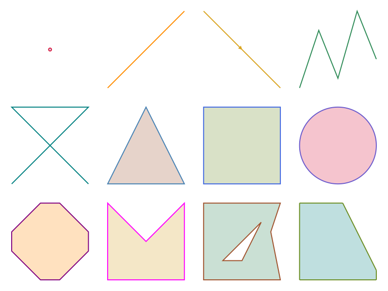</a>
</td>
<td width="33%" valign="top" align="center">
<a href="example_helloworld.cpp"></a>
</td>
</tr>
<tr>
<td valign="top"><a href="example2.cpp"><code>example2</code></a>  Streams shapes into a <a href="../doc/canvas.md"><code>Canvas</code></a>, styling them.</td>
<td valign="top"><a href="example_canvas.cpp"><code>canvas</code></a>  Draws every bounded shape the library offers and exports as <a href="figures/canvas_gallery.svg">SVG</a>, <a href="figures/canvas_gallery.pdf">PDF</a> and <a href="figures/canvas_gallery.ipe">IPE</a>.</td>
<td valign="top"><a href="example_helloworld.cpp"><code>helloworld</code></a>  Letters built from several shapes.</td>
</tr>

<tr>
<td width="33%" valign="top" align="center">
<a href="example_enclosing.cpp">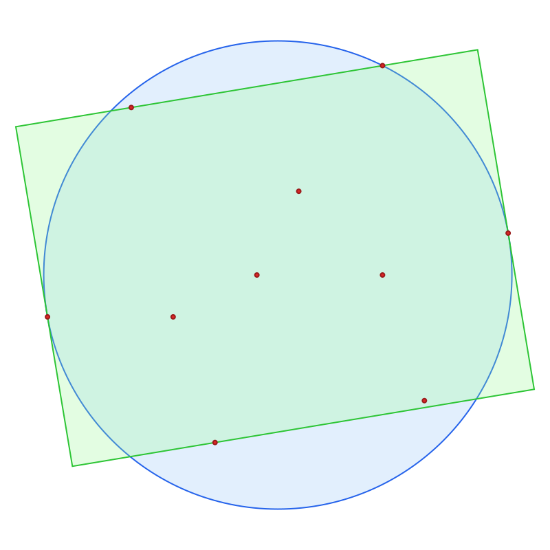</a>
</td>
<td width="33%" valign="top" align="center">
<a href="example_convex.cpp">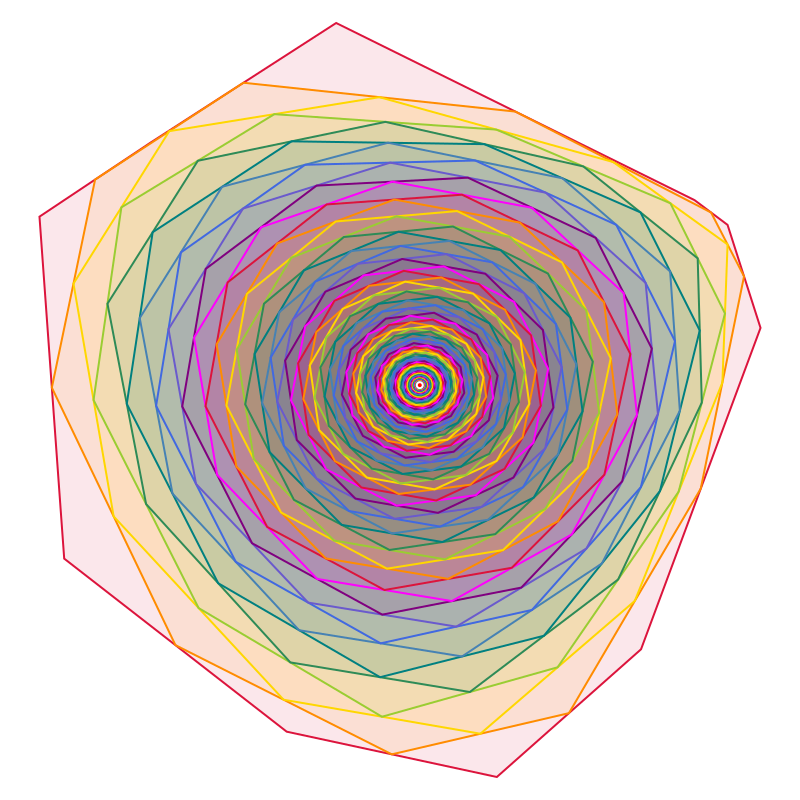</a>
</td>
<td width="33%" valign="top" align="center">
<a href="example_minkowskisum.cpp"></a>
</td>
</tr>
<tr>
<td valign="top"><a href="example_enclosing.cpp"><code>enclosing</code></a> Computes the minimum disk and smallest-area rectangle enclosing a set of points.</td>
<td valign="top"><a href="example_convex.cpp"><code>convex</code></a>  Iterates the midpoint map on a <a href="../doc/shapes.md#convex"><code>Convex</code></a> hull 100 times.</td>
<td valign="top"><a href="example_minkowskisum.cpp"><code>minkowskisum</code></a>  Grows a nonconvex polygon by a convex one.</td>
</tr>

<tr>
<td width="33%" valign="top" align="center">
<a href="example_triangulation.cpp">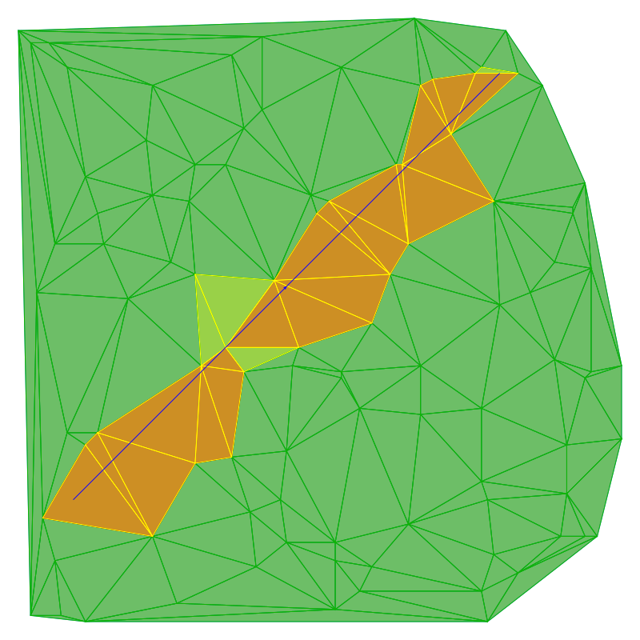</a>
</td>
<td width="33%" valign="top" align="center">
<a href="example_polygon_triangulation.cpp">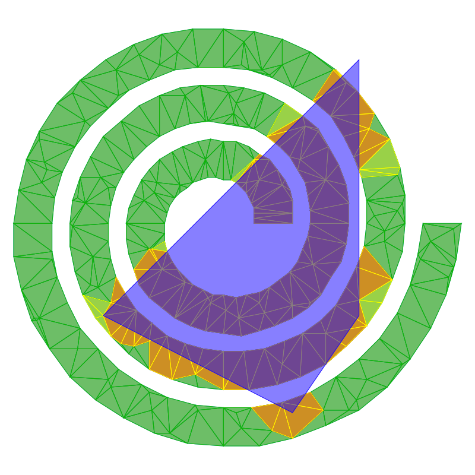</a>
</td>
<td width="33%" valign="top" align="center">
<a href="example_voronoi.cpp">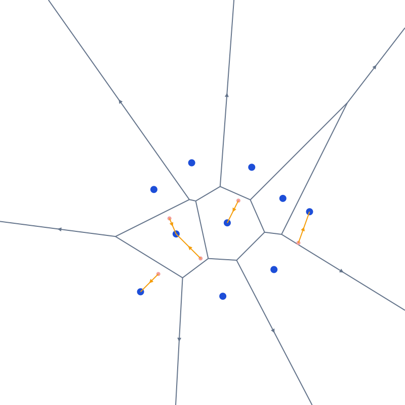</a>
</td>
</tr>
<tr>
<td valign="top"><a href="example_triangulation.cpp"><code>triangulation</code></a>  Delaunay <a href="../doc/data_structures.md"><code>Triangulation</code></a> queried for the triangles a segment intersects.</td>
<td valign="top"><a href="example_polygon_triangulation.cpp"><code>polygon_triangulation</code></a>  Constrained Delaunay triangulation of a polygon and interior points, with intersection queries.</td>
<td valign="top"><a href="example_voronoi.cpp"><code>voronoi</code></a>  Builds the Voronoi diagram from a Delaunay triangulation and answers nearest-neighbor queries.</td>
</tr>

<tr>
<td width="33%" valign="top" align="center">
<a href="example_mst.cpp">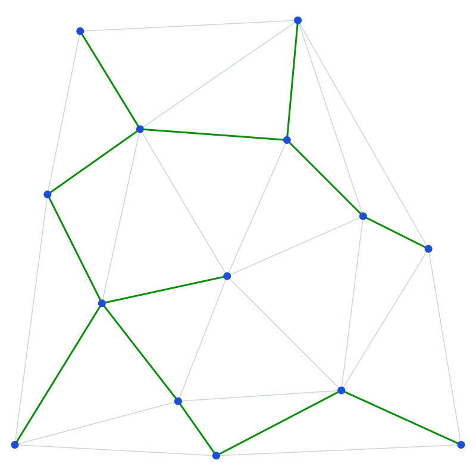</a>
</td>
<td width="33%" valign="top" align="center">
<a href="example_visibility.cpp">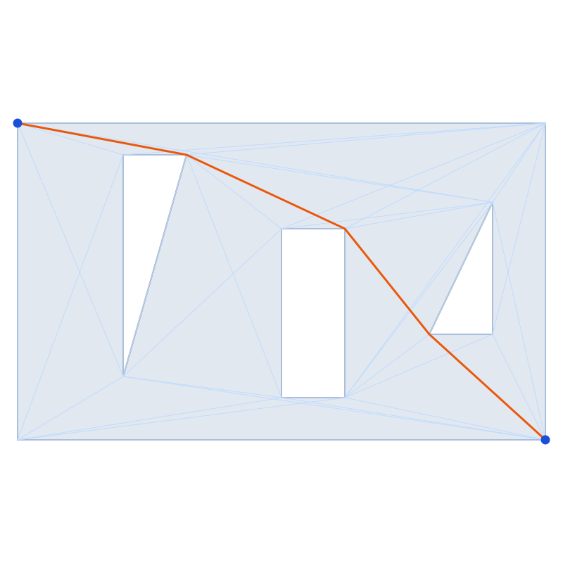</a>
</td>
<td width="33%" valign="top" align="center">
<a href="example_motion.cpp">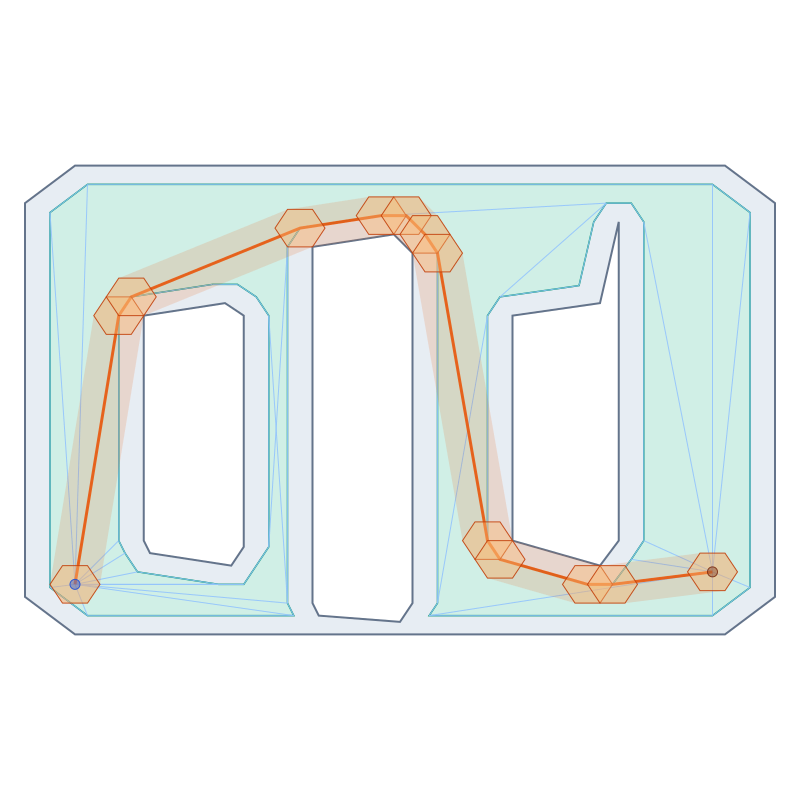</a>
</td>
</tr>
<tr>
<td valign="top"><a href="example_mst.cpp"><code>mst</code></a>  Builds a Delaunay triangulation and grows the Euclidean minimum spanning tree.</td>
<td valign="top"><a href="example_visibility.cpp"><code>visibility</code></a>  Uses the visibility graph to find the shortest path in a polygonal room.</td>
<td valign="top"><a href="example_motion.cpp"><code>motion</code></a>  Motion planning of a polygonal robot by eroding a room and routing in the reduced visibility graph.</td>
</tr>

<tr>
<td width="33%" valign="top" align="center">
<a href="example_arrangement.cpp"></a>
</td>
<td width="33%" valign="top" align="center">
<a href="example_dual_arrangement.cpp">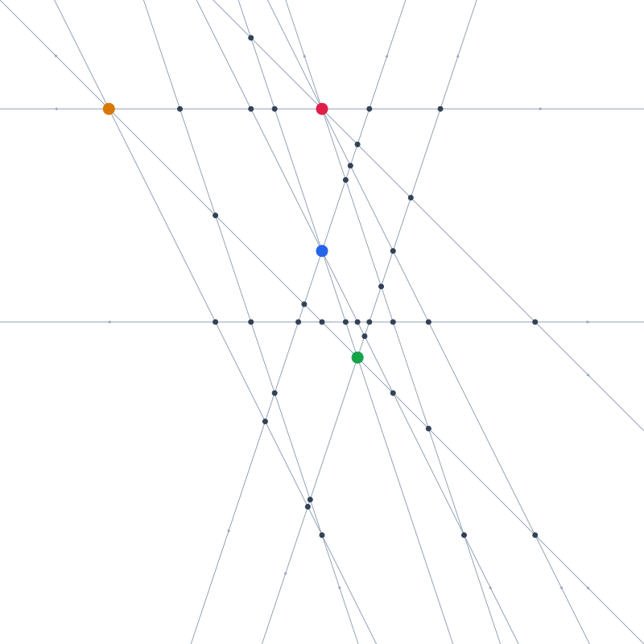</a>
</td>
<td width="33%" valign="top" align="center">
<a href="example_shapetree.cpp">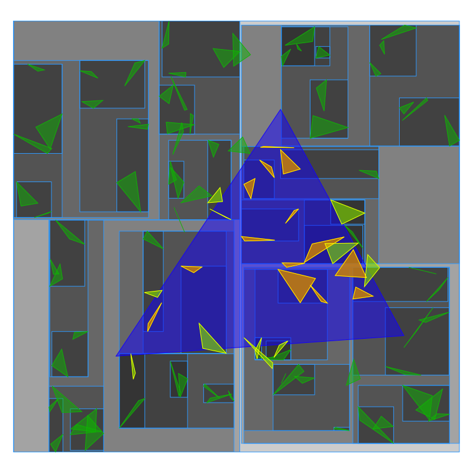</a>
</td>
<td width="33%"></td>
</tr>
<tr>
<td valign="top"><a href="example_arrangement.cpp"><code>arrangement</code></a>  Builds an <a href="../doc/data_structures.md"><code>Arrangement</code></a> and walks the boundary of its largest bounded face.</td>
<td valign="top"><a href="example_dual_arrangement.cpp"><code>dual_arrangement</code></a>  Point-line <a href="../doc/shape_methods.md"><code>dual</code></a> <a href="../doc/data_structures.md"><code>arrangement</code></a> used to detect collinear points.</td>
<td valign="top"><a href="example_shapetree.cpp"><code>shapetree</code></a>  A <a href="../doc/data_structures.md"><code>ShapeTree</code></a> indexes triangles to answer queries with another triangle.</td>
<td></td>
</tr>
</table>
